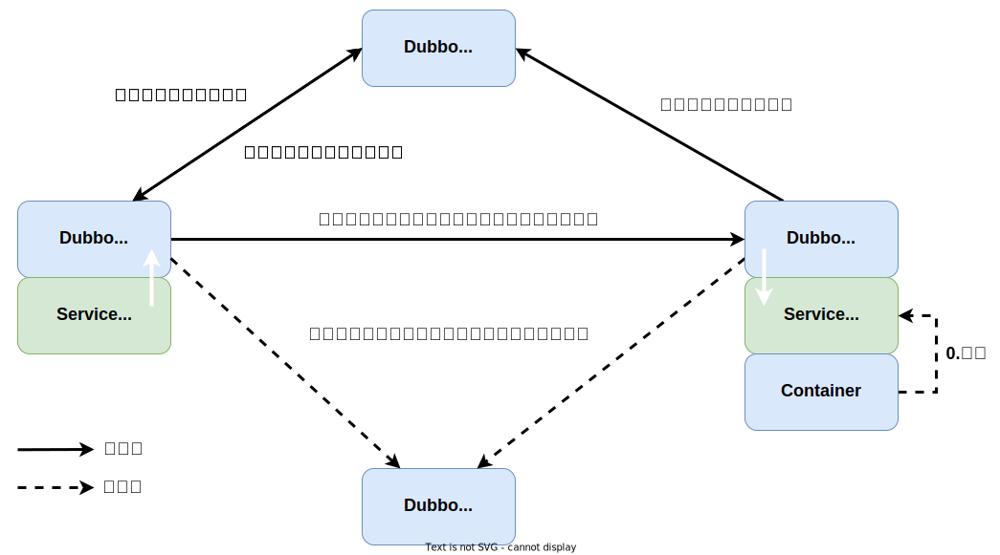

## 什么是Dubbo

> Dubbo是一个分布式服务框架，用于提供高性能和透明化的RPC远程服务调用方案，以及服务治理方案。

### Remoting网络通信框架

> 网络通信框架，提供对多种NIO框架抽象封装，包括“同步转异步”和“请求-响应”模式的信息交换方式

### Cluster服务框架

> 服务框架，提供基于接口方法的透明远程过程调用，包括多协议支持，以及软负载均衡，失败容错，地址路由，动态配置等集群支持

### Registry服务注册

> 服务注册，基于注册中心目录服务，使服务消费方能动态的查找服务提供方，使地址透明，使服务提供方可以平滑增加或减少机器

## Dubbo的主要应用场景

> - 透明化的远程方法调用，就像调用本地方法一样调用远程方法，只需简单配置，没有任何API侵入
> - 软负载均衡及容错机制，可在内网替代F5等硬件负载均衡器，降低成本，减少单点
> - 服务自动注册与发现，不再需要写死服务提供方地址，注册中心基于接口名查询服务提供者的IP地址，并且能够平滑添加或删除服务提供者

## 核心组件

| 组件角色      | 说明                  |
|-----------|---------------------|
| Provider  | 暴露服务的服务提供方          |
| Consumer  | 调用远程服务的服务消费方        |
| Registry  | 服务注册与发现的注册中心        |
| Monitor   | 统计服务的调用次数和调用时间的监控中心 |
| Container | 服务运行容器              |

## Dubbo服务注册与发现的流程

> 流程说明
> 1. Provider(提供者)绑定指定端口并启动服务
> 2. 指供者连接注册中心，并发本机 IP、端口、应用信息和提供服务信息发送至注册中心存储
> 3. Consumer(消费者），连接注册中心，并发送应用信息、所求服务信息至注册中心
> 4. 注册中心根据消费者所求服务信息匹配对应的提供者列表发送至Consumer应用缓存
> 5. Consumer在发起远程调用时基于缓存的消费者列表择其一发起调用
> 6. Provider状态变更会实时通知注册中心、在由注册中心实时推送至Consumer

## Dubbo框架设计

> 1. **服务接口层（Service）：** 该层是与实际业务逻辑相关的，根据服务提供方和服务消费方的业务设计对应的接口和实现
> 2. **配置层（Config）：** 对外配置接口，以ServiceConfig和ReferenceConfig为中心
> 3. **服务代理层（Proxy）：** 服务接口透明代理，生成服务的客户端Stub和服务器端Skeleton
> 4. **服务注册层（Registry）：** 封装服务地址的注册与发现，以服务URL为中心
> 5. **集群层（Cluster）：** 封装多个提供者的路由及负载均衡，并桥接注册中心，以Invoker为中心
> 6. **监控层（Monitor）：** RPC调用次数和调用时间监控
> 7. **远程调用层（Protocol）：** 封装RPC调用，以Invocation和Result为中心，扩展接口为Protocol、Invoker和Exporter
> 8. **信息交换层（Exchange）：** 封装请求响应模式，同步转异步，以Request和Response为中心
> 9. **网络传输层（Transport）：** 抽象mina和netty为统一接口，以Message为中心
> 10. **数据序列化层（Serialize）：** 负责管理整个框架中的数据传输的序列化和反序列化

## Dubbo支持的协议

> - **dubbo(推荐)：** 单一长连接和NIO异步通讯，适合大并发小数据量的服务调用，以及消费者远大于提供者。传输协议TCP，异步，Hessian序列化
> - **rmi：** 采用JDK标准的rmi协议实现，传输参数和返回参数对象需要实现Serializable接口，使用java标准序列化机制，使用阻塞式短连接，传输数据包大小混合，消费者和提供者个数差不多，可传文件，传输协议TCP。 多个短连接，TCP协议传输，同步传输，适用常规的远程服务调用和rmi互操作。在依赖低版本的Common-Collections包，java序列化存在安全漏洞
> - **webservice：** 基于WebService的远程调用协议，集成CXF实现，提供和原生WebService的互操作。多个短连接，基于HTTP传输，同步传输，适用系统集成和跨语言调用
> - **http：** 基于Http表单提交的远程调用协议，使用Spring的HttpInvoke实现。多个短连接，传输协议HTTP，传入参数大小混合，提供者个数多于消费者，需要给应用程序和浏览器JS调用
> - **hessian：** 集成 Hessian服务，基于HTTP通讯，采用Servlet暴露服务，Dubbo内嵌Jetty作为服务器时默认实现，提供与Hession服务互操作。多个短连接，同步HTTP传输，Hessian序列化，传入参数较大，提供者大于消费者，提供者压力较大，可传文件
> - **memcache：** 基于memcached实现的RPC协议
> - **redis：** 基于redis实现的RPC协议

## Dubbo支持的注册中心

> - **Multicast注册中心：** Multicast注册中心不需要任何中心节点，只要广播地址，就能进行服务注册和发现。基于网络中组播传输实现
> - **Zookeeper注册中心：** 基于分布式协调系统Zookeeper实现，采用Zookeeper的watch机制实现数据变更
> - **redis注册中心：** 基于redis实现，采用key/Map存储，住key存储服务名和类型，Map中key存储服务URL，value服务过期时间。基于redis的发布/订阅模式通知数据变更
> - **Simple注册中心：** 
> - **Nacos注册中心：** 

## Dubbo集群

### 集群负载均衡策略

> - **Random LoadBalance(默认):** 随机选取提供者策略，有利于动态调整提供者权重。截面碰撞率高，调用次数越多，分布越均匀
> - **RoundRobin LoadBalance:** 轮循选取提供者策略，平均分布，但是存在请求累积的问题
> - **LeastActive LoadBalance:** 最少活跃调用策略，解决慢提供者接收更少的请求
> - **ConstantHash LoadBalance:** 一致性Hash策略，使相同参数请求总是发到同一提供者，一台机器宕机，可以基于虚拟节点，分摊至其他提供者，避免引起提供者的剧烈变动

### 集群容错方案

> - **Failover Cluster(默认):** 失败自动切换，当出现失败，重试其它服务器。通常用于读操作，但重试会带来更长延迟
> - **Failfast Cluster:** 快速失败，只发起一次调用，失败立即报错。通常用于非幂等性的写操作，比如新增记录
> - **Failsafe Cluster:** 失败安全，出现异常时，直接忽略。通常用于写入审计日志等操作
> - **Failback Cluster:** 失败自动恢复，后台记录失败请求，定时重发。通常用于消息通知操作
> - **Forking Cluster:** 并行调用多个服务器，只要一个成功即返回。通常用于实时性要求较高的读操作，但需要浪费更多服务资源。可通过forks="2"来设置最大并行数
> - **Broadcast Cluster:** 广播调用所有提供者，逐个调用，任意一台报错则报错 。通常用于通知所有提供者更新缓存或日志等本地资源信息

## 其他问题

### Dubbo的注册中心集群挂掉后发布者和订阅者之间是否还能通信

> 可以的，启动dubbo时，消费者会从注册中心拉取注册的生产者的地址接口等数据，缓存在本地每次调用时，按照本地存储的地址进行调用