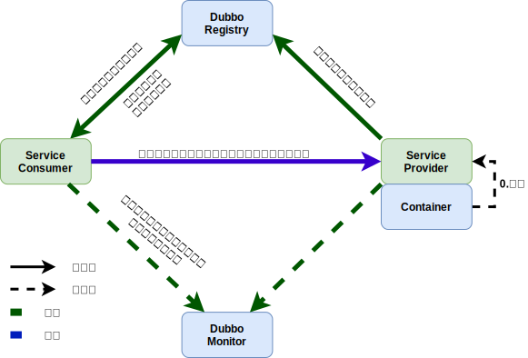

## 什么是Dubbo

Dubbo 是一个分布式服务框架，用于提供高性能和透明化的 RPC 远程服务调用方案，以及服务治理方案。

## Dubbo的三个核心功能

### Remoting网络通信框架

网络通信框架，提供对多种 NIO 框架抽象封装，包括“同步转异步”和“请求-响应”模式的信息交换方式

### Cluster服务框架

服务框架，提供基于接口方法的透明远程过程调用，包括多协议支持，以及软负载均衡，失败容错，地址路由，动态配置等集群支持

### Registry服务注册

服务注册，基于注册中心目录服务，使服务消费方能动态的查找服务提供方，使地址透明，使服务提供方可以平滑增加或减少机器

## Dubbo的主要应用场景

- 透明化的远程方法调用，就像调用本地方法一样调用远程方法，只需简单配置，没有任何 API 侵入
- 软负载均衡及容错机制，可在内网替代 F5 等硬件负载均衡器，降低成本，减少单点
- 服务自动注册与发现，不再需要写死服务提供方地址，注册中心基于接口名查询服务提供者的IP地址，并且能够平滑添加或删除服务提供者

## 核心组件

| 组件角色      | 说明                  |
|-----------|---------------------|
| Provider  | 暴露服务的服务提供方          |
| Consumer  | 调用远程服务的服务消费方        |
| Registry  | 服务注册与发现的注册中心        |
| Monitor   | 统计服务的调用次数和调用时间的监控中心 |
| Container | 服务运行容器              |

### Monitor实现原理

Consumer 端在发起调用之前会先走 filter 链；Provider 端在接收到请求时也是先走 Filter 链，然后才进行真正的业务逻辑处理。默认情况下，在 Consumer 和 Provider 的 Filter 链中都会有 MonitorFilter

- MonitorFilter 向 DubboMonitor 发送数据
- DubboMonitor 将数据进行聚合后（默认聚合 1min 中的统计数据）暂存到 ConcurrentMap<Statistics, AtomicReference> statisticsMap，然后使用一个含有 3 个线程（线程名字：DubboMonitorSendTimer）的线程池每隔 1min 钟，调用 SimpleMonitorService 遍历发送 statisticsMap 中的统计数据，每发送完毕一个，就重置当前的 Statistics 的 AtomicReference
- SimpleMonitorService 将这些聚合数据塞入 BlockingQueue queue 中（队列大写为 100000）
- SimpleMonitorService 使用一个后台线程（线程名为：DubboMonitorAsyncWriteLogThread）将 queue 中的数据写入文件（该线程以死循环的形式来写）
- SimpleMonitorService 还会使用一个含有 1 个线程（线程名字：DubboMonitorTimer）的线程池每隔 5min 钟，将文件中的统计数据画成图表

## Dubbo服务注册与发现的流程



流程说明

1. Provider(提供者)绑定指定端口并启动服务
2. 指供者连接注册中心，并将本机 IP、端口、应用信息和提供服务信息发送至注册中心存储
3. Consumer(消费者），连接注册中心，并发送应用信息、所求服务信息至注册中心
4. 注册中心根据消费者所求服务信息匹配对应的提供者列表发送至 Consumer 应用缓存
5. Consumer 在发起远程调用时基于缓存的消费者列表择其一发起调用
6. Provider 状态变更会实时通知注册中心、在由注册中心实时推送至 Consumer

## Dubbo框架设计分层

1. **服务接口层(Service)：** 该层是与实际业务逻辑相关的，根据服务提供方和服务消费方的业务设计对应的接口和实现
2. **配置层(Config)：** 对外配置接口，以 ServiceConfig 和 ReferenceConfig 为中心
3. **服务代理层(Proxy)：** 服务接口透明代理，生成服务的客户端 Stub 和服务器端 Skeleton
4. **服务注册层(Registry)：** 封装服务地址的注册与发现，以服务 URL 为中心
5. **集群层(Cluster)：** 封装多个提供者的路由及负载均衡，并桥接注册中心，以Invoker为中心
6. **监控层(Monitor)：** RPC 调用次数和调用时间监控
7. **远程调用层(Protocol)：** 封装 RPC 调用，以 Invocation 和 Result 为中心，扩展接口为 Protocol、Invoker 和 Exporter
8. **信息交换层(Exchange)：** 封装请求响应模式，同步转异步，以 Request 和 Response 为中心
9. **网络传输层(Transport)：** 抽象 mina 和 netty 为统一接口，以 Message 为中心
10. **数据序列化层(Serialize)：** 负责管理整个框架中的数据传输的序列化和反序列化

## Dubbo支持的协议

- **Dubbo(推荐)：** 单一长连接和 NIO 异步通讯，适合大并发小数据量（建议出入参数数据包小于 100K）的服务调用，以及消费者远大于提供者。TCP 传输协议，NIO 异步传输，Hessian 二进制序列化
- **Rmi：** 采用 JDK 标准的 rmi 协议实现，传输参数和返回参数对象需要实现 Serializable 接口，使用 java 标准二进制序列化机制，使用阻塞式短连接，传输数据包大小混合，消费者和提供者个数差不多，可传文件。 多个短连接，TCP 协议传输，同步传输，适用常规的远程服务调用和 rmi 互操作。在依赖低版本的 Common-Collections 包，java 序列化存在安全漏洞
- **Webservice：** 基于 WebService 的远程调用协议，集成 CXF 实现，提供和原生 WebService 的互操作。多个短连接，基于 HTTP 传输，同步传输，适用系统集成和跨语言调用
- **Http：** 基于 Http 表单提交的远程调用协议，使用 Spring 的 HttpInvoke 实现。多个短连接，传输协议 HTTP，传入参数大小混合，提供者个数多于消费者，需要给应用程序和浏览器JS调用
- **Hessian：** 集成 Hessian 服务，基于HTTP通讯，采用Servlet暴露服务，Dubbo内嵌Jetty作为服务器时默认实现，提供与 Hessian 服务互操作。多个短连接，同步 HTTP 传输，Hessian 二进制序列化，传入参数较大，提供者大于消费者，提供者压力较大，可传文件
- **Thrift：** Thrift 是 Facebook 捐给 Apache 的一个RPC框架，当前 Dubbo 支持的 Thrift 协议是对 Thrift 原生协议的扩展，在原生协议的基础上添加了一些额外的头信息，比如 service name，magic number 等
- **Memcached：** 基于 Memcached 实现的RPC协议
- **Redis：** 基于 Redis 实现的RPC协议

## Dubbo支持的注册中心

- **Multicast 注册中心：** Multicast 注册中心不需要任何中心节点，只要广播地址，就能进行服务注册和发现。基于网络中组播传输实现
- **Zookeeper 注册中心：** 基于分布式协调系统 Zookeeper 实现，采用 Zookeeper 的 watch 机制实现数据变更
- **Redis 注册中心：** 基于 Redis 实现，采用 key/Map 存储，住 key 存储服务名和类型，Map 中 key 存储服务URL，value 服务过期时间。基于 redis 的发布/订阅模式通知数据变更
- **Simple 注册中心：** 一个简单的基于内存的注册中心实现，它本身就是一个标准的 RPC 服务，不支持集群，也可能出现单点故障

## Dubbo集群

### 集群负载均衡策略

- **Random LoadBalance(默认):** 随机选取提供者策略，有利于动态调整提供者权重。截面碰撞率高，调用次数越多，分布越均匀
- **RoundRobin LoadBalance:** 轮循选取提供者策略，平均分布，但是存在请求累积的问题
- **LeastActive LoadBalance:** 最少活跃调用策略，解决慢提供者接收更少的请求
- **ConstantHash LoadBalance:** 一致性Hash策略，使相同参数请求总是发到同一提供者，一台机器宕机，可以基于虚拟节点，分摊至其他提供者，避免引起提供者的剧烈变动

### 集群容错方案

- **Failover Cluster(默认):** 失败自动切换，当出现失败，重试其它服务器。通常用于读操作，但重试会带来更长延迟
- **Failfast Cluster:** 快速失败，只发起一次调用，失败立即报错。通常用于非幂等性的写操作，比如新增记录
- **Failsafe Cluster:** 失败安全，出现异常时，直接忽略。通常用于写入审计日志等操作
- **Failback Cluster:** 失败自动恢复，后台记录失败请求，定时重发。通常用于消息通知操作
- **Forking Cluster:** 并行调用多个服务器，只要一个成功即返回。通常用于实时性要求较高的读操作，但需要浪费更多服务资源。可通过 forks="2" 来设置最大并行数
- **Broadcast Cluster:** 广播调用所有提供者，逐个调用，任意一台报错则报错 。通常用于通知所有提供者更新缓存或日志等本地资源信息

## 其他问题

### Dubbo的注册中心集群挂掉后发布者和订阅者之间是否还能通信

可以的，启动 dubbo 时，消费者会从注册中心拉取注册的生产者的地址接口等数据，缓存在本地每次调用时，按照本地存储的地址进行调用

### Duboo核心的配置

| 标签                   | 用途     | 解释                                                  |
|----------------------|--------|-----------------------------------------------------|
| `dubbo:service/`     | 服务配置   | 用于暴露一个服务，定义服务的元信息，一个服务可以用多个协议暴露，一个服务也可以注册到多个注册中心    |
| `dubbo:reference/`   | 引用配置   | 用于创建一个远程服务代理，一个引用可以指向多个注册中心                         |
| `dubbo:protocol/`    | 协议配置   | 用于配置提供服务的协议信息，协议由提供方指定，消费方被动接受                      |
| `dubbo:application/` | 应用配置   | 用于配置当前应用信息，不管该应用是提供者还是消费者                           |
| `dubbo:module/`      | 模块配置   | 用于配置当前模块信息，可选                                       |
| `dubbo:registry/`    | 注册中心配置 | 用于配置连接注册中心相关信息                                      |
| `dubbo:monitor/`     | 监控中心配置 | 用于配置连接监控中心相关信息，可选                                   |
| `dubbo:provider/`    | 提供方配置  | 当 ProtocolConfig 和 ServiceConfig 某属性没有配置时，采用此缺省值，可选 |
| `dubbo:consumer/`    | 消费方配置  | 当 ReferenceConfig 某属性没有配置时，采用此缺省值，可选                |
| `dubbo:method/`      | 方法配置   | 用于 ServiceConfig 和 ReferenceConfig 指定方法级的配置信息       |
| `dubbo:argument`     | 参数配置   | 用于指定方法参数配置                                          |

PS: 如果是 SpringBoot 项目就只需要注解，或者开 Application 配置文件

### Dubbo用到的设计模式

<!-- tabs:start -->
<!-- tab:工厂模式 -->
Provider 在 export 服务时，会调用 ServiceConfig 的 export 方法。ServiceConfig 中有个字段:

```java
private static final Protocol protocol = ExtensionLoader.getExtensionLoader(Protocol.class).getAdaptiveExtension();
```

Dubbo 里有很多这种代码。这也是一种工厂模式，只是实现类的获取采用了 JDK SPI 的机制。这么实现的优点是可扩展性强，想要扩展实现，只需要在 classpath 下增加个文件就可以了，代码零侵入。另外，像上面的 Adaptive 实现，可以做到调用时动态决定调用哪个实现，但是由于这种实现采用了动态代理，会造成代码调试比较麻烦，需要分析出实际调用的实现类

<!-- tab:装饰器模式 -->
Dubbo 在启动和调用阶段都大量使用了装饰器模式。以 Provider 提供的调用链为例，具体的调用链代码是在 ProtocolFilterWrapper 的 buildInvokerChain 完成的，具体是将注解中含有 group=provider 的 Filter 实现，按照 order 排序，最后的调用顺序是:

```text
EchoFilter -> ClassLoaderFilter -> GenericFilter -> ContextFilter -> ExecuteLimitFilter -> TraceFilter -> TimeoutFilter -> MonitorFilter -> ExceptionFilter
```

更确切地说，这里是装饰器和责任链模式的混合使用。例如，EchoFilter 的作用是判断是否是回声测试请求，是的话直接返回内容，这是一种责任链的体现。而像 ClassLoaderFilter 则只是在主功能上添加了功能，更改当前线程的 ClassLoader，这是典型的装饰器模式

<!-- tab:观察者模式 -->
Dubbo 的 Provider 启动时，需要与注册中心交互，先注册自己的服务，再订阅自己的服务，订阅时，采用了观察者模式，开启一个 listener。注册中心会每 5 秒定时检查是否有服务更新，如果有更新，向该服务的提供者发送一个 notify 消息，provider 接受到 notify 消息后，运行 NotifyListener 的 notify 方法，执行监听器方法

<!-- tab:动态代理模式 -->
Dubbo 扩展 JDK SPI 的类 ExtensionLoader 的 Adaptive 实现是典型的动态代理实现。Dubbo 需要灵活地控制实现类，即在调用阶段动态地根据参数决定调用哪个实现类，所以采用先生成代理类的方法，能够做到灵活的调用。生成代理类的代码是 ExtensionLoader 的 createAdaptiveExtensionClassCode 方法。代理类主要逻辑是，获取 URL 参数中指定参数的值作为获取实现类的 key

<!-- tabs:end -->

### Dubbo配置服务降级

以通过 dubbo:reference 中设置 mock=“return null”。mock 的值也可以修改为 true，然后再跟接口同一个路径下实现一个 Mock 类，命名规则是“接口名称+ Mock”后缀。然后在 Mock 类里实现自己的降级逻辑

### Dubbo不支持分布式事务

Dubbo 是一个分布式服务框架,本身并不提供分布式事务的解决方案。可以通过 tcc-transaction 等外部框架实现

### Dubbo对结果进行缓存

为了提高数据访问的速度。Dubbo 提供了声明式缓存，以减少用户加缓存的工作量 `<dubbo:reference cache="true"/>`

### Dubbo是否安全

- Dubbo 通过 Token 令牌防止用户绕过注册中心直连，然后在注册中心上管理授权
- Dubbo 还提供服务黑白名单，来控制服务所允许的调用方
