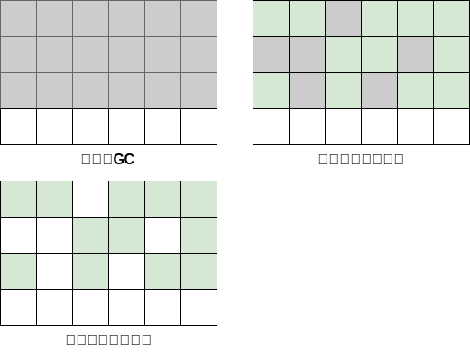
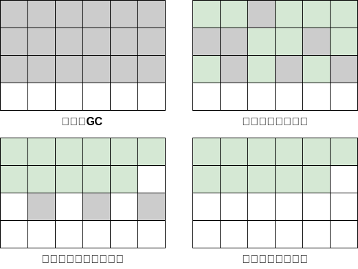
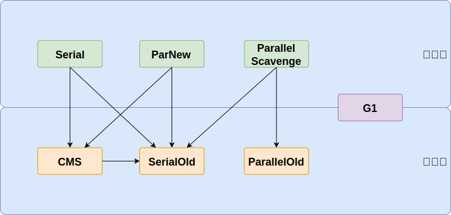

## 对象存活判断

### 引用计数器算法

为每个对象创建一个引用计数，有对象引用时计数器+1，引用被释放时计数-1，当计数器为0时就可以被回收。它有一个缺点不能解决循环引用的问题

### 可达性分析算法

从GC Roots开始向下搜索，搜索所走过的路径称为引用链。当一个对象到GC Roots没有任何引用链相连时，则证明此对象是可以被回收的

## GC回收算法

<!-- tabs:start -->
<!-- tab:复制算法 -->
按照容量划分两个大小相等的内存区域，当一块用完的时候将活着的对象复制到另一块上，然后再把已使用的内存空间一次清理掉。

- **优点：** 按顺序分配内存即可，实现简单、运行高效，不用考虑内存碎片
- **缺点：** 内存使用率不高，只有原来的一半

<!-- tab:标记清除算法 -->
标记无用对象，然后进行清除回收。它将垃圾收集分为两个阶段

- 标记阶段：标记出可以回收的对象。
- 清除阶段：回收被标记的对象所占用的空间。

- **优点：** 实现简单，不需要对象进行移动
- **缺点：** 效率不高，无法清除垃圾碎片

<!-- tab:标记整理算法 -->
标记可回收的对象后将所有存活的对象压缩到内存的一端

- **优点：** 解决了标记清理算法存在的内存碎片问题
- **缺点：** 仍需要进行局部对象移动，一定程度上降低了效率

<!-- tab:分代收集算法 -->
根据对象的 **存活周期** 将内存划分为几块，并通过不同的回收算法实现垃圾回收，。一般包括 **年轻代** 、 **老年代** 和 **永久代**

- 分代回收器有两个分区：老生代和新生代，新生代默认的空间占比总空间的1/3，老生代的默认占比是2/3。
- 新生代使用的是复制算法，新生代里有 3 个分区：Eden、To Survivor、From Survivor，它们的默认占比是8:1:1，它的执行流程如下：
- 把Eden + From Survivor存活的对象放入To Survivor区
    - 清空Eden和From Survivor分区
    - From Survivor和To Survivor分区交换，From Survivor变To Survivor，To Survivor变From Survivor。
- 每次在From Survivor到To Survivor移动时都存活的对象，年龄就+1，当年龄到达15（默认配置是15）时，升级为老生代。大对象也会直接进入老生代。
- 老生代当空间占用到达某个值之后就会触发全局垃圾收回，一般使用标记整理的执行算法。以上这些循环往复就构成了整个分代垃圾回收的整体执行流程

<!-- tab:分区收集算法 -->
<!-- tabs:end -->

## GC回收器

| 垃圾回收器            | 工作区域      | 回收算法          | 工作线程 | 用户线程并行 | 描述                                      |
|------------------|-----------|---------------|------|--------|-----------------------------------------|
| Serial           | 新生代       | 复制算法          | 单线程  | 否      | Client模式下默认新生代收集器，简单高效                  |
| ParNew           | 新生代       | 复制算法          | 多线程  | 否      | Serial的多线程版本，Server模式下首选， 可搭配CMS的新生代收集器 |
| ParallelScavenge | 新生代       | 复制算法          | 多线程  | 否      | 目标是达到可控制的吞吐量                            |
| SerialOld        | 老年代       | 标记整理算法        | 单线程  | 否      | Serial老年代版本，给Client模式下的虚拟机使用            |
| ParallelOld      | 老年代       | 标记整理算法        | 多线程  | 否      | Parallel Scavenge老年代版本，吞吐量优先            |
| CMS              | 老年代       | 标记清除算法        | 多线程  | 是      | CMS有高并发、低停顿的特点，追求最短GC回收停顿时间             |
| G1               | 新生代 + 老年代 | 标记整理算法 + 复制算法 | 多线程  | 是      | JDK1.9默认垃圾收集器                           |

### Serial

Serial 收集器是最基本的垃圾回收器，它使用单线程进行垃圾回收，适用于单核处理器环境下的应用程序。Serial 收集器主要用于新生代的垃圾回收

### ParNew

Parallel 收集器也称为吞吐量优先收集器，它使用多线程并行进行垃圾回收，可以充分利用多核处理器的优势，提高垃圾回收的吞吐量。Parallel 收集器主要用于新生代的垃圾回收

### Parallel Scavenge

新生代的垃圾回收

### Serial Old

老年代单线程收集器，Serial收集器的老年代版本

### Parallel Old

老年代并行收集器，吞吐量优先，Parallel Scavenge收集器的老年代版本

### CMS

老年代并行收集器，以获取最短回收停顿时间为目标的收集器，具有高并发、低停顿的特点，追求最短GC回收停顿时间

### G1

Java 堆并行收集器，G1 收集器是 JDK1.7 提供的一个新收集器，G1 收集器基于“标记-整理”算法实现，也就是说不会产生内存碎片。此外，G1 收集器不同于之前的收集器的一个重要特点是：G1回收的范围是整个Java堆(包括新生代，老年代)，而前六种收集器回收的范围仅限于新生代或老年代
