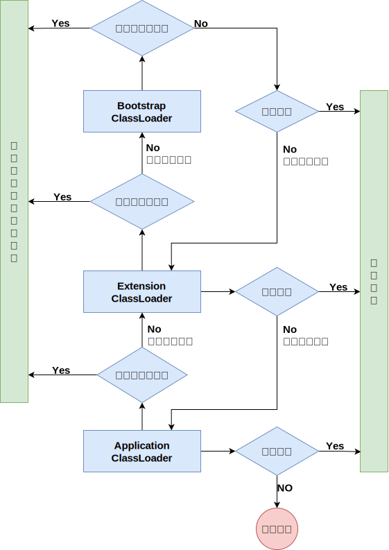
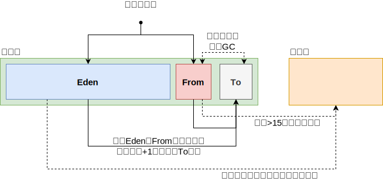

在 Java 中，JVM 内存模型主要分为堆、方法区、程序计数器、虚拟机栈和本地方法栈。其中，堆和方法区被所有线程共享，虚拟机栈、本地方法栈、程序计数器是线程私有的

## 类加载子系统

### 类加载器

- **Bootstrap ClassLoader ：** 主要负责加载核心的类库( `java.lang.*` 等)，构造 Extension ClassLoader 和 Application ClassLoader
- **Extension ClassLoader ：** 主要负责加载 `jre/lib/ext` 目录下的一些扩展的 jar
- **Application ClassLoader ：** 主要负责加载应用程序的主函数类

### 双亲委派机制

作用：

- 防止重复加载同一个 class 对象
- 保证核心 class 对象不能被篡改。保证了 Class 执行安全

## JVM运行时数据区

### Heap堆

被线程共享的一块数据区域，用于存储创建的对象与数组等。是垃圾回收器进行垃圾收集的主要区域，根据VM的分代收集算法，Java 堆还可以被细分为： **新生代** （ Eden 、 FormSurvivor 和 ToSurvivor ）和 **老年代**，新生代与老年代占据空间的比例默认为1:2

<!-- tabs:start -->
<!-- tab:新生代 -->
用于存放新创建的对象，一般占据堆内存的 1/3 空间。由于对象创建频繁，所以该区域会频繁触发 `Minor GC(新生代GC)` 进行垃圾回收。新生代内又细分如下部分，

- **Eden：** Java 新生对象的存储位置（如果对象占用空间过大会直接放入老年代中）。当 空间不足时就会触发 `Minor GC` 通过 [复制算法](/Java/JVM/GC回收机制.md?id=GC回收算法) 进行垃圾回收
- **From Survivor：** 上次 GC 的幸存者
- **To Survivor：** 用于临时保存 GC 过程中的幸存者

Eden、From、To 三个占据空间的比例默认为8:1:1

--- 

**新生代回收流程如下**

<!-- tab:老年代 -->
用于存放程序中生命周期比较长的内存对象，由于老年代中的对象比较稳定，所以 `Major GC/Full GC(老年代GC)` 不会频繁触发。在进行 `Major GC/Full GC` 前一般会先进行一次 `Minor GC` ，使新生代的对象晋升到老年代，导致空间不足时才会触发。当剩余空间不足以为新创建比较大的对象分配连续空间时，也会提前触发 `Major GC/Full GC` 通过 [标记整理算法](/Java/JVM/GC回收机制.md?id=GC回收算法) 进行垃圾回收腾出空间

<!-- tabs:end -->

### MethodArea方法区

被线程共享的内存区域，常用永久代描述方法区。用于存储 JVM 加载的类信息、常量、静态变量、即时编译器编译后的代码等。 HotspotVM 采取 Java 堆的永久代来实现方法区，这样垃圾回收器可以像管理 Java 堆一样管理方法区，而不需要重新实现（永久代的回收收益也很小，一般只有常量池回收与类型卸载）。

#### 常量池

用于存放方法编译期生成的各种字面常量和符号引用，这部分的内容将在类加载后存放到方法区中的运行时常量池

### VMStack虚拟机栈

描述 Java 方法执行的内存模型，每个线程独立拥有。 每调用一个方法都会创建一个栈帧，栈帧随着方法的调用而创建，随着方法的结束而销毁。

#### 栈帧

用于存储一个方法的局部变量、操作数栈、动态链接、方法出口等信息

- **局部变量表：** 是用来存储我们临时 8 个基本数据类型、对象引用地址、 returnAddress 类型。（ returnAddress 中保存的是 return 后要执行的字节码的指令地址。）
- **操作数栈：** 操作数栈就是用来操作的，例如代码中有个 `i = 6 * 6`，他在一开始的时候就会进行操 作，读取我们的代码，进行计算后再放入局部变量表中去
- **动态链接：** 假如方法中，有个 `service.add()` 方法，要链接到别的方法中去，这就是动态链接，存储链接的地方
- **方法出口：** 出口正常的话就是 return ，不正常的话就是抛出异常

PS:

- 一个方法调用其他方法/递归调用方法自身都会创建一个栈帧
- 栈中要使用成员变量时不会存储成员变量，只会存储一个引用地址

### NativeMethodStack本地方法栈

线程私有的栈空间，用于存储线程执行的 Native 方法

### ProgramCounterRegister程序计数器

一块很小的内存空间，每个线程独立拥有。主要用于存储当前线程执行的 Java 方法的字节码指令地址，如果调用的是 Native 方法则为空

由于 Java 虚拟机的多线程是通过线程轮流切换并分配处理器执行时间的方式来实现的，一个处理器都只会执行一条线程中的指令。因此，为了线程切换后能恢复到正确的执行位置，每条线程都有一个独立的程序计数器，各个线程之间计数器互不影响，独立存储。称之为“线程私有”的内存。程序计数器内存区域是虚拟机中唯一没有规定 OutOfMemoryError 情况的区域

### 永久代

用于永久保存的内存区域，主要用于存放 Class 和 Meta （元数据）， Class 被加载的时候会放入永久区域。与存放实例的区域不同， GC 不会在主程序运行期对永久区域进行去清理。在 JDK8 后废弃永久代的概念，采用元空间来带代替，元空间通过本地内存实现，由系统控制可用空间

## 执行引擎

## 本地接口
