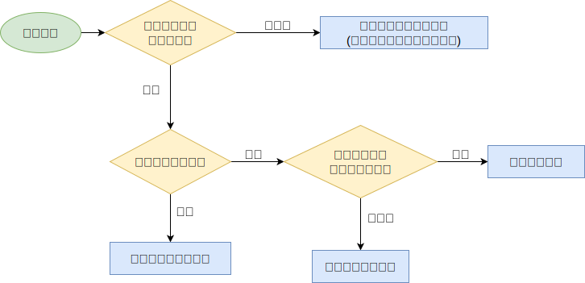

## 线程的生命周期

当线程被创建并启动以后，它既不是一启动就进入了执行状态，也不是一直处于执行状态。在线程的生命周期中，它要经过新建（ New ）、就绪（ Runnable ）、运行（ Running ）、阻塞（ Blocked ）和死亡（ Dead ）5种状态。尤其是当线程启动以后，它不可能一直"霸占"着 CPU 独自运行，所以 CPU 需要在多条线程之间切换，于是线程状态也会多次在运行、阻塞之间切换

### 新建（NEW）

当程序使用 new 关键字创建了一个线程之后，该线程就处于新建状态，此时仅由 JVM 为其分配内存，并初始化其成员变量的值

### 就绪（RUNNABLE）

当线程对象调用了 `start()` 方法之后，该线程处于就绪状态。 Java 虚拟机会为其创建方法调用栈和程序计数器，等待调度运行

### 运行（RUNNING）

如果处于就绪状态的线程获得了 CPU ，开始执行 `run()` 方法的线程执行体，则该线程处于运行状态

### 阻塞（BLOCKED）

阻塞状态是指线程因为某种原因放弃了 cpu 使用权，也即让出了 cpu timeslice ，暂时停止运行。直到线程进入可运行( runnable )状态，才有机会再次获得 cpu timeslice 转到运行( running )状态。阻塞的情况分三种：

- **等待阻塞( o.wait ->等待对列)：** 运行( running )状态的线程执行 `o.wait()` 方法， JVM 会把该线程放入等待队列( waitting queue )中。
- **同步阻塞( lock ->锁池)：** 运行( running )状态的线程在获取对象的同步锁时，若该同步锁被别的线程占用，则 JVM 会把该线程放入锁池( lock pool )中。
- **其他阻塞( sleep/join )：** 运行( running )状态的线程执行 `Thread.sleep(long ms)` 或 `t.join()` 方法，或者发出了 `I/O` 请求时， JVM 会把该线程置为阻塞状态。当 sleep() 状态超时、 join() 等待线程终止或者超时、或者 I/O 处理完毕时，线程重新转入可运行( runnable )状态。

### 线程死亡（DEAD）

线程会以下面三种方式结束，结束后就是死亡状态

- **正常结束：** `run()` 或 `call()` 方法执行完成，线程正常结束
- **异常结束：** 线程抛出一个未捕获的 `Exception` 或 `Error`
- **调用 stop ：** 直接调用该线程的 `stop()` 方法来结束该线程—该方法通常容易导致死锁，不推荐使用!

### 生命周期流程


## 线程创建方式

### 继承Thread类

Thread 类本质上是实现了 Runnable 接口的一个实例，代表一个线程的实例。启动线程的唯一方法就是通过 Thread 类的 start() 实例方法。 start() 方法是一个 native 方法，它将启动一个新线程，并执行 run() 方法。

```java
public class MyThread extends Thread {
    @Override
    public void run() {
        System.out.println("MyThread.run()");
    }

    public static void main(String[] args) {
        MyThread myThread1 = new MyThread();
        myThread1.start();
    }
} 
```

### 实现Runnable接口

```java
public class MyRunnable extends OtherClass implements Runnable {
    @Override
    public void run() {
        System.out.println("MyRunnable.run()");
    }

    public static void main(String[] args) {
        Runnable myRunnable = new MyRunnable();
        Thread thread = new Thread(myRunnable);
        thread.start();
    }
}
```

### Callable与Future、FutureTask

- **Callable:**
    - 可以获取线程的执行结果,也称为返回值
    - 通过与 Future 的结合,可以实现利用 Future 来跟踪异步计算的结果
- **Runnable 和 Callable 的区别:**
    - Callable 规定的方法是 `call()` , Runnable 规定的接口是 `run()`
    - Callable 的任务执行后可返回值,而 Runnable 的任务是不能有返回值的
    - call 方法可以抛出异常, run 方法不可以
    - 运行 Callable 任务可以拿到一个 Future 对象,表示异步计算的结果,它提供了检查是否计算完成的方法,以等待计算的完成,并检索计算的结果,通过 Future 对象可以了解任务执行情况,可以取消任务的执行,还可以获取执行结果
- **Future 接口:**
    - Future 是一个接口,代表了一个异步计算的结果,接口中的方法用来检查计算是否完成,等待完成和得到计算结果
    - 当计算完成后,只能通过 get() 方法得到结果, get() 方法会阻塞,一直到线程的计算结果完成并返回
    - 如果想取消,那么调用 cancel() 方法,其他方法用于确定任务是正常完成还是取消了
    - 一旦计算完成了,那么这个计算就不能被取消
- **FutureTask 类:**
    - FutureTask 类实现了 RunnableFuture 接口,而 RunnableFuture 接口是继承了 Runnable 和 Future 接口,所以说 FutureTask 是一个提供异步计算结果的任务
    - FutureTask 可以用来包装 Callable 或者 Runnable 接口的实现对象,因为 FutureTask 实现了 Runnable 接口,所以 FutureTask 也可以提交给线程池

代码实现

<!-- tabs:start -->
<!-- tab:通过实现Callable接口 -->

```java
import java.util.Random;
import java.util.concurrent.Callable;
import java.util.concurrent.ExecutionException;
import java.util.concurrent.FutureTask;

public class UseCallable {
    /**
     * 实现 Callable 接口的线程
     */
    private static class UseCall implements Callable<Integer> {
        private int sum;

        @Override
        public Integer call() throws Exception {
            System.out.println("callable 子线程开始执行任务计算");
            Thread.sleep(2000);
            for (int i = 0; i < 5000; i++) {
                sum += i;
            }
            System.out.println("子线程任务计算完成,返回值:" + sum);
            return sum;
        }
    }

    public static void main(String[] args) throws ExecutionException, InterruptedException {
        UseCall useCall = new UseCall();
        // 使用FutureTask包装
        FutureTask<Integer> futureTask = new FutureTask<>(useCall);
        // 包装为Thread
        Thread thread = new Thread(futureTask);
        thread.start();
        // 开始主线程的任务
        Random random = new Random();
        SleepTools.second(1);
        if (random.nextBoolean()) {
            System.out.println("获取 Callable result :" + futureTask.get());
        } else {
            System.out.println("中断计算");
            // 中断计算,取消线程的执行
            futureTask.cancel(true);
        }
    }
}
```

<!-- tab:通过线程池 -->

```java
UseCall useCall = new UseCall();
// 创建一个线程池
ExecutorService executorService = Executors.newCachedThreadPool();
Future<Integer> future = executorService.submit(useCall);
```

<!-- tabs:end -->

## 操作线程的常见方法

### Thread.start()

启动一个新的线程， start() 方法必须是新线程第一个调用的方法，且不能被重复调用，新线程会调用 runnable 接口的 run() 方法

### Thread.run()

线程需要执行的具体逻辑，在主线线程中直接调用 run() 并不会在新的线程中执行方法体，而是当普通方法调用在主线程中阻塞执行方法体

### Thread.yield()

暂停当前正在执行的线程对象（及放弃当前拥有的 cpu 资源）， 并执行其他线程，但并不一定会执行其他线程，也可能该线程会被重新选中

### Thread.sleep()

让线程进行休眠，即让线程阻塞等待指定时间

### Thread.join()

等待该线程执行结束

### Thread.interrupt()

标记线程中断，并不会马上停止线程

### Thread.stop()

强行停止线程，可能造成程序异常

### Object.wait()

wait() 方法会线程暂停线程执行，并将该线程加入等待队列

### Object.notify()

唤醒一个在此对象监视器上等待的线程，如果是多线程则随机唤醒其中一个

PS：如果在当前线程的对象锁未释放前调用 notify() ，则需要当当前线程释放锁以后等待线程才会执行

### Object.notifyAll()

唤醒所有在此对象监视器上等待的线程，所有线程竞争对象锁，获取锁的线程继续执行，而其他线程再次进入等待队列

PS ：如果在当前线程的对象锁未释放前调用 notifyAll() ，则需要当当前线程释放锁以后等待线程才会执行

### sleep()、wait()、yield()与join()的区别

- sleep() 阻塞该线程等待指定时间，期间不会被执行不释放锁对象，可以在任意地方被调用
- wait() 阻塞该线程等待被 notify()/notifyAll() 唤醒，调用后释放锁对象给其他竞争同一个锁的线程，只能在同步方法或同步块中使用
- yield() 暂停当前正在执行的线程对象，并未让线程阻塞而是让线程重回就绪状态，等待重新获取 CPU 执行时间即可执行，可能调用后马上又被执行
- join() 阻塞等待调用线程终止

## 线程池

Java 里面的线程池顶级接口是 **`Executor`** ，但是实际上来讲 Executor 并不是一个线程池而是一个执行线程的工具。真正的线程池接口是 **`ExecutorService`**

### ThreadPoolExecutor类

```java
public ThreadPoolExecutor(int corePoolSize, // 核心线程数
                          int maximumPoolSize, // 最大线程数
                          long keepAliveTime, // 非核心线程存活时间
                          TimeUnit unit, // 时间单位
                          BlockingQueue<Runnable> workQueue, // 工作队列
                          ThreadFactory threadFactory, //线程工厂类
                          RejectedExecutionHandler handler) {
} //拒绝策略
```

- **corePoolSize：**

  > 核心线程数，也是线程池中常驻的线程数，线程池初始化时默认是没有线程的，当任务来临时才开始创建线程去执行任务

- **maximumPoolSize：**

  > 最大线程数，在核心线程数的基础上可能会额外增加一些非核心线程，需要注意的是只有当 workQueue 队列填满时才会创建多于 corePoolSize 的线程(线程池总线程数不超过 maxPoolSize )

- **keepAliveTime：**

  > 非核心线程的空闲时间超过 keepAliveTime 就会被自动终止回收掉，注意当 corePoolSize=maxPoolSize 时， keepAliveTime 参数也就不起作用了(因为不存在非核心线程)；

- **unit：**

  > keepAliveTime 的时间单位

- **workQueue：**

  > 用于保存任务的队列，可以为无界、有界、同步移交三种队列类型之一，当池子里的工作线程数大于 corePoolSize 时，这时新进来的任务会被放到队列中

- **threadFactory：**

  > 创建线程的工厂类，默认使用 Executors.defaultThreadFactory() ，也可以使用 guava 库的 ThreadFactoryBuilder 来创建

- **handler：**

  > 线程池无法继续接收任务(队列已满且线程数达到 maximunPoolSize )时的饱和策略，取值有 AbortPolicy 、 CallerRunsPolicy 、 DiscardOldestPolicy 、 DiscardPolicy

### 线程池创建线程流程



### 工作队列

- **SynchronousQueue(同步移交队列)：** 队列不作为任务的缓冲方式，可以简单理解为队列长度为零
- **LinkedBlockingQueue(无界队列)：** 队列长度不受限制，当请求越来越多时(任务处理速度跟不上任务提交速度造成请求堆积)可能导致内存占用过多或OOM
- **ArrayBlockintQueue(有界队列)：** 队列长度受限，当队列满了就需要创建多余的线程来执行任务

### 通过Executors工具类创建线程池的几种方式

<!-- tabs:start -->

<!-- tab:newCachedThreadPool线程池 -->

```java
/**
 * 创建一个线程池，根据需要创建新线程，但在可用时将重用先前构造的线程。
 * 这些池通常会提高执行许多短期异步任务的程序的性能。
 * 如果可用，调用 execute 将重用先前构造的线程。
 * 如果没有可用的现有线程，则会创建一个新线程并将其添加到池中。
 * 60 秒内未使用的线程将被终止并从缓存中删除。
 * 因此，保持空闲足够长时间的池不会消耗任何资源。
 * 请注意，可以使用 ThreadPoolExecutor 构造函数创建具有相似属性但不同细节（例如，超时参数）的池。
 *
 * !!! 当请求很多时就可能创建过多的线程，导致资源耗尽 OOM
 */
public static ExecutorService newCachedThreadPool() {
    return new ThreadPoolExecutor(0, Integer.MAX_VALUE, 60L, TimeUnit.SECONDS,
            new SynchronousQueue<Runnable>()); // 同步移交队列
}
```

<!-- tab:newFixedThreadPool线程池 -->

```java
/**
 * 创建一个线程池，该线程池重用固定数量的线程在共享的无界队列中运行。
 * 在任何时候，最多有 nThreads 个线程是活动的处理任务。
 * 如果在所有线程都处于活动状态时提交了额外的任务，它们将在队列中等待，直到有线程可用。
 * 如果任何线程在关闭前的执行过程中由于失败而终止，则在需要执行后续任务时，将有一个新线程代替它。
 * 池中的线程将一直存在，直到它被明确关闭。
 * @param nThreads 线程数
 *
 * !!! 任务可以无限放入，当请求过多时(任务处理速度跟不上任务提交速度造成请求堆积)可能导致占用过多内存或直接导致 OOM 异常
 */
public static ExecutorService newFixedThreadPool(int nThreads) {
    return new ThreadPoolExecutor(nThreads, nThreads, 0L, TimeUnit.MILLISECONDS,
            new LinkedBlockingQueue<Runnable>()); // 基于链表实现的可选界队列，先进先出,空参时为 int 最大值
}
```

<!-- tab:newScheduledThreadPool线程池 -->

```java
/**
 * 创建一个线程池，它可安排在给定延迟后运行命令或者定期地执行
 *
 * !!! 弊端同 newCachedThreadPool 一致
 */
public static ScheduledExecutorService newScheduledThreadPool(int corePoolSize) {
    return new ScheduledThreadPoolExecutor(corePoolSize);
}

public class ScheduledThreadPoolExecutor extends ThreadPoolExecutor implements ScheduledExecutorService {
    public ScheduledThreadPoolExecutor(int corePoolSize) {
        super(corePoolSize, Integer.MAX_VALUE, 0, NANOSECONDS,
                new DelayedWorkQueue()); // 延迟工作队列
    }
}
```

用例

```java
void test() {
    ScheduledExecutorService scheduledThreadPool = Executors.newScheduledThreadPool(3);

    scheduledThreadPool.schedule(new Runnable() {
        @Override
        public void run() {
            System.out.println("延迟三秒");
        }
    }, 3, TimeUnit.SECONDS);

    scheduledThreadPool.scheduleAtFixedRate(new Runnable() {
        @Override
        public void run() {
            System.out.println("延迟 1 秒后每三秒执行一次");
        }
    }, 1, 3, TimeUnit.SECONDS);
}
```

<!-- tab:newSingleThreadExecutor线程池 -->

```java
/**
 * 创建一个 Executor，它使用单个工作线程在无界队列中运行。 
 * （但是请注意，如果这个单线程在关闭之前由于执行失败而终止，如果需要执行后续任务，一个新线程将取代它。）
 * 任务保证按顺序执行，并且不会超过一个任务处于活动状态在任何给定的时间。
 * 与其他等效的 newFixedThreadPool(1) 不同，返回的执行程序保证不可重新配置以使用其他线程。
 *
 * !!! 弊端和 newFixedThreadPool 一致
 */
public static ExecutorService newSingleThreadExecutor() {
    return new FinalizableDelegatedExecutorService
            (new ThreadPoolExecutor(1, 1, 0L, TimeUnit.MILLISECONDS,
                    new LinkedBlockingQueue<Runnable>())); // 基于链表实现的可选界队列，先进先出,空参时为int最大值
}
```

<!-- tabs:end -->

### 拒绝策略

- **AbortPolicy：** 中断抛出异常
- **DiscardPolicy：** 默认丢弃任务，不进行任何通知
- **DiscardOldestPolicy：** 丢弃掉在队列中存在时间最久的任务
- **CallerRunsPolicy：** 让提交任务的线程去执行任务(对比前三种比较友好一丢丢)

### Java默认线程池存在哪些问题

- 当前线程数小于核心线程数时，会直接创建线程，空闲线程浪费
- 当核心线程满时，队列未满，导致任务在队列中堆积

## 其他问题

### ThreadLocal内部实现机制

每个线程内部都会维护一个类似 HashMap 的对象，称为 ThreadLocalMap，里边会包含若干了 Entry （ K-V 键值对），相应的线程被称为这些 Entry 的属主线程

Entry 的 Key 是一个 ThreadLocal 实例，Value 是一个线程特有对象。Entry 的作用即是：为其属主线程建立起一个 ThreadLocal 实例与一个线程特有对象之间的对应关系

Entry 对 Key 的引用是弱引用； Entry 对 Value 的引用是强引用
