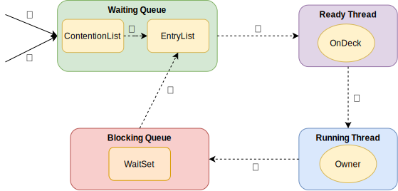

## AQS

**AQS（AbstractQueuedSynchronizer）** 是 Java 并发包 `java.util.concurrent` 中一个非常核心的抽象类，它为构建锁和其他同步器提供了一套可扩展的框架。AQS 使用一个 int 成员变量来表示同步状态，通过内置的 FIFO 队列来完成获取资源线程的排队工作。AQS 能够以非阻塞的方式实现同步器，并且可以用于实现依赖于 FIFO 等待队列的阻塞锁和相关同步器，如信号量、事件等

## CAS

**CAS（Compare-and-Swap）** 是一种用于并发编程中的关键技术，它允许在多线程环境中以原子性的方式更新变量。CAS 操作通常包含三个参数：内存位置（V）、旧值（A）和新值（B）。当执行 CAS 时，它会检查内存位置 V 的当前值是否与 A 相等，如果相等，则将 V 的值更新为 B。整个操作是原子的，即在执行过程中不会被其他线程中断

CAS 操作的典型使用场景是实现无锁的同步机制，例如在设计非阻塞数据结构时。它通过乐观锁的方式，避免了传统锁机制可能带来的性能瓶颈和死锁问题

在 Java 中，sun.misc.Unsafe 类提供了 compareAndSwapXXX 系列方法来实现CAS操作，这些方法利用了底层硬件的原子指令，如 x86 架构中的 LOCK XCHG 指令。CAS 操作也被广泛应用于 java.util.concurrent.atomic 包中的原子类，如 AtomicInteger 和 AtomicLong 等，它们利用 CAS 来保证操作的原子性

CAS 虽然强大，但也存在一些缺点，比如 ABA 问题，即如果一个变量的值在被读取和比较期间被修改了两次，即使最终值没有变化，CAS 操作也会失败。为了解决这个问题，Java 中的原子类使用了锁或其它机制来保证操作的安全性

此外，CAS 操作可能会导致活锁（livelock），即线程不断地重试操作，但因为其他线程也在不断地修改共享资源，导致操作一直无法成功。在设计并发程序时，需要仔细考虑这些因素

## 乐观锁

乐观锁是一种乐观思想，即认为读多写少，遇到并发写的可能性低，每次去拿数据的时候都认为别人不会修改，所以不会上锁，但是在更新时会判断此期间数据是否被更新采取在写时先读出当前版本号，然后加锁操作(比较跟上一次的版本号，如果一样则更新)，如果失败则要重复读-比较-写的操作java中的乐观锁基本通过 `CAS` 操作实现的，`CAS` 是一种更新的原子操作，比较当前值跟传入值是否一样，一样则更新，否则失败

## 悲观锁

悲观锁是就是悲观思想，即认为写多，遇到并发写的可能性高，每次去拿数据的时候都认为别人会修改，所以每次在读写数据的时候都会上锁，这样别人想读写这个数据就会 `block` 直到拿到锁。 java中的悲观锁就是 `synchronized` ，`AQS` 框架下的锁则是先尝试 `CAS` 乐观锁去获取锁，获取不到， 才会转换为悲观锁，如 `RetreenLock`

## 自旋锁

自旋锁原理非常简单，如果持有锁的线程能在很短时间内释放锁资源，那么那些等待竞争锁的线程就不需要做内核态和用户态之间的切换进入阻塞挂起状态，它们只需要等一等（自旋），等持有锁的线程释放锁后即可立即获取锁，这样就避免用户线程和内核的切换的消耗。 线程自旋是需要消耗 cpu 的，说白了就是让 cpu 在做无用功，如果一直获取不到锁，那线程也不能一直占用 cpu 自旋做无用功，所以需要设定一个自旋等待的最大时间。

如果持有锁的线程执行的时间超过自旋等待的最大时间扔没有释放锁，就会导致其它争用锁的线程在最大等待时间内还是获取不到锁，这时争用线程会停止自旋进入阻塞状态

### 自旋锁优缺点

自旋锁尽可能的减少线程的阻塞，这对于锁的竞争不激烈，且占用锁时间非常短的代码块来说性能能大幅度的提升，因为自旋的消耗会小于线程阻塞挂起再唤醒的操作的消耗，这些操作会导致线程发生两次上下文切换！

但是如果锁的竞争激烈，或者持有锁的线程需要长时间占用锁执行同步块，这时候就不适合使用自旋锁了，因为自旋锁在获取锁前一直都是占用 cpu 做无用功，同时有大量线程在竞争一个锁，会导致获取锁的时间很长，线程自旋的消耗大于线程阻塞挂起操作的消耗，其它需要 cpu 的线程又不能获取到 cpu ，造成 cpu 的浪费。所以这种情况下我们要关闭自旋锁

### 自旋锁的开启

| 版本   | JDK1.6             | JDK1.7 |
|------|--------------------|--------|
| 开启方式 | X:+UseSpinning     | 由jvm控制 |
| 次数控制 | XX:PreBlockSpin=10 | 由jvm控制 |

## synchronized同步锁

synchronized 它可以把任意一个非 NULL 的对象当作锁。**他属于独占式的悲观锁，同时属于可重入锁**

### synchronized作用范围

- 作用于方法时，锁住的是对象的实例(this)
- 当作用于静态方法时，锁住的是Class实例，又因为Class的相关数据存储在永久代PermGen（jdk1.8 则是 metaspace），永久代是全局共享的，因此静态方法锁相当于类的一个全局锁，会锁所有调用该方法的线程
- synchronized作用于一个对象实例时，锁住的是所有以该对象为锁的代码块。它有多个队列， 当多个线程一起访问某个对象监视器的时候，对象监视器会将这些线程存储在不同的容器中

### synchronized核心组件

- **`Wait Set：`** 哪些调用wait方法被阻塞的线程被放置在这里
- **`Contention List：`** 竞争队列，所有请求锁的线程首先被放在这个竞争队列中
- **`Entry List：`** Contention List 中那些有资格成为候选资源的线程被移动到Entry List中
- **`OnDeck：`** 任意时刻，最多只有一个线程正在竞争锁资源，该线程被成为OnDeck
- **`Owner：`** 当前已经获取到所资源的线程被称为Owner
- **`!Owner：`** 当前释放锁的线程

### synchronized实现

### JDK1.6后的优化

## ReentrantLock

### Lock接口主要方法

### tryLock、lock和lockInterruptibly

## ReentrantLock与synchronized

## 非公平锁

## 公平锁

## 可重入锁(递归锁)

## 读写锁

## 独占锁

## 共享锁

## 锁状态

### 重量级锁(Mutex Lock)

### 轻量级锁

### 偏向锁

### 锁升级

### 分段锁

## 同步锁与死锁

### 同步锁

### 死锁

### 锁优化思路

#### 减少锁持有时间

#### 减小锁粒度

#### 锁分离

#### 锁粗化

## Condition类和Object类锁方法
