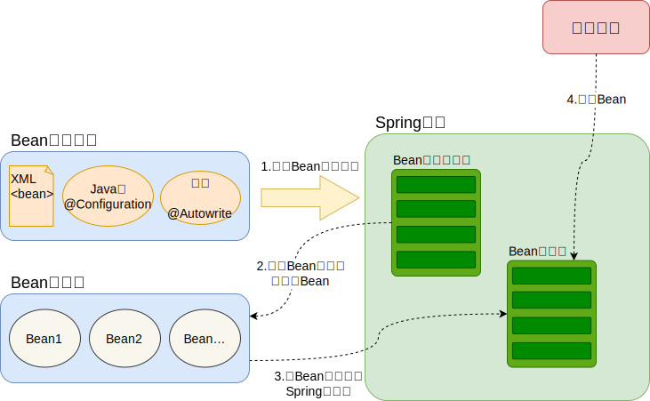
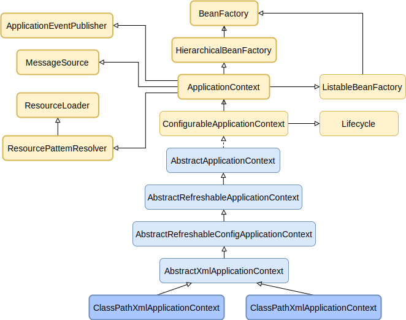

## IOC简介

Spring通过一个配置文件描述Bean及Bean之间的依赖关系，利用 Java 语言的反射功能实例化Bean并建立Bean之间的依赖关系。 Spring的IOC容器在完成这些底层工作的基础上，还提供了Bean实例缓存、生命周期管理、 Bean实例代理、事件发布、资源装载等高级服务。

## Spring 容器高层视图

Spring启动时读取应用程序提供的Bean配置信息，并在Spring 容器中生成一份相应的Bean配置注册表，然后根据这张注册表实例化Bean，装配好Bean之间的依赖关系，为上层应用提供准备就绪的运行环境。其中Bean缓存池为HashMap实现



## IOC容器实现

Spring IOC容器的设计主要是基于BeanFactory和ApplicationContext两个接口，其中ApplicationContext是BeanFactory的子接口之一。换句话说BeanFactory是Spring IOC容器所定义的最底层接口，而ApplicationContext是其高级接口之一，并且对BeanFactory功能做了许多有用的扩展，所以在绝大部分的工作场景下，都会使用ApplicationContext作为Spring IOC容器

| **容器**                     | 描述                                                                                                                                                                                            |
|----------------------------|-----------------------------------------------------------------------------------------------------------------------------------------------------------------------------------------------|
| SpringBeanFactory容器        | 最简单的容器，给DI提供了基本支持，它用 org.springframework.beans.factory.BeanFactory 接口来定义。BeanFactory 或者相关的接口，如 BeanFactoryAware，InitializingBean，DisposableBean，在 Spring 中仍然存在具有大量的与 Spring 整合的第三方框架的反向兼容性的目的 |
| SpringApplicationContext容器 | 该容器添加了更多的企业特定的功能，例如从一个属性文件中解析文本信息的能力，发布应用程序事件给感兴趣的事件监听器的能力。该容器是由 org.springframework.context.ApplicationContext 接口定义                                                                          |

### BeanFactory结构

BeanFactory是Spring框架的基础设施，面向Spring本身。ApplicationContext面向使用Spring 框架的开发者，几乎所有的应用场合我们都直接使用ApplicationContext而非底层的BeanFactory


- **BeanDefinitionRegistry注册表**

  > Spring配置文件中每一个节点元素在Spring容器里都通过一个BeanDefinition对象表示，它描述了Bean的配置信息。而BeanDefinitionRegistry接口提供了向容器手工注册BeanDefinition对象的方法

- **BeanFactory顶层接口**

  > 位于类结构树的顶端 ，它最主要的方法就是getBean(String beanName)，该方法从容器中返回特定名称的Bean，BeanFactory的功能通过其他的接口得到不断扩展

- **ListableBeanFactory**

  > 该接口定义了访问容器中Bean基本信息的若干方法，如查看Bean的个数、获取某一类型Bean的配置名、查看容器中是否包括某一Bean等方法

- **HierarchicalBeanFactory父子级联**

  > 父子级联IOC容器的接口，子容器可以通过接口方法访问父容器； 通过HierarchicalBeanFactory接口， Spring的IOC容器可以建立父子层级关联的容器体系，子容器可以访问父容器中的Bean，但父容器不能访问子容器的Bean。Spring使用父子容器实现了很多功能，比如在SpringMVC中，展现层Bean位于一个子容器中，而业务层和持久层的Bean位于父容器中。这样，展现层Bean就可以引用业务层和持久层的Bean，而业务层和持久层的Bean则看不到展现层的Bean

- **ConfigurableBeanFactory**

  > 是一个重要的接口，增强了IOC容器的可定制性，它定义了设置类装载器、属性编辑器、容器初始化后置处理器等方法

- **AutowireCapableBeanFactory自动装配**

  > 定义了将容器中的Bean按某种规则（如按名字匹配、按类型匹配等）进行自动装配的方法

- **SingletonBeanRegistry运行期间注册单例Bean**

  > 定义了允许在运行期间向容器注册单实例Bean的方法；对于单实例（ singleton）的Bean来说，BeanFactory会缓存Bean实例，所以第二次使用getBean()获取Bean时将直接从IOC容器的缓存中获取Bean实例。Spring在DefaultSingletonBeanRegistry类中提供了一个用于缓存单实例 Bean 的缓存器，它是一个用HashMap实现的缓存器，单实例的Bean以beanName为键保存在这个HashMap中

- **依赖日志框框**

  > 在初始化BeanFactory时，必须为其提供一种日志框架，比如使用Log4J， 即在类路径下提供Log4J配置文件，这样启动Spring容器才不会报错

### ApplicationContext结构

ApplicationContext由BeanFactory派生而来，提供了更多面向实际应用的功能。ApplicationContext继承了HierarchicalBeanFactory和ListableBeanFactory接口，在此基础上，还通过多个其他的接口扩展了BeanFactory的功能：



- **ClassPathXmlApplicationContext：** 默认从类路径加载配置文件
- **FileSystemXmlApplicationContext：** 默认从文件系统中装载配置文件
- **ApplicationEventPublisher：** 让容器拥有发布应用上下文事件的功能，包括容器启动事件、关闭事件等。
- **MessageSource：** 为应用提供i18n国际化消息访问的功能
- **ResourcePatternResolver ：** 所有ApplicationContext实现类都实现了类似于PathMatchingResourcePatternResolver的功能，可以通过带前缀的Ant风格的资源文件路径装载Spring的配置文件。
- **LifeCycle：** 该接口是Spring2.0加入的，该接口提供了start()和stop()两个方法，主要用于控制异步处理过程。在具体使用时，该接口同时被ApplicationContext实现及具体Bean实现，ApplicationContext会将start/stop的信息传递给容器中所有实现了该接口的Bean，以达到管理和控制JMX、任务调度等目的
- **ConfigurableApplicationContext：** 扩展于 ApplicationContext，它新增加了两个主要的方法：refresh()和close()，让ApplicationContext具有启动、刷新和关闭应用上下文的能力。在应用上下文关闭的情况下调用refresh()即可启动应用上下文，在已经启动的状态下，调用refresh()则清除缓存并重新装载配置信息，而调用close()则可关闭应用上下文

### BeanFactory与ApplicationContext的区别

- **对Bean的加载方式不同**

  > BeanFactory采用懒加载机制，只有调用getBean()时才进行对象的实例化

  > ApplicationContext采用预加载机制，应用启动后就实例化所有Bean，

- **特性不同**

  > BeanFactory接口只提供了IOC/DI的支持，常用的API是XMLBeanFactory

  > ApplicationContext继承自BeanFactory，功能更加广泛

## SpringBean

### Bean的生命周期


### Bean的作用域

- **singleton：** 在SpringIOC容器中只有一个
- **prototype：** 一个Bean存在多个实例
- **request：** 每次Http请求都创建一个Bean该作用域仅在基于web的SpringApplicationContext情形下有效。
- **session：** 在一个HTTP Session中，一个bean定义对应一个实例。该作用域仅在基于web的Spring ApplicationContext情形下有效。
- **global-session：** 在一个全局的HTTP Session中，一个bean定义对应一个实例。该作用域仅在基于web的Spring ApplicationContext情形下有效。

SpringIOC容器默认采用singleton(单例)创建Bean，使用prototype因为频繁创建和销毁Bean会造成很大的性能消耗

### 依赖注入四种方式

<!-- tabs:start -->
<!-- tab:构造器 -->

```java
public class A {
  public B b;

  public A(B b) {
      this.b = b;
  }
}
  ```

<!-- tab:set方法 -->

```java
public class A {
  public B b;

  public setB(B b) {
    this.b = b;
  }
}
```

<!-- tab:静态工厂 -->
<!-- tab:实例工厂 -->
<!-- tabs:end -->

### Bean自动装配类型

- **no：** 默认的方式是不进行自动装配，通过显式设置ref属性来进行装配
- **byName：** 通过参数名自动装配，Spring容器在配置文件中发现bean的autowire属性被设置成byName，之后容器试图匹配、装配和该bean的属性具有相同名字的bean
- **byType：** 通过参数类型自动装配，Spring容器在配置文件中发现bean的autowire属性被设置成byType，之后容器试图匹配、装配和该bean的属性具有相同类型的bean。如果有多个bean符合条件，则抛出错误
- **constructor：** 这个方式类似于byType， 但是要提供给构造器参数，如果没有确定的带参数 的构造器参数类型，将会抛出异常
- **autodetect：** 首先尝试使用constructor来自动装配，如果无法工作，则使用byType方式

## 其他问题

### 三级缓存解决循环依赖的原理
