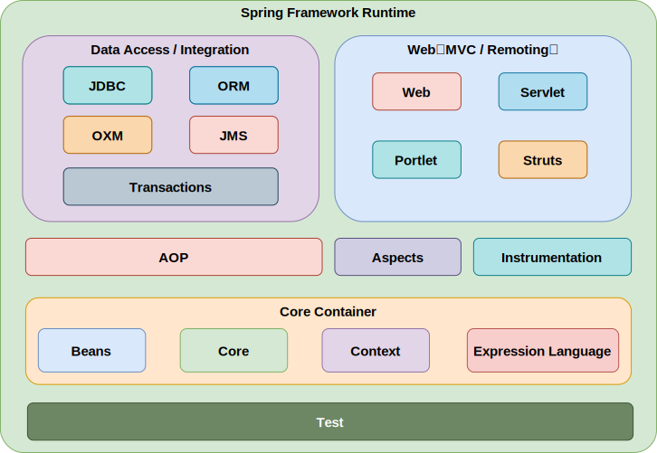

## Spring核心组件

## Spring核心

IOC容器和AOP模块。通过IOC容器管理POJO对象以及他们之间的耦合关系；通过AOP以动态非侵入的方式增强服务。IOC让相互协作的组件保持松散的耦合，而AOP编程允许你把遍布于应用各层的功能分离出来形成可重用的功能组件。

## Spring框架中使用的设计模式

- **单例模式：** Spring创建Bean对象的默认方式就是单例
- **代理模式：** SpringAOP中使用了代理模式
- **模板模式：** RestTemplate、RedisTemplate等
- **工厂模式：** Spring中的BeanFactory就是典型的工厂方法模式
- **观察者模式：** Spring中的Event和Listener
- **责任链模式：** DispatcherServlet中使用到了
