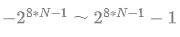
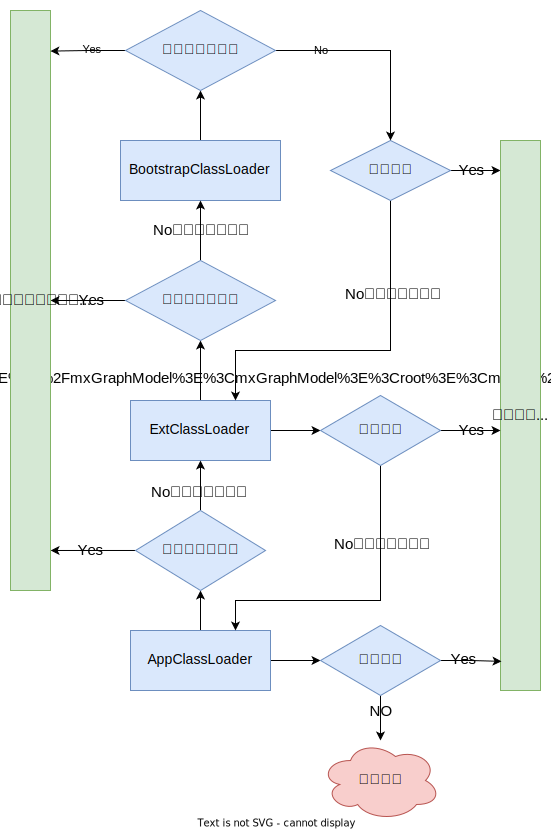

## 基础数据类型

> 而Java又将基础数据类型分为8种，分别为：`byte`、`short`、`int`、`long`、`float`、`double`、`char`、`boolean`，同样该8中数据类型同样对应了8种引用数据类型

### 8种基础类型相关属性

| 类型          | 占用字节数   | 默认值            | 对应引用类型(包装类型) |
|-------------|---------|----------------|--------------|
| **byte**    | 1       | (byte)0        | Byte         |
| **short**   | 2       | (short)0       | Short        |
| **int**     | 4       | 0              | Integer      |
| **long**    | 8       | 0L             | Long         |
| **float**   | 4       | 0.0F           | Float        |
| **double**  | 8       | 0.0D           | Double       |
| **char**    | 2       | '/u0000'(null) | Character    |
| **boolean** | 1       | false          | Boolean      |

> 整数数值类型如byte、short、int、long取值可将公式中N替换为占用字节数  计算获得有符号的取值范围，用最大值减去最小值可得无符号取值的上限，无符号最小值为0

### 基础数据类型之间的转换

> 数值型 `byte`、`short`、`int`、`long`、`float`、`double` 以及字符型 `char` 按照占用字节数的大小比较区分为 **低精度** 与 **高精度** ,当低精度值赋值给高精度值时触发 [隐式(自动)转换](/Java基础/基础知识.md?id=隐式自动类型转换)，反之需要 [显示(强制)转换](/Java基础/基础知识.md?id=强制显式类型转换)，`boolean` 是不能参与类型转换的，这与C语言是存在区别的

## 引用数据类型

> Java将数据、接口、类定义为引用数据类型，当该类型的变量创建时需要先开辟内存空间，然后将引用(相当于指针)指向对应的内存空间，其中 `Integer`、`String` 比较特殊

## 自动拆箱与自动装箱

> - **自动拆箱：** 将包装类型赋值给对应的基本类型时，触发自动拆箱操作
> - **自动装箱：** 将基本类型赋值给对应的包装类型时，触发自动装箱操作

### 自动拆装箱过程中的问题

> 当包装类型为 `null` 时赋值给基础数据类型会报错

```java
public class TestDemo {
    public static void main(String[] args) {
        Integer i = null;
        int num = i; // error
    }
}
```

> 当基础类型与包装类型做 `==` 运算时，包装类型会被转换为基础数据类型，从而 `==` 比较的其实为数值大小，而非地址值

```java
public class TestDemo {
    public static void main(String[] args) {
        int i1 = 1000;
        Integer i2 = new Integer(1000);
        System.out.println(i1 == i2); // true
    }
}
```

## 隐式(自动)类型转换

> 根据精度从低到高，能够隐式转换，数据类型将自动提高，其转换方向如下

`byte` `short` `char` ---> `int` ---> `long` ---> `float` ---> `double`

```java
public class TestDemo {
    public static void main(String[] args) {
        byte b=6;
        int i=b; // i = 6
        float f=i; // f = 1.0F
        double d=f; // d = 1.0D
    }
}
```

## 强制(显式)类型转换

> 将高精度的值强制赋值给低精度的变量，该操作需要显示的编写转换类型，该操作会造成精度丢失（高精度的空间大于低精度的存储空间，此时强制转换会截断数据，且赋值后不可逆，从而导致精度丢失）

```java
public class TestDemo {
    public static void main(String[] args) {
        float f = 1.2F;
        int i = (int) f; // i = 1
        f = i; // f = 1.0F
        System.out.println("f = " + f);
    }
}
```

## 数值缓存

> Java将数值 `-128` ~ `127` 存放在 [常量池](/JVM/JVM内存模型.md?id=常量池) 中，当Integer类变量被直接赋值该范围的值时，会直接指向常量池中的缓存值，并非重新开辟空间，只有当最终值不在该范围内或通过 `new` 关键字创建新实例会指向新的内存地址


```java
public class TestDemo {
    public static void main(String[] args) {
        Integer i1 = 127;
        Integer i2 = 128;
        Integer i3 = i2 - 1;
        Integer i4 = new Integer(127);
        System.out.println(i1 == i2); // false
        System.out.println(i1 == i3); // true
        System.out.println(i1 == i4); // false
    }
}
```

## String

### new与直接赋值的区别

> - **new：** 创建一个新的实例，且单独开辟内存空间
> - **直接赋值：** 该值存放于 [常量池](/JVM/JVM内存模型.md?id=常量池) 中，当多个String直接赋值同一个字符串时，其地址值相同

```java
public class TestDemo {
    public static void main(String[] args) {
        String s1 = "abc"; // "abc"来源于常量池
        String s2 = "abc";
        String s3 = new String("abc") // "abc"来源于常量池，但new重新开辟了空间存储"abc"
        String s4 = new String(s2)
        System.out.println(s1 == s2); // true
        System.out.println(s1 == s3); // false
        System.out.println(s2 == s4); // false
    }
}
```

### String为什么不可变

> 其原因并不因为是底层实现 `char[]` 由final修饰，毕竟final修饰的引用类型仅仅是不让修改其地址指向罢了，不可变其关键在于对其数据的封装，`char[]` 被 `private` 修饰同时String类也通过final修饰禁止被继承，阻止了通过访问成员变量以及通过继承访问父类成员变量，而且String类中的每次字符串操作后都会创建一个新的对象。综上所述最终实现String实例不可变

### String、StringBuffer、StringBuilder三者的区别

> - **String：** 值是不可变的，每次对String的操作都会生成新的String对象
> - **StringBuffer：** 可变类和线程安全的字符串操作类，方法由synchronize关键字修饰，任何对它指向的字符串的操作都不会产生新的对象。每个StringBuffer对象都有一定的缓冲区容量，当字符串大小没有超过容量时，不会分配新的容量，当字符串大小超过容量时，会自动增加容量
> - **StringBuilder：** 相较于StringBuffer有速度优势，所以多数情况下建议使用StringBuilder类。然而在应用程序要求线程安全的情况下，则必须使用StringBuffer类

## static关键字的特点

> static修饰的类只能是内部类，且静态内部类只能访问外部类的静态变量及静态方法

> static修饰的方法，可以直接通过类名调用，不需要实例对象调用，且不能在方法中调用实例变量或实例方法

> static修饰的变量，全局只有一个

## 重载与重写

> **重载：** 一个类中存在多个方法名称相同，而参数列表不同的方法，这种行为叫重载

```java
public interface TestDemo{
    void add(int i,int n){}
    //void add(int m,int n){} 不构成重载，参数不同体现在类型、顺序、个数上的不同而不是参数名
    void add(float f,float x){}
    void add(int i,float f){}
}
```

> **重写：** 一个类对父类的定义的方法进行重新实现，这种行为重写/覆盖

```java
class Person{
  void eat(){
      System.out.println("该吃饭了");
  }
}
class Man extends Person{ 
  @Override
  void eat(){ //重新实现了父类的方法
      System.out.println("我爱吃肉");
  }
}
```

## 为什么要重写equals和hashCode

> 重写equals是因为equals的默认实现是==，比较的是地址值，而很多情况下需要根据具体的内容比较去区分对象是不是同一个，此时就需要重写equals

> 重写hashCode是因为Java中Set与Map都是先通过hash值去判断两个对象是不是同一个，而默认的hashCode是通过地址值计算的，两个new创建的对象地址一定是不一样的，此时Set和Map就会认为两个对象不相等

> PS: 
> - equals相等时hashCode值也要相等
> - hashCode相等时，equals不一定相等

## 类初始化顺序

```
父类静态变量-->父类静态代码块-->子类静态变量-->子类静态代码块-->父类普通变量
-->父类普通代码块-->父类构造函数-->子类普通变量-->子类普通代码块-->子类构造函数
```

## this与super的指向

> - **this：** this指对象本身，this.xx指向对象的成员变量，this.xx()指向对象的成员方法，this()指向本类的空参/含参构造器

> - **super：** super指向父类空间，super.xx指向父类变量，super.xx()指向父类方法，super()指向父类的空参/含参构造器

> 子类构造器中会默认调用super()

## throw与throws的区别

- **throw：** 在函数体内使用，可以抛出指定类型的异常，执行带throw会终止其功能将问题抛给调用者
- **throws：** 在函数声明上，可以指定多个可能会发生的异常，并不一定发生该异常

## try-catch-finally

> try-catch只能捕获Exception不嫩捕获Error
>
> try-catch的catch异常应从子类异常开始捕获，再是父类异常
>
> try-catch-finally中无论是否发生异常都会执行到finally代码块中的代码

## 泛型擦除

> 在程序运行期间，所有的泛型信息都会被消除

## 类加载器

- **Bootstrap classLoader：** 主要负责加载核心的类库(java.lang.*等)，构造ExtClassLoader和APPClassLoader
- **ExtClassLoader：** 主要负责加载jre/lib/ext目录下的一些扩展的jar。
- **AppClassLoader：** 主要负责加载应用程序的主函数类

### 双亲委派机制

> 作用：
> - 防止重复加载同一个class对象。
> - 保证核心class对象不能被篡改。保证了Class执行安全。



## 动态代理

### JDK动态代理

> JDK中的动态代理是通过反射类Proxy以及InvocationHandler回调接口实现的，但是JDK中所有要进行动态代理的类必须要实现一个接口，也就是说只能对该类所实现接口中定义的方法进行代理，这在实际编程中有一定的局限性，而且使用反射的效率也不高

### Cglib动态代理

> 使用cglib是实现动态代理，不受代理类必须实现接口的限制，因为cglib底层是用ASM框架，使用字节码技术生成代理类，你使用Java反射的效率要高，cglib不能对声明final的方法进行代理，因为cglib原理是动态生成被代理类的子类