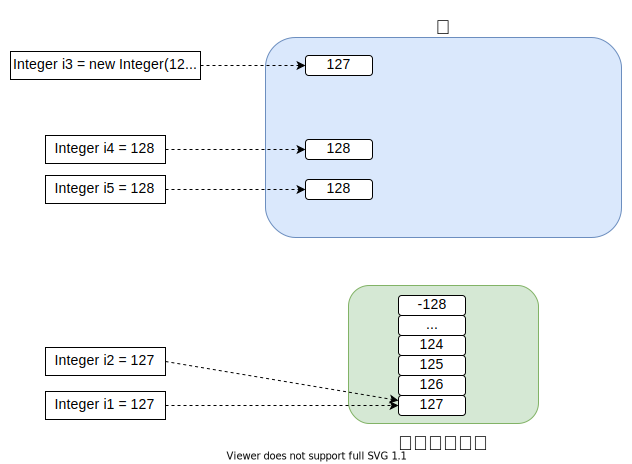

> Java中数据类型分为两大类，分别为 **基础数据类型** 与 **引用数据类型**

## 基础数据类型

> 而Java又将基础数据类型分为8种，分别为：`byte`、`short`、`int`、`long`、`float`、`double`、`char`、`boolean`，同样该8中数据类型同样对应了8种引用数据类型

### 8种基础类型相关属性

| 类型        | 占用字节数 | 默认值         | 对应引用类型(包装类型) |
| ----------- |---------| -------------- |--------------|
| **byte**    | 1       | 0              | Byte         |
| **short**   | 2       | 0              | Short        |
| **int**     | 4       | 0              | Integer      |
| **long**    | 8       | 0L             | Long         |
| **float**   | 4       | 0.0F           | Float        |
| **double**  | 8       | 0.0D           | Double       |
| **char**    | 2       | '/uoooo'(null) | Character    |
| **boolean** | 1       | false          | Boolean      |

### 基础数据类型之间的转换

> 数值型 `byte`、`short`、`int`、`long`、`float`、`double` 以及字符型 `char` 按照占用字节数的大小比较区分为 **低精度** 与 **高精度**,
当低精度值赋值给高精度值时触发 [隐式(自动)转换](/Java基础/数据类型.md?id=隐式(自动)类型转换) ，反之需要 [显示(强制)转换](/Java基础/数据类型.md?id=强制(显式)类型转换)，
`boolean` 是不能参与类型转换的，这与C语言是存在区别的

## 引用数据类型

> Java将数据、接口、类定义为引用数据类型，当该类型的变量创建时需要先开辟内存空间，然后将引用(相当于指针)指向对应的内存空间，其中 `Integer`、`String` 比较特殊

## 自动拆箱与自动装箱

- **自动拆箱：** 将包装类型赋值给对应的基本类型时，触发自动拆箱操作
- **自动装箱：** 将基本类型赋值给对应的包装类型时，触发自动装箱操作

### 自动拆装箱过程中的问题

1. 当包装类型为 `null` 时赋值给基础数据类型会报错
   ```java
   Integer i = null;
   int num = i; // error
   ```
2. 当基础类型与包装类型做 `==` 运算时，包装类型会被转换为基础数据类型，从而 `==` 比较的其实为数值大小，而非地址值
   ```java
   int i1 = 1000;
   Integer i2 = new Integer(1000);
   System.out.println(i1 == i2); // true
   ```

## 隐式(自动)类型转换

> 根据精度从低到高，能够隐式转换，数据类型将自动提高，其转换方向如下

`byte` `short` `char` ---> `int` ---> `long` ---> `float` ---> `double`

```java
byte b = 6;
int i = b; // i = 6
float f = i; // f = 1.0F
double d = f; // d = 1.0D
```

## 强制(显式)类型转换

> 将高精度的值强制赋值给低精度的变量，该操作需要显示的编写转换类型，该操作会造成精度丢失（高精度的空间大于低精度的存储空间，此时强制转换会截断数据，且赋值后不可逆，从而导致精度丢失）

```java
float f = 1.2F;
int i = (int)f; // i = 1
f = i; // f = 1.0F
```

## 数值缓存

> Java将数值 `-128` ~ `127` 存放在 [常量池](/JVM/JVM内存模型.md?id=常量池)
中，当Integer类变量被直接赋值该范围的值时，会直接指向常量池中的缓存值，并非重新开辟空间，只有当最终值不在该范围内或通过 `new` 关键字创建新实例会指向新的内存地址



```java
Integer i1 = 127;
Integer i2 = 128; 
Integer i3 = i2 - 1;
Integer i4 = new Integer(127);
System.out.println(i1 == i2); // false
System.out.println(i1 == i3); // true
System.out.println(i1 == i4); // false
```

## String

### new与直接赋值的区别

- **new：** 创建一个新的实例，且单独开辟内存空间
- **直接赋值：** 该值存放于 [常量池](/JVM/JVM内存模型.md?id=常量池) 中，当多个String直接赋值同一个字符串时，其地址值相同

```java
String s1 = "abc"; // "abc"来源于常量池
String s2 = "abc";
String s3 = new String("abc") // "abc"来源于常量池，但new重新开辟了空间存储"abc"
String s4 = new String(s2)
System.out.println(s1 == s2); // true
System.out.println(s1 == s3); // false
System.out.println(s2 == s4); // false
```

### String为什么不可变

> 其原因并不因为是底层实现 `char[]` 由final修饰，毕竟final修饰的引用类型仅仅时不让修改其地址指向罢了，不可变其关键在于对其数据的封装，`char[]` 被 `private`
修饰同时String类也通过final修饰禁止被继承，阻止了通过访问成员变量以及通过继承访问父类成员变量，而且String类中的每次字符串操作后都会创建一个新的对象。综上所述最终实现String实例不可变

### String、StringBuffer、StringBuilder三者的区别

- **String：** 值不可变
- **StringBuilder：** 值可变，线程不安全但效率高
- **StringBuffer：** 值可变，方法由synchronize修饰，线程安全但效率低