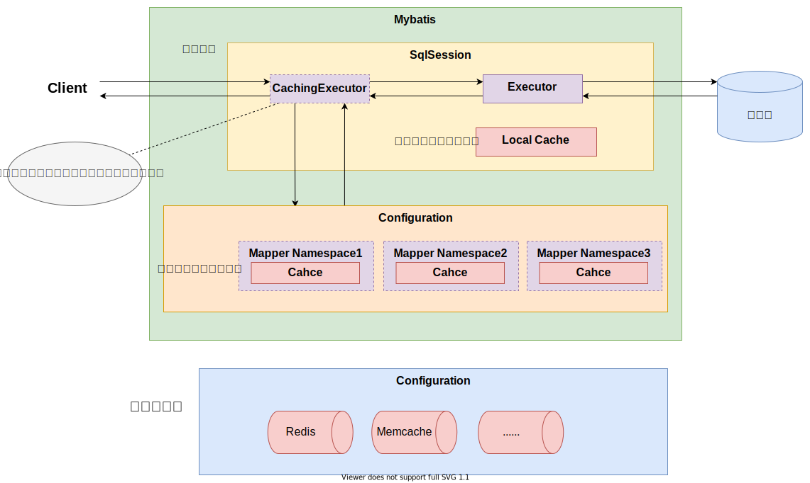

## Mybatis介绍

## Mybatis缓存

> Mybatis中有一级缓存和二级缓存，默认情况下一级缓存是开启的，而且是不能关闭的。一级缓存是指SqlSession级别的缓存，当在同一个SqlSession中进行相同的SQL语句查询时，第二次以后的查询不会从数据库查询，而是直接从缓存中获取，一级缓存最多缓存 `1024` 条SQL。二级缓存是指可以跨SqlSession的缓存。是mapper级别的缓存，对于mapper级别的缓存不同的sqlsession是可以共享的



### 一级缓存原理

> 第一次发出一个查询sql，sql查询结果写入sqlsession的一级缓存中，缓存使用的数据结构是一个map
> - `key`： MapperID+offset+limit+Sql+所有的入参
> - `value`： 用户信息

> 同一个sqlsession再次发出相同的sql，就从缓存中取出数据。如果两次中间出现commit操作（修改、添加、删除），本sqlsession中的一级缓存区域全部清空，下次再去缓存中查询不到所以要从数据库查询，从数据库查询到再写入缓存

### 二级缓存原理

> 二级缓存的范围是mapper级别（mapper同一个命名空间），mapper以命名空间为单位创建缓存数据结构，结构是map。mybatis的二级缓存是通过CacheExecutor实现的。CacheExecutor其实是Executor的代理对象。所有的查询操作，在CacheExecutor中都会先匹配缓存中是否存在，不存在则查询数据库。
> - `key`： MapperID+offset+limit+Sql+所有的入参

### 二级缓存开启方式

#### 全局配置开启二级缓存

**通过xml文件进行配置**

```xml

<settings>
    <!-- 开启二级缓存(整体开启) -->
    <setting name="cacheEnabled" value="true"/>
</settings>
```

**通过yml/yaml文件进行配置**

```yaml
mybatis:
  configuration:
    cache-enabled: true
```

#### 在Mapper映射文件中配置cache节点

```xml
<!-- 开启本mapper所在namespace的二级缓存 -->
<cache eviction="FIFO" flushInterval="60000" size="512" readOnly="true"/>
```

> 相关配置属性：
> - `eviction:` 清除策略
>   - `LRU:` 最近最少使用：移除最长时间不被使用的对象。默认清除策略
>   - `FIFO:` 先进先出：按对象进入缓存的顺序来移除它们。
>   - `SOFT:` 软引用：基于垃圾回收器状态和软引用规则移除对象。
>   - `WEAK:` 弱引用：更积极地基于垃圾收集器状态和弱引用规则移除对象。
> - `flushInterval:` 刷新间隔时间 单位毫秒ms
> - `size:` 缓存最大占用空间
> - `readOnly:` 只读

#### SQL禁用二级缓存与清空二级缓存配置

##### 禁用二级缓存

> 通过设置 `useCache="false"` 可以禁用单个SQL使用缓存

```xml
<!--根据店id和职位查询员工-->
<select id="getAllTableA" resultType="string" useCache="false">
    select * from table_a
</select>
```

##### 清空二级缓存

> 通过设置 `flushCache="true"` 可以清空该namespace下的缓存

```xml

<update id="updateTableAData" flushCache="true" parameterType="xx.xx">
    update table_a set name = #{name} where id = #{id}
</update>
```
