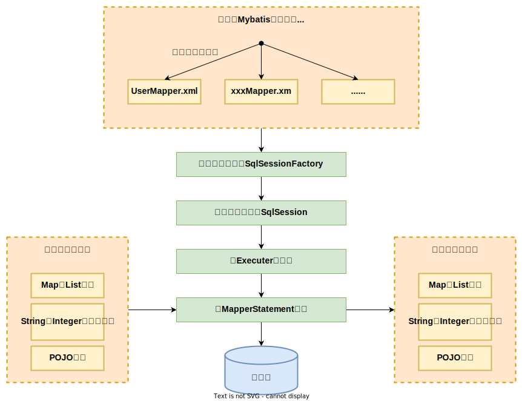

## 什么时Mybatis？

> 1. Mybatis是一个半ORM(对象关系映射)的框架，内部通过对JDBC的封装实现。减少了开发过程中花费大量精力去加载驱动、创建连接、创建statement等繁杂的操作，只需要关注SQL语句本身。
> 2. Mybatis可以通过XML或注解来配置和映射原生信息，将Entity映射成数据库中的记录，避免了绝大部分JDBC代码、手动设置参数以及手动封装结果集
> 3. 通过XML文件或注解的方式将要执行的各种statement配置起来，并通过Java对象和statement中的sql的动态参数进行映射生成最终的sql语句，最后由mybatis框架执行sql并将结果映射为java对象返回

## MyBatis的工作原理



> 1. **读取MyBatis配置文件：** `mybatis-config.xml`为MyBatis的全局配置文件，配置了MyBatis的运行环境等信息，例如数据库连接信息。
> 2. **加载映射文件：** 映射文件即SQL映射文件，该文件中配置了操作数据库的SQL语句，需要在MyBatis配置文件mybatis-config.xml中加载。mybatis-config.xml文件可以加载多个映射文件，每个文件对应数据库中的一张表。
> 3. **构造会话工厂：** 通过MyBatis的环境等配置信息构建会话工厂SqlSessionFactory。
> 4. **创建会话对象：** 由会话工厂创建SqlSession对象，该对象中包含了执行SQL语句的所有方法。
> 5. **Executor执行器：** MyBatis底层定义了一个Executor接口来操作数据库，它将根据SqlSession传递的参数动态地生成需要执行的SQL语句，同时负责查询缓存的维护。
> 6. **MappedStatement对象：** 在Executor接口的执行方法中有一个MappedStatement类型的参数，该参数是对映射信息的封装，用于存储要映射的SQL语句的id、参数等信息。
> 7. **输入参数映射：** 输入参数类型可以是Map、List等集合类型，也可以是基本数据类型和POJO类型。输入参数映射过程类似于JDBC对preparedStatement对象设置参数的过程。
> 8. **输出结果映射：** 输出结果类型可以是Map、 List等集合类型，也可以是基本数据类型和POJO类型。输出结果映射过程类似于JDBC对结果集的解析过程

## Mybatis的优缺点

### 优点

> 1. 基于SQL语句编程，SQL语句写在XML中，解除了sql与程序代码的耦合，便于统一管理。提供xml标签，支持编写动态sql，可以重用
> 2. 与JDBC相比减少了代码量，消除了JDBC大量的冗余代码，接替了手动处理连接创建、调用、销毁
> 3. 提供相关映射标签，支持对象与数据库的ORM字段关系映射。提供对象关系银蛇标签，支持对象关系维护
> 4. 与数据库具有很好的兼容性
> 5. 与Spring集成方便
> 6. 能很好对SQL进行性能优化和调整

### 缺点

> 1. SQL语句编写工作量较大，数据量大时对开发人员的SQL功底有一定的要求
> 2. SQL依赖于数据库，导致数据库移植性差，不能随意更换、调整数据库

## #{}与${}的区别

> - `#{}` 为预编译处理，Mybatis在处理 `#{}` 时会将sql中的 `#{}` 替换为 `?` ，调用PreparedStatement的set方法进行赋值
> - `${}` 为字符串拼接，Mybatis处理 `${}` 时会将sql中的 `${}` 直接替换成对应的值
> - `#{}` 能有效的防止sql注入，提高安全性

## 实体属性名与表中字段不一致

> 1. 通过在sql中设置别名返回与实体属性名对应的别名
> 2. 通过 `<resultMap>` 设置实体属性名与表字段的映射关系

## like模糊查询怎么写

### Java代码中拼接

> java代码中完成通配符添加，sql中通过 `#{}` 注入

```java
String key = "ABC";
String likeStr = "%" + key + "%";
List<Table> tables = mapper.qryList(likeStr);
```

```xml
<select id="xxxx">
     select * from table where name like #{likeStr}
</select>
```

### SQL拼接

> sql中直接拼接通配符，可能造成sql注入问题

```xml
<select id="xxxx">
     select * from table where name like '%${key}%'
</select>
```

### SQL拼接函数

> sql中调用拼接函数拼接通配符，可以避免出现sql注入问题

```xml
<select id="xxxx">
     select * from table where name like concat('%',#{key},'%')
</select>
```

## mapper中如何传递多个参数？

### 通过参数索引位

> 通过 `#{n}` 实现，n为参数索引位

```java
User findUser(Integer age,Integer sex);
```

```xml
<select id="findUser">
     select * from table where age = ${0} and sex = #{1}
</select>
```

### 使用注解

> 使用 `@Param` 注解

```java
User findUser(@Param("age") Integer age,@Param("sex") Integer sex);
```

```xml
<select id="findUser">
     select * from table where age = ${age} and sex = #{sex}
</select>
```

## Mapper接口的工作原理

> Mapper接口没有实现类，当调用接口时通过全限名(例：com.xxxx.user.mapper.UserMapper)+方法名拼接字符串作为Key值(例：com.xxxx.user.mapper.UserMapper.findUserByName)，可唯一定位一个MapperStatement。在xml中的每一个 `<select>` 、`<insert>`、`<update>`、`<delete>` 标签都会被解析成一个MapperStatement对象。Mapper接口采用JDK动态代理，Mybatis在运行时生成代理对象proxy，代理对象会拦截接口方法，转而执行MapperStatement所代表的sql，然后将sql执行结果封装放回

## Mapper接口可以重载吗？

> Mapper接口中的方法不能进行重载，因为采用 **全限名 + 方法名** 的保存和寻找策略。

## Mybatis动态SQL有什么用

> 根据标签中表达式的值，完成逻辑判断并动态拼接sql的功能，提高了单个接口的重用性

## XML映射文件中有哪些创建的标签

**定义SQL**

> - **`<insert>`**
> - **`<select>`**
> - **`<update>`**
> - **`<delete>`**

**格式化**

> - **`<where>`：** 动态添加 `where` 关键字，并处理条件开头通过动态sql可能多出来的 `AND` | `OR`
> - **`<set>`：** 当动态sql拼接时，`set` 后未设置更新字段及其值时去除多余的 `set` 关键字
> - **`<trim>`：** 与where关键字功能相似，区别在于该标签可以指定要去除的关键字

**动态SQL**

> - **`<if>`：** 当 `test` 表达式成立时，拼接标签中的sql
> - **`<foreac>`：** 循环遍历集合元素，常用于 `in` 和 `insert into values`
> - **`<choose>`：** 相当于java中的switch ，当内部按顺序任意一个 `<when>` 条件成即结束，如果都不满足则使用 `<ootherwise>`
> - **`<when>`：** 相当于switch语句中的case，默认带break的那种
> - **`<ootherwise>`：** 相当于switch语句中的default
> - **`<bind>`：**

**结果映射**

> - **`<resultMap>`：** 结果映射集
> - **`<id>`：** 设置表主键字段与属性的关联
> - **`<result>`：** 设置属性与字段的关联
> - **`<association>`：** 设置属性与记录属于一对一关联关系，常用与属性为其他对象
> - **`<collection>`：** 设置属性与记录属于一对多关联关系，常用于属性为集合

**其他**

> - **`<sql>`：** 定义SQL片段
> - **`<include>`：** 导入sql片段
> - **`<selectKey>`：** 设置主键生成策略

## 关联查询结果封装

### 一对一

```html
<select id="findUser" resultMap="bindEntity">
    select * from student s,class c where s.c_id = c.c_id and s.s_id = #{id}
</select>
<resultMap id="bindEntity" resultType="student">
    <id property="id" column="s_id"/>
    <result property="name" column="s_name"/>
    <association property="class" javaType="class">
        <id property="id" column="c_id"/>
        <result property="name" column="c_name"/>
    </association>
</resultMap>
```

### 一对多

```html
 <select id="findUser" resultMap="bindEntity">
    select * from class c,student s where c.c_id = s.c_id and c.c_id = #{id}
</select>
<resultMap id="bindEntity" resultType="class">
    <id property="id" column="c_id"/>
    <result property="name" column="c_name"/>
    <collection property="class" javaType="class">
        <id property="id" column="c_id"/>
        <result property="name" column="c_name"/>
    </collection>
</resultMap>
```

## Mybatis缓存

> Mybatis中有一级缓存和二级缓存，默认情况下一级缓存是开启的，而且是不能关闭的。一级缓存是指SqlSession级别的缓存，当在同一个SqlSession中进行相同的SQL语句查询时，第二次以后的查询不会从数据库查询，而是直接从缓存中获取，一级缓存最多缓存 `1024` 条SQL。二级缓存是指可以跨SqlSession的缓存。是mapper级别的缓存，对于mapper级别的缓存不同的sqlsession是可以共享的


### 一级缓存原理

> 第一次发出一个查询sql，sql查询结果写入sqlsession的一级缓存中，缓存使用的数据结构是一个map
> - `key`： MapperID+offset+limit+Sql+所有的入参
> - `value`： 用户信息

> 同一个sqlsession再次发出相同的sql，就从缓存中取出数据。如果两次中间出现commit操作（修改、添加、删除），本sqlsession中的一级缓存区域全部清空，下次再去缓存中查询不到所以要从数据库查询，从数据库查询到再写入缓存

### 二级缓存原理

> 二级缓存的范围是mapper级别（mapper同一个命名空间），mapper以命名空间为单位创建缓存数据结构，结构是map。mybatis的二级缓存是通过CacheExecutor实现的。CacheExecutor其实是Executor的代理对象。所有的查询操作，在CacheExecutor中都会先匹配缓存中是否存在，不存在则查询数据库。
> - `key`： MapperID+offset+limit+Sql+所有的入参

### 二级缓存开启方式

#### 全局配置开启二级缓存

**通过xml文件进行配置**

```xml

<settings>
    <!-- 开启二级缓存(整体开启) -->
    <setting name="cacheEnabled" value="true"/>
</settings>
```

**通过yml/yaml文件进行配置**

```yaml
mybatis:
  configuration:
    cache-enabled: true
```

#### 在Mapper映射文件中配置cache节点

```xml
<!-- 开启本mapper所在namespace的二级缓存 -->
<cache eviction="FIFO" flushInterval="60000" size="512" readOnly="true"/>
```

> 相关配置属性：
> - `eviction:` 清除策略
>   - `LRU:` 最近最少使用：移除最长时间不被使用的对象。默认清除策略
>   - `FIFO:` 先进先出：按对象进入缓存的顺序来移除它们。
>   - `SOFT:` 软引用：基于垃圾回收器状态和软引用规则移除对象。
>   - `WEAK:` 弱引用：更积极地基于垃圾收集器状态和弱引用规则移除对象。
> - `flushInterval:` 刷新间隔时间 单位毫秒ms
> - `size:` 缓存最大占用空间
> - `readOnly:` 只读

#### SQL禁用二级缓存与清空二级缓存配置

##### 禁用二级缓存

> 通过设置 `useCache="false"` 可以禁用单个SQL使用缓存

```xml
<!--根据店id和职位查询员工-->
<select id="getAllTableA" resultType="string" useCache="false">
    select * from table_a
</select>
```

##### 清空二级缓存

> 通过设置 `flushCache="true"` 可以清空该namespace下的缓存

```xml
<update id="updateTableAData" flushCache="true" parameterType="xx.xx">
    update table_a set name = #{name} where id = #{id}
</update>
```
