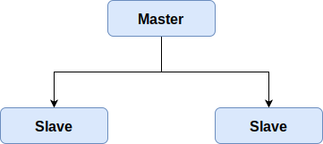
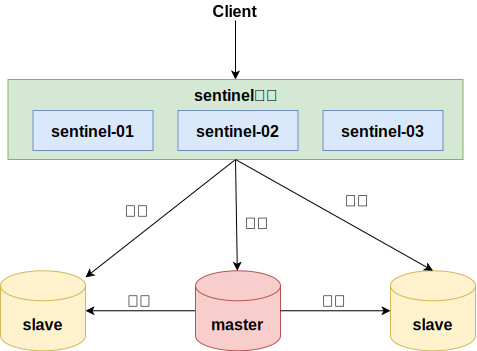
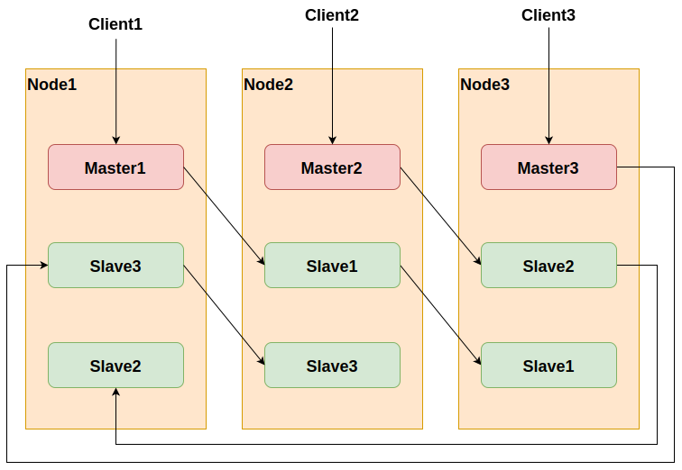

## 主从架构

### slaveof命令

- 建立主从命令： `slaveof ip port`
- 取消主从命令： `slaveof no one`

### 配置文件

redis.conf 配置文件配置

- 格式： `slaveof ip port`
- 从节点只读： `slave-read-only yes`

### 复制过程

1. 从节点执行 slaveof 命令
2. 从节点只是保存了 slaveof 命令中主节点的信息，并没有立即发起复制
3. 从节点内部的定时任务发现有主节点的信息，开始使用 socket 连接主节点
4. 连接建立成功后，发送 ping 命令，希望得到 pong 命令响应，否则会进行重连
5. 如果主节点设置了权限，那么就需要进行权限验证，如果验证失败，复制终止
6. 权限验证通过后，进行数据同步，这是耗时最长的操作，主节点将把所有的数据全部发送给从节点
7. 当主节点把当前的数据同步给从节点后，便完成了复制的建立流程。接下来，主节点就会持续的把写命令发送给从节点，保证主从数据一致性

## Sentinel哨兵模式

哨兵是 redis 集群结构中非常重要的一个组件，哨兵的出现主要是解决了主从复制出现故障时需要人为干预的问题

主要有以下功能：

- 集群监控：负责监控 redis master 和 slave 进程是否正常工作
- 消息通知：如果某个 redis 实例有故障，那么哨兵负责发送消息作为报警通知给管理员
- 故障转移：如果 master node 挂掉了，会自动转移到 slave node 上
- 配置中心：如果故障转移发生了，通知 client 客户端新的 master 地址

哨兵用于实现 redis 集群的高可用，本身也是分布式的，作为一个哨兵集群去运行，互相协同工作

- 哨兵机制建立了多个哨兵节点(进程)，共同监控数据节点的运行状况
- 同时哨兵节点之间也互相通信，交换对主从节点的监控状况
- 每隔1秒每个哨兵会向整个集群：Master + Slave + 其他 Sentinel 进程，发送一次ping命令做一次心跳检测

## Redis Cluster方案

Redis Cluster 是一种服务端 Sharding 技术， 3.0 版本开始正式提供。 Redis Cluster 并没有使用一致性 hash ，而是采用 slot (槽)的概念，一共分成 16384 个槽。将请求发送到任意节点，接收到请求的节点会将查询请求发送到正确的节点上执行

## 三者之间的区别

- **主从模式：** 读写分离、备份，一个Master可以有多个Slaves
- **哨兵sentinel：** 监控、自动转移，哨兵发现主服务器挂了后，就会从 slave 中重新选举一个主服务器
- **集群：** 为了解决单机 Redis 容量有限的问题，将数据按一定的规则分配到多台机器，内存/QPS 不受限于单机，可受益于分布式集群高扩展性
