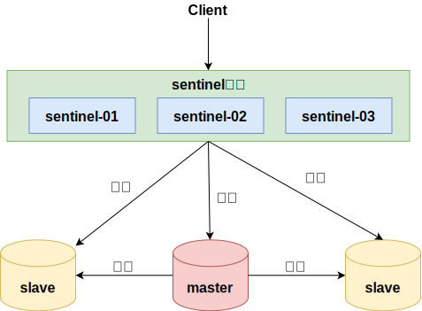
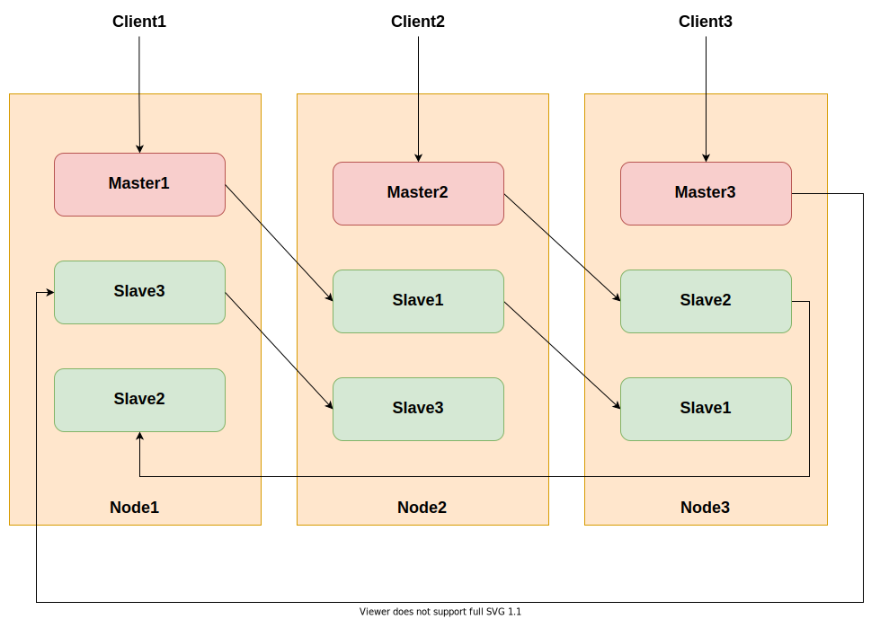

## 哨兵模式

> sentinel，中文名是哨兵。哨兵是 redis 集群机构中非常重要的一个组件，主要有以下功能：
> - 集群监控：负责监控redis master和slave进程是否正常工作。
> - 消息通知：如果某个redis实例有故障，那么哨兵负责发送消息作为报警通知给管理员。
> - 故障转移：如果master node挂掉了，会自动转移到slave node上。
> - 配置中心：如果故障转移发生了，通知client客户端新的master地址

> 哨兵用于实现redis集群的高可用，本身也是分布式的，作为一个哨兵集群去运行，互相协同工作。
> - 故障转移时，判断一个master node是否宕机了，需要大部分的哨兵都同意才行，涉及到了分布式选举的问题。
> - 即使部分哨兵节点挂掉了，哨兵集群还是能正常工作的，因为如果一个作为高可用机制重要组成部分的故障转移系统本身是单点的，那就很坑爹了

> PS: 
> 1. 哨兵至少需要3个实例，来保证自己的健壮性
> 2. 哨兵+redis主从的部署架构，是不保证数据零丢失的，只能保证redis集群的高可用性

## Redis Cluster方案

> Redis Cluster是一种服务端Sharding技术，3.0版本开始正式提供。Redis Cluster并没有使用一致性hash，而是采用slot(槽)的概念，一共分成16384个槽。将请求发送到任意节点，接收到请求的节点会将查询请求发送到正确的节点上执行

## 主从架构