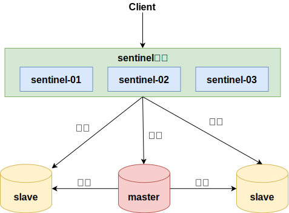

## 主从架构

### slaveof命令

- 建立主从命令： `slaveof ip port`
- 取消主从命令： `slaveof no one`

### 配置文件

redis.conf 配置文件配置

- 格式： `slaveof ip port`
- 从节点只读： `slave-read-only yes`

### 复制过程

1. 从节点执行 slaveof 命令
2. 从节点只是保存了 slaveof 命令中主节点的信息，并没有立即发起复制
3. 从节点内部的定时任务发现有主节点的信息，开始使用 socket 连接主节点
4. 连接建立成功后，发送 ping 命令，希望得到 pong 命令响应，否则会进行重连
5. 如果主节点设置了权限，那么就需要进行权限验证，如果验证失败，复制终止
6. 权限验证通过后，进行数据同步，这是耗时最长的操作，主节点将把所有的数据全部发送给从节点
7. 当主节点把当前的数据同步给从节点后，便完成了复制的建立流程。接下来，主节点就会持续的把写命令发送给从节点，保证主从数据一致性

## 哨兵模式

sentinel ，中文名是哨兵。哨兵是 redis 集群结构中非常重要的一个组件，主要有以下功能：

- 集群监控：负责监控 redis master 和 slave 进程是否正常工作。
- 消息通知：如果某个 redis 实例有故障，那么哨兵负责发送消息作为报警通知给管理员。
- 故障转移：如果 master node 挂掉了，会自动转移到 slave node 上。
- 配置中心：如果故障转移发生了，通知 client 客户端新的 master 地址

哨兵用于实现 redis 集群的高可用，本身也是分布式的，作为一个哨兵集群去运行，互相协同工作。

- 故障转移时，判断一个 master node 是否宕机了，需要大部分的哨兵都同意才行，涉及到了分布式选举的问题。
- 即使部分哨兵节点挂掉了，哨兵集群还是能正常工作的，因为如果一个作为高可用机制重要组成部分的故障转移系统本身是单点的，那就很坑爹了

PS:

1. 哨兵至少需要 3 个实例，来保证自己的健壮性
2. 哨兵+ redis 主从的部署架构，是不保证数据零丢失的，只能保证 redis 集群的高可用性

## Redis Cluster方案

Redis Cluster 是一种服务端 Sharding 技术， 3.0 版本开始正式提供。 Redis Cluster 并没有使用一致性 hash ，而是采用 slot (槽)的概念，一共分成 16384 个槽。将请求发送到任意节点，接收到请求的节点会将查询请求发送到正确的节点上执行
