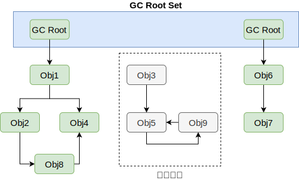
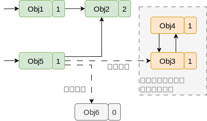
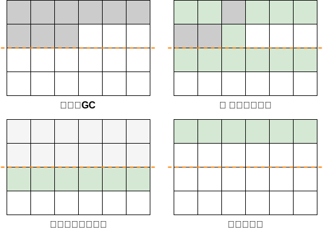
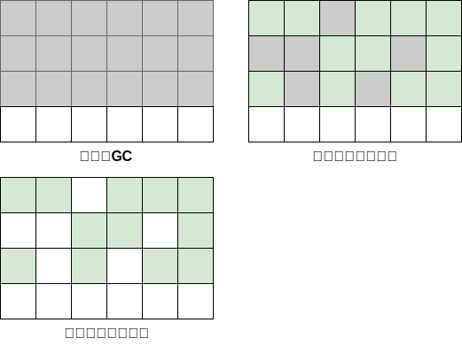
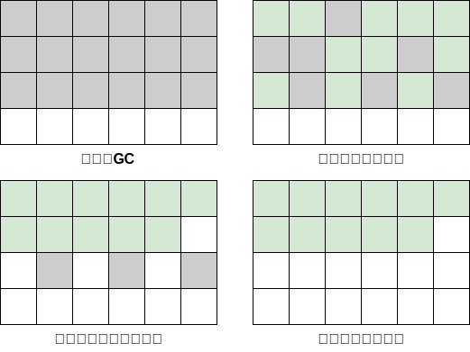
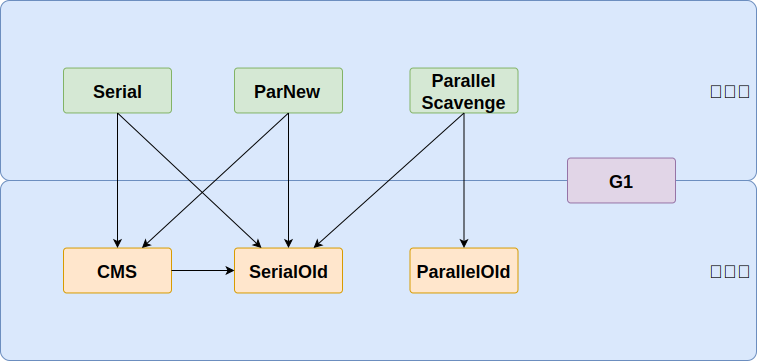

## 对象存活判断

### 可达性分析法

从 GC Roots 开始向下搜索，搜索所走过的路径称为引用链。当一个对象到 GC Roots 没有任何引用链相连时，则证明此对象是可以被回收的

### 引用计数法

为每个对象创建一个引用计数，有对象引用时计数器 +1，引用被释放时计数 -1，当计数器为 0 时就可以被回收。它有一个缺点不能解决循环引用的问题

## 引用对象

引用对象封装了指向其他对象的连接：被指向的对象称为引用目标。`Reference` 有三个直接子类 `SoftReference`、`WeakReference`、`PhantomReference`，分别代表：软引用、弱引用、虚引用。强引用在Java中是普遍存在的，类似 `Object o = new Object();` 这类引用就是强引用，强引用和以上引用的区别在于： **强引用禁止引用目标被垃圾收集器收集，而其他引用不禁止**

当使用软引用、弱引用、虚引用时，并且对可触及性状态的改变有兴趣，可以把引用对象和引用队列关联起来

对象有六种可触及状态变化：

- **强可触及：** 对象可以从根节点不通过任何引用对象搜索到。垃圾收集器不会回收这个对象的内存空间
- **软可触及：** 对象可以从根节点通过一个或多个(未被清除的)软引用对象触及，垃圾收集器在要发生内存溢出前将这些对象列入回收范围中进行回收，如果该软引用对象和引用队列相关联，它会把该软引用对象加入队列。SoftReference 可以用来创建内存中缓存，JVM 的实现需要在抛出 OutOfMemoryError 之前清除软引用，但在其他的情况下可以选择清理的时间或者是否清除它们
- **弱可触及：** 对象可以从根节点开始通过一个或多个(未被清除的)弱引用对象触及，垃圾收集器在一次GC的时候会回收所有的弱引用对象，如果该弱引用对象和引用队列相关联，它会把该弱引用对象加入队列
- **可复活的：** 对象既不是强可触及、软可触及、也不是弱可触及，但仍然可能通过执行某些终结方法复活到这几个状态之一。Java 类可以通过重写finalize方法复活准备回收的对象，但 finalize 方法只是在对象第一次回收时会调用
- **虚可触及：** **垃圾收集器不会清除一个虚引用，所有的虚引用都必须由程序明确的清除。** 同时也不能通过虚引用来取得一个对象的实例
- **不可触及：** 不可触及对象已经准备好回收了

若一个对象的引用类型有多个，那到底如何判断它的可达性呢？其实规则如下：

1. 单条引用链的可达性以最弱的一个引用类型来决定；
2. 多条引用链的可达性以最强的一个引用类型来决定；

## GC回收算法

### 复制算法

按照容量划分两个大小相等的内存区域，当一块用完的时候将活着的对象复制到另一块上，然后再把已使用的内存空间一次清理掉

- **优点：** 按顺序分配内存即可，实现简单、运行高效，不用考虑内存碎片
- **缺点：** 内存使用率不高，只有原来的一半

### 标记清除算法

标记无用对象，然后进行清除回收。它将垃圾收集分为两个阶段

- 标记阶段：标记出可以回收的对象
- 清除阶段：回收被标记的对象所占用的空间

- **优点：** 实现简单，不需要对象进行移动
- **缺点：** 效率不高，无法清除垃圾碎片

### 标记整理算法

标记可回收的对象后将所有存活的对象压缩到内存的一端

- **优点：** 解决了标记清理算法存在的内存碎片问题
- **缺点：** 仍需要进行局部对象移动，一定程度上降低了效率

### 分代收集算法

根据对象的 **存活周期** 将内存划分为几块，并通过不同的回收算法实现垃圾回收。例如 **年轻代**、**老年代** 和 **永久代**

- 分代回收器有两个分区：老生代和新生代
- 新生代使用的是复制算法，新生代里有 3 个分区：Eden、To Survivor、From Survivor，它的执行流程如下：
- 把 Eden + From Survivor 存活的对象放入 To Survivor 区
    - 清空 Eden 和 From Survivor分区
    - From Survivor 和 To Survivor 分区交换，From Survivor 变 To Survivor，To Survivor 变 From Survivor
- 每次在 From Survivor 到 To Survivor 移动时都存活的对象，年龄就 +1，当年龄到达 15（默认配置是 15）时，升级为老生代。大对象也会直接进入老生代
- 老生代当空间占用到达某个值之后就会触发全局垃圾收回，一般使用标记整理的执行算法。以上这些循环往复就构成了整个分代垃圾回收的整体执行流程

**垃圾回收触发条件：**

由于对象进行了分代处理，因此垃圾回收区域、时间也不一样。GC 有两种类型：Scavenge GC 和 Full GC。对于一个拥有终结方法的对象，在垃圾收集器释放对象前必须执行终结方法。但是当垃圾收集器第二次收集这个对象时便不会再次调用终结方法

- **Scavenge GC：** 一般情况下，当新对象生成，并且在 Eden 申请空间失败时，就会触发 Scavenge GC，对 Eden 区域进行 GC，清除非存活对象，并且把尚且存活的对象移动到 Survivor 区，然后整理 Survivor 的两个区。这种方式的 GC 是对新生代的 Eden 区进行，不会影响到老年代。因为大部分对象都是从 Eden 区开始的，同时 Eden 区不会分配的很大，所以 Eden 区的 GC 会频繁进行
- **Full GC：** 对整个堆进行整理，包括 Young、Tenured 和 Perm。Full GC 因为需要对整个对进行回收，所以比 Scavenge GC 要慢，因此应该尽可能减少 Full GC 的次数。在对 JVM 调优的过程中，很大一部分工作就是对于 Full GC 的调节。有如下原因可能导致 Full GC：
    - 老年代 (Tenured) 被写满
    - 持久代 (Perm) 被写满
    - System.gc() 被显示调用

## GC回收器

| 垃圾回收器            | 工作区域      | 回收算法          | 工作线程 | 用户线程并行 | 描述                                        |
|------------------|-----------|---------------|------|--------|-------------------------------------------|
| Serial           | 新生代       | 复制算法          | 单线程  | 否      | Client 模式下默认新生代收集器，简单高效                   |
| ParNew           | 新生代       | 复制算法          | 多线程  | 否      | Serial 的多线程版本，Server 模式下首选， 可搭配CMS的新生代收集器 |
| ParallelScavenge | 新生代       | 复制算法          | 多线程  | 否      | 目标是达到可控制的吞吐量                              |
| SerialOld        | 老年代       | 标记整理算法        | 单线程  | 否      | Serial 老年代版本，给 Client 模式下的虚拟机使用           |
| ParallelOld      | 老年代       | 标记整理算法        | 多线程  | 否      | Parallel Scavenge 老年代版本，吞吐量优先             |
| CMS              | 老年代       | 标记清除算法        | 多线程  | 是      | CMS 有高并发、低停顿的特点，追求最短 GC 回收停顿时间            |
| G1               | 新生代 + 老年代 | 标记整理算法 + 复制算法 | 多线程  | 是      | JDK9 默认垃圾收集器                              |

### Serial

Serial 收集器是最基本的垃圾回收器，它使用单线程进行垃圾回收,单线程意味着它进行垃圾收集工作时，必须暂停其他工作线程，直到它收集完成。适用于单核处理器环境下的应用程序。Serial 收集器主要用于新生代的垃圾回收

虽然 Serial 收集器的缺点很明显，但是它仍然是 JVM 在 Client 模式下的默认新生代收集器。它有着优于其他收集器的地方：简单而高效（与其他收集器的单线程比较），Serial 收集器由于没有线程交互的开销，专心只做垃圾收集自然也获得最高的效率。在用户桌面场景下，分配给 JVM 的内存不会太多，停顿时间完全可以在几十到一百多毫秒之间，只要收集不频繁，这是完全可以接受的

### ParNew

ParNew 是 Serial 的多线程版本，也称为吞吐量优先收集器，它使用多线程并行进行垃圾回收，可以充分利用多核处理器的优势，提高垃圾回收的吞吐量。Parallel 收集器主要用于新生代的垃圾回收

### Parallel Scavenge

Parallel Scavenge 收集器是一个新生代垃圾收集器，其使用的算法是 复制算法，也是并行的多线程收集器。新生代的垃圾回收

Parallel Scavenge 收集器更关注可控制的吞吐量，吞吐量等于运行用户代码的时间/(运行用户代码的时间+垃圾收集时间)。直观上，只要最大的垃圾收集停顿时间越小，吞吐量是越高的，但是 GC 停顿时间的缩短是以牺牲吞吐量和新生代空间作为代价的。比如原来 10 秒收集一次，每次停顿 100 毫秒，现在变成 5 秒收集一次，每次停顿 70 毫秒。停顿时间下降的同时，吞吐量也下降了

### Serial Old

Serial Old 收集器是 Serial 收集器的老年代版本，也是一个单线程收集器，采用 标记-整理 算法 进行回收。其运行过程与 Serial 收集器一样

### Parallel Old

Parallel Old 收集器是 Parallel Scavenge 收集器的老年代版本，使用多线程和 标记-整理 算法进行垃圾回收其通常与 Parallel Scavenge 收集器配合使用，“吞吐量优先”收集器是这个组合的特点，在注重吞吐量和 CPU 资源敏感的场合，都可以使用这个组合，吞吐量优先

### CMS

CMS(Concurrent Mark Sweep) 收集器是一种以获取最短停顿时间为目标的收集器，CMS 收集器采用 标记-清除 算法，运行在老年代。主要包含以下几个步骤：

- 初始标记
- 并发标记
- 重新标记
- 并发清除

其中初始标记和重新标记仍然需要 **Stop the world**。初始标记仅仅标记 GC Root 能直接关联的对象，并发标记就是进行 GC Root Tracing 过程，而重新标记则是为了修正并发标记期间，因用户程序继续运行而导致标记变动的那部分对象的标记记录

由于整个过程中最耗时的并发标记和并发清除，收集线程和用户线程一起工作，所以总体上来说，CMS 收集器回收过程是与用户线程并发执行的。虽然 CMS 优点是并发收集、低停顿，很大程度上已经是一个不错的垃圾收集器，但是还是有三个显著的缺点：

- **CMS 收集器对 CPU 资源很敏感**。在并发阶段，虽然它不会导致用户线程停顿，但是会因为占用一部分线程（CPU 资源）而导致应用程序变慢
- **CMS 收集器不能处理浮动垃圾**。所谓的“浮动垃圾”，就是在并发标记阶段，由于用户程序在运行，那么自然就会有新的垃圾产生，这部分垃圾被标记过后，CMS 无法在当次集中处理它们，只好在下一次 GC 的时候处理，这部分未处理的垃圾就称为“浮动垃圾”。也是由于在垃圾收集阶段程序还需要运行，即还需要预留足够的内存空间供用户使用，因此 CMS 收集器不能像其他收集器那样等到老年代几乎填满才进行收集，需要预留一部分空间提供并发收集时程序运作使用。要是 CMS 预留的内存空间不能满足程序的要求，这是 JVM 就会启动预备方案：临时启动 Serial
  Old 收集器来收集老年代，这样停顿的时间就会很长
- **由于 CMS 使用 标记-清除 算法，所以在收集之后会产生大量内存碎片**。当内存碎片过多时，将会给分配大对象带来困难，这是就会进行Full GC

### G1

Java 堆并行收集器，G1 收集器是 JDK1.7 提供的一个新收集器，回收的范围是整个 Java 堆(包括新生代，老年代)而前六种收集器回收的范围仅限于新生代或老年代，G1 收集器基于 标记-整理 算法实现，也就是说不会产生内存碎片。G1 收集器可以实现在基本不牺牲吞吐量的情况下完成低停顿的内存回收，这是由于它极力的避免全区域的回收，G1 收集器将 Java 堆（包括新生代和老年代）划分为多个区域（Region），并在后台维护一个优先列表，每次根据允许的时间，优先回收垃圾最多的区域

G1 收集器与 CMS 相比有很大的改进：

- G1 收集器采用 标记-整理 算法实现
- 可以非常精确地控制停顿

?> 没有一个收集器能完全不停顿，只是停顿的时间长短
