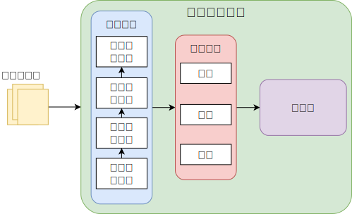
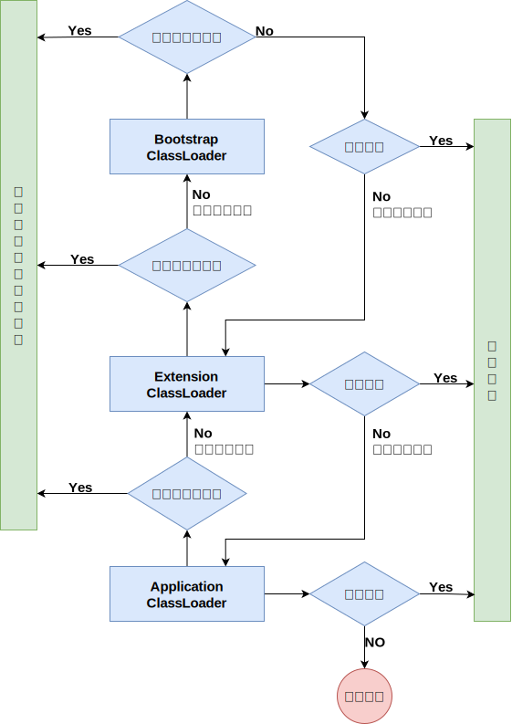
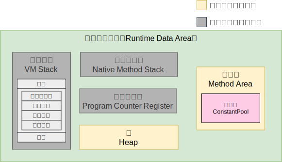
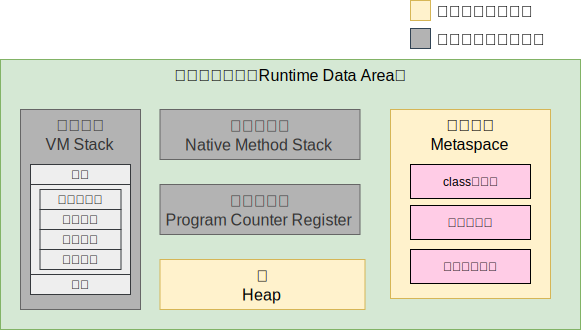
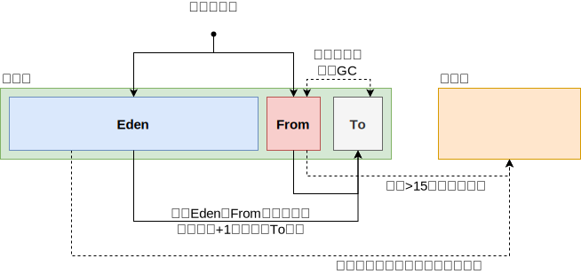

## JVM内存模型

## 类加载子系统

### 类加载器

- **Bootstrap ClassLoader** ：主要负责加载核心的类库(`java.lang.*` 等)，构造 Extension ClassLoader 和 Application ClassLoader
- **Extension ClassLoader** ：主要负责加载 `jre/lib/ext` 目录下的一些扩展的 jar
- **Application ClassLoader** ：主要负责加载应用程序的主函数类

### 类加载过程

Java 虚拟机通过装载、连接和初始化一个类型，使该类型可以被正在运行的 Java 程序使用

1. 装载：把二进制形式的Java类型读入 Java 虚拟机中
2. 连接：把装载的二进制形式的类型数据合并到虚拟机的运行时状态中去
    1. 验证：确保Java类型数据格式正确并且适合于 Java 虚拟机使用
    2. 准备：负责为该类型分配它所需内存
    3. 解析：把常量池中的符号引用转换为直接引用。(可推迟到运行中的程序真正使用某个符号引用时再解析)
3. 初始化：为类变量赋适当的初始值

所有Java虚拟机实现必须在每个类或接口首次主动使用时初始化。以下六种情况符合主动使用的要求：

- 当创建某个类的新实例时(new、反射、克隆、序列化)
- 调用某个类的静态方法
- 使用某个类或接口的静态字段，或对该字段赋值(用final修饰的静态字段除外，它被初始化为一个编译时常量表达式)
- 当调用 Java API 的某些反射方法时
- 初始化某个类的子类时
- 当虚拟机启动时被标明为启动类的类

除以上六种情况，所有其他使用 Java 类型的方式都是被动的，它们不会导致 Java 类型的初始化

对于接口来说，只有在某个接口声明的非常量字段被使用时，该接口才会初始化，而不会因为事先这个接口的子接口或类要初始化而被初始化

**父类需要在子类初始化之前被初始化，所以这些类应该被装载了。当实现了接口的类被初始化的时候，不需要初始化父接口。然而，当实现了父接口的子类(或者是扩展了父接口的子接口)被装载时，父接口也要被装载。(只是被装载，没有初始化)**

#### 装载

- 通过该类型的全限定名，产生一个代表该类型的二进制数据流
- 解析这个二进制数据流为方法去内的内部数据结构
- 创建一个表示该类型的 `java.lang.Class` 类的实例

Java 虚拟机在识别 Java class 文件，产生了类型的二进制数据后，Java 虚拟机必须把这些二进制数据解析为与实现相关的内部数据结构。**装载的最终产品就是 Class 实例，它称为 Java程序与内部数据结构之间的接口**
。要访问关于该类型的信息(存储在内部数据结构中)，程序就要调用该类型对应的Class实例的方法。**这样一个过程，就是把一个类型的二进制数据解析为方法区中的内部数据结构，并在堆上建立一个 Class 对象的过程，这被称为"创建"类型。**

#### 验证

确认装载后的类型符合Java语言的语义，并且不会危及虚拟机的完整性

- **装载时验证** ：检查二进制数据以确保数据全部是预期格式、确保除Object之外的每个类都有父类、确保该类的所有父类都已经被装载
- **正式验证阶段** ：检查final类不能有子类、确保 final 方法不被覆盖、确保在类型和超类型之间没有不兼容的方法声明(比如拥有两个名字相同的方法，参数在数量、顺序、类型上都相同，但返回类型不同)
- **符号引用的验证** ：当虚拟机搜寻一个呗符号引用的元素(类型、字段或方法)时，必须首先确认该元素存在。如果虚拟机发现元素存在，则必须进一步检查引用类型有访问该元素的权限

#### 准备

当 Java 虚拟机装载一个类，并执行了一些验证之后，类就可以进入准备阶段。**在准备阶段，Java 虚拟机为类变量分配内存，设置默认初始值。但在到到初始化阶段之前，类变量都没有被初始化为真正的初始值**

#### 解析

类型经过连接的前两个阶段验证和准备之后，就可以进入第三个阶段解析。解析的过程就是在类型的常量池总寻找类、接口、字段和方法的符号引用，**把这些符号引用替换为直接引用的过程**

- **类或接口的解析** ：判断所要转化成的直接引用是对数组类型，还是普通的对象类型的引用，从而进行不同的解析
- **字段解析** ：对字段进行解析时，会先在本类中查找是否包含有简单名称和字段描述符都与目标相匹配的字段，如果有，则查找结束；如果没有，则会按照继承关系从上往下递归搜索该类所实现的各个接口和它们的父接口，还没有，则按照继承关系从上往下递归搜索其父类，直至查找结束

#### 初始化

为类变量赋予“正确”的初始值。这里的“正确”的初始值是指程序员希望这个类变量所具备的初始值。**所有的类变量(即静态量)初始化语句和类型的静态初始化器都被Java编译器收集在一起，放到一个特殊的方法中**

对于类来说，这个方法被称作类初始化方法；对于接口来说，它被称为接口初始化方法。在类和接口的class文件中，这个方法被称为 `<clinit>`

### 双亲委派机制

作用：

- 防止重复加载同一个 class 对象
- 保证核心 class 对象不能被篡改。保证了 Class 执行安全

## JVM运行时数据区

<!-- tabs:start -->
<!-- tab:jdk7 -->

<!-- tab:jdk8 -->

<!-- tabs:end -->
?> 上图中大小比例与实际占用内存大小没有关联

### Heap堆

被线程共享的一块数据区域，用于存储创建的对象与数组等。是垃圾回收器进行垃圾收集的主要区域，根据VM的分代收集算法，Java 堆还可以被细分为： **新生代** 和 **老年代**，新生代与老年代占据空间的比例默认为 1:2

<!-- tabs:start -->
<!-- tab:新生代 -->
用于存放新创建的对象，一般占据堆内存的 1/3 空间。由于对象创建频繁，所以该区域会频繁触发 **Minor GC(新生代GC)** 进行垃圾回收。新生代内又细分如下部分，

- **Eden** ：Java 新生对象的存储位置（如果对象占用空间过大会直接放入老年代中）。当 空间不足时就会触发 Minor GC 通过 [复制算法](/开发语言/Java/JVM/GC回收机制.md?id=GC回收算法) 进行垃圾回收
- **From Survivor** ：上次 GC 的幸存者
- **To Survivor** ：用于临时保存 GC 过程中的幸存者

Eden、From、To 三个占据空间的比例默认为8:1:1

--- 

**新生代回收流程如下**

<!-- tab:老年代 -->
用于存放程序中生命周期比较长的内存对象，由于老年代中的对象比较稳定，所以 **Major GC/Full GC(老年代GC)** 不会频繁触发。在进行 Major GC/Full GC 前一般会先进行一次 Minor GC，使新生代的对象晋升到老年代，导致空间不足时才会触发。当剩余空间不足以为新创建比较大的对象分配连续空间时，也会提前触发 Major GC/Full GC 通过 [标记整理算法](/开发语言/Java/JVM/GC回收机制.md?id=GC回收算法) 进行垃圾回收腾出空间

<!-- tabs:end -->

### MethodArea方法区

被线程共享的内存区域，常用永久代描述方法区。用于存储 JVM 加载的类信息、常量、静态变量、即时编译器编译后的代码等。 HotspotVM 采取 Java 堆的永久代来实现方法区，这样垃圾回收器可以像管理 Java 堆一样管理方法区，而不需要重新实现（永久代的回收收益也很小，一般只有常量池回收与类型卸载）

#### 常量池

用于存放方法编译期生成的各种字面常量和符号引用，这部分的内容将在类加载后存放到方法区中的运行时常量池

### VMStack虚拟机栈

描述 Java 方法执行的内存模型，每个线程独立拥有。 每调用一个方法都会创建一个栈帧，栈帧随着方法的调用而创建，随着方法的结束而销毁

#### 栈帧

用于存储一个方法的局部变量、操作数栈、动态链接、方法出口等信息

- **局部变量表** ：是用来存储我们临时 8 个基本数据类型、对象引用地址、 returnAddress 类型。（ returnAddress 中保存的是 return 后要执行的字节码的指令地址。）
- **操作数栈** ：操作数栈就是用来操作的，例如代码中有个 `i = 6 * 6`，他在一开始的时候就会进行操 作，读取我们的代码，进行计算后再放入局部变量表中去
- **动态链接** ：假如方法中，有个 `service.add()` 方法，要链接到别的方法中去，这就是动态链接，存储链接的地方
- **方法出口** ：出口正常的话就是 return ，不正常的话就是抛出异常

PS:

- 一个方法调用其他方法/递归调用方法自身都会创建一个栈帧
- 栈中要使用成员变量时不会存储成员变量，只会存储一个引用地址

### NativeMethodStack本地方法栈

线程私有的栈空间，用于存储线程执行的 Native 方法

### ProgramCounterRegister程序计数器

一块很小的内存空间，每个线程独立拥有。主要用于存储当前线程执行的 Java 方法的字节码指令地址，如果调用的是 Native 方法则为空

由于 Java 虚拟机的多线程是通过线程轮流切换并分配处理器执行时间的方式来实现的，一个处理器都只会执行一条线程中的指令。因此，为了线程切换后能恢复到正确的执行位置，每条线程都有一个独立的程序计数器，各个线程之间计数器互不影响，独立存储。称之为“线程私有”的内存。程序计数器内存区域是虚拟机中唯一没有规定 OutOfMemoryError 情况的区域

### 永久代

用于永久保存的内存区域，主要用于存放 Class 和 Meta （元数据）， Class 加载的时候会被放入永久区域。与存放实例的区域不同， GC 不会在主程序运行期对永久区域进行去清理。在 JDK8 后废弃永久代的概念，采用元空间来带代替，元空间通过本地内存实现，由系统控制可用空间

## 执行引擎

## 本地接口

## 对象空间分配

Java 中对象地址操作主要使用 Unsafe 调用了 C 的 allocate 和 free 两个方法，分配方法有两种：

- **空闲链表（free list）** ：通过额外的存储记录空闲的地址，将随机 IO 变为顺序 IO，但带来了额外的空间消耗
- **碰撞指针（bump pointer）** ：通过一个指针作为分界点，需要分配内存时，仅需把指针往空闲的一端移动与对象大小相等的距离，分配效率较高，但使用场景有限
