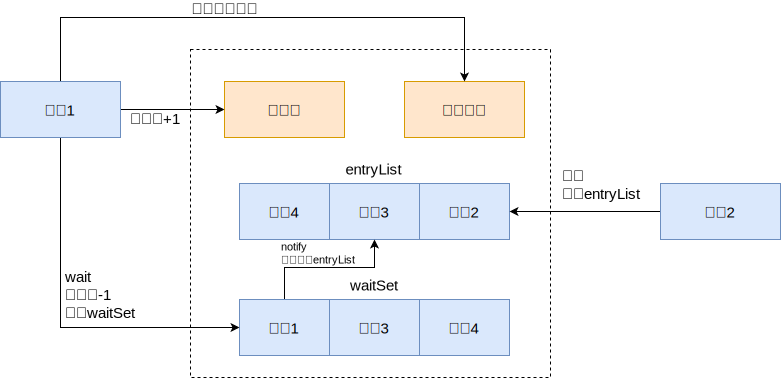

## AQS

**AQS（AbstractQueuedSynchronizer）** 是 Java 并发包 `java.util.concurrent` 中一个非常核心的抽象类，它为构建锁和其他同步器提供了一套可扩展的框架。AQS 使用一个 int 成员变量来表示同步状态，通过内置的 FIFO 队列来完成获取资源线程的排队工作。AQS 能够以非阻塞的方式实现同步器，并且可以用于实现依赖于 FIFO 等待队列的阻塞锁和相关同步器，如信号量、事件等

## CAS

**CAS(Compare-and-Swap)** 是一种用于并发编程中的关键技术，它允许在多线程环境中以原子性的方式更新变量。CAS 操作通常包含三个参数：内存位置（V）、旧值（A）和新值（B）。当执行 CAS 时，它会检查内存位置 V 的当前值是否与 A 相等，如果相等，则将 V 的值更新为 B。整个操作是原子的，即在执行过程中不会被其他线程中断

CAS 操作的典型使用场景是实现无锁的同步机制，例如在设计非阻塞数据结构时。它通过乐观锁的方式，避免了传统锁机制可能带来的性能瓶颈和死锁问题

在 Java 中，sun.misc.Unsafe 类提供了 compareAndSwapXXX 系列方法来实现 CAS 操作，这些方法利用了底层硬件的原子指令，如 x86 架构中的 LOCK XCHG 指令。CAS 操作也被广泛应用于 `java.util.concurrent.atomic` 包中的原子类，如 AtomicInteger 和 AtomicLong 等，它们利用 CAS 来保证操作的原子性

CAS 虽然强大，但也存在一些缺点，CAS的缺点主要有3点：

- **ABA问题** ：ABA 的问题指的是在 CAS 更新的过程中，当读取到的值是 A，然后准备赋值的时候仍然是 A，但是实际上有可能 A 的值被改成了 B，然后又被改回了 A，这个 CAS 更新的漏洞就叫做 ABA。只是 ABA 的问题大部分场景下都不影响并发的最终效果。Java 中有 AtomicStampedReference 来解决这个问题，他加入了预期标志和更新后标志两个字段，更新时不光检查值，还要检查当前的标志是否等于预期标志，全部相等的话才会更新
- **循环时间长开销大** ：自旋 CAS 的方式如果长时间不成功，会给 CPU 带来很大的开销
- **只能保证一个共享变量的原子操作** ：只对一个共享变量操作可以保证原子性，但是多个则不行，多个可以通过 AtomicReference 来处理或者使用锁 synchronized 实现

## 乐观锁

乐观锁是一种乐观思想，即认为读多写少，遇到并发写的可能性低，每次去拿数据的时候都认为别人不会修改，所以不会上锁，但是在更新时会判断此期间数据是否被更新采取在写时先读出当前版本号，然后加锁操作(比较跟上一次的版本号，如果一样则更新)，如果失败则要重复读-比较-写的操作 java 中的乐观锁基本通过 CAS 操作实现的，CAS 是一种更新的原子操作，比较当前值跟传入值是否一样，一样则更新，否则失败

## 悲观锁

悲观锁是就是悲观思想，即认为写多，遇到并发写的可能性高，每次去拿数据的时候都认为别人会修改，所以每次在读写数据的时候都会上锁，这样别人想读写这个数据就会 block 直到拿到锁。 java 中的悲观锁就是 synchronized ，AQS 框架下的锁则是先尝试 CAS 乐观锁去获取锁，获取不到， 才会转换为悲观锁，如 RetreenLock

## 独占锁

独占锁是指锁一次只能被一个线程所持有。如果一个线程对数据加上排他锁后，那么其他线程不能再对该数据加任何类型的锁，就如上面悲观锁的流程图一样。获得独占锁的线程即能读数据又能修改数据。JDK 中的 synchronized 和 `java.util.concurrent(JUC)` 包中 Lock 的实现类就是独占锁

## 共享锁

共享锁是指锁可被多个线程所持有。如果一个线程对数据加上共享锁后，那么其他线程只能对数据再加共享锁，不能加独占锁。获得共享锁的线程只能读数据，不能修改数据。在 JDK 中 ReentrantReadWriteLock 就是一种共享锁

## 自旋锁

自旋锁原理非常简单，如果持有锁的线程能在很短时间内释放锁资源，那么那些等待竞争锁的线程就不需要做内核态和用户态之间的切换进入阻塞挂起状态，它们只需要等一等（自旋），等持有锁的线程释放锁后即可立即获取锁，这样就避免用户线程和内核的切换的消耗。 线程自旋是需要消耗 cpu 的，说白了就是让 cpu 在做无用功，如果一直获取不到锁，那线程也不能一直占用 cpu 自旋做无用功，所以需要设定一个自旋等待的最大时间

如果持有锁的线程执行的时间超过自旋等待的最大时间扔没有释放锁，就会导致其它争用锁的线程在最大等待时间内还是获取不到锁，这时争用线程会停止自旋进入阻塞状态

### 自旋锁优缺点

自旋锁尽可能的减少线程的阻塞，这对于锁的竞争不激烈，且占用锁时间非常短的代码块来说性能能大幅度的提升，因为自旋的消耗会小于线程阻塞挂起再唤醒的操作的消耗，这些操作会导致线程发生两次上下文切换！

但是如果锁的竞争激烈，或者持有锁的线程需要长时间占用锁执行同步块，这时候就不适合使用自旋锁了，因为自旋锁在获取锁前一直都是占用 cpu 做无用功，同时有大量线程在竞争一个锁，会导致获取锁的时间很长，线程自旋的消耗大于线程阻塞挂起操作的消耗，其它需要 cpu 的线程又不能获取到 cpu ，造成 cpu 的浪费。所以这种情况下我们要关闭自旋锁

### 自旋锁的开启

| 版本   | JDK1.6             | JDK1.7 |
|------|--------------------|--------|
| 开启方式 | X:+UseSpinning     | 由jvm控制 |
| 次数控制 | XX:PreBlockSpin=10 | 由jvm控制 |

## 非公平锁

## 公平锁

## 可重入锁(递归锁)

## 读写锁

## 锁状态

JDK1.6 为了提升性能减少获得锁和释放锁所带来的消耗，引入了4种锁的状态：**无锁**、**偏向锁**、**轻量级锁** 和 **重量级锁**，它会随着多线程的竞争情况逐渐升级，但不能降级

### 无锁

无锁状态其实就是上面讲的乐观锁，这里不再赘述

### 偏向锁

Java 偏向锁(Biased Locking)是指它会偏向于第一个访问锁的线程，如果在运行过程中，只有一个线程访问加锁的资源，不存在多线程竞争的情况，那么线程是不需要重复获取锁的，这种情况下，就会给线程加一个偏向锁。偏向锁的实现是通过控制对象 `Mark Word` 的标志位来实现的，如果当前是可偏向状态，需要进一步判断对象头存储的线程 ID 是否与当前线程 ID 一致，如果一致直接进入

### 轻量级锁

当线程竞争变得比较激烈时，偏向锁就会升级为轻量级锁，轻量级锁认为虽然竞争是存在的，但是理想情况下竞争的程度很低，通过 **自旋方式** 等待上一个线程释放锁

### 重量级锁(Mutex Lock)

如果线程并发进一步加剧，线程的自旋超过了一定次数，或者一个线程持有锁，一个线程在自旋，又来了第三个线程访问时（反正就是竞争继续加大了），轻量级锁就会膨胀为重量级锁，重量级锁会使除了此时拥有锁的线程以外的线程都阻塞。升级到重量级锁其实就是互斥锁了，一个线程拿到锁，其余线程都会处于阻塞等待状态

### 锁升级

在 Java 中，synchronized 关键字内部实现原理就是锁升级的过程：无锁 --> 偏向锁 --> 轻量级锁 --> 重量级锁

### 分段锁

分段锁是一种锁的设计，并不是具体的一种锁。分段锁设计目的是将锁的粒度进一步细化，当操作不需要更新整个数组的时候，就仅仅针对数组中的一项进行加锁操作。在 Java 语言中 CurrentHashMap 底层就用了分段锁，使用 Segment，就可以进行并发使用了

## 同步锁与死锁

### 同步锁

### 死锁

### 锁优化思路

#### 减少锁持有时间

#### 减小锁粒度

#### 锁分离

#### 锁粗化

## synchronized

synchronized 它可以把任意一个非 NULL 的对象当作锁。**他属于独占式的悲观锁，同时属于可重入锁**

### synchronized作用范围

- 作用于方法时，锁住的是对象的实例(this)
- 当作用于静态方法时，锁住的是 Class 实例，又因为 Class 的相关数据存储在永久代 PermGen（jdk1.8 则是 metaspace），永久代是全局共享的，因此静态方法锁相当于类的一个全局锁，会锁所有调用该方法的线程
- synchronized 作用于一个对象实例时，锁住的是所有以该对象为锁的代码块。它有多个队列， 当多个线程一起访问某个对象监视器的时候，对象监视器会将这些线程存储在不同的容器中

### synchronized核心组件

- **`Wait Set`** ：哪些调用 wait 方法被阻塞的线程被放置在这里
- **`Contention List`** ：竞争队列，所有请求锁的线程首先被放在这个竞争队列中
- **`Entry List`** ：Contention List 中那些有资格成为候选资源的线程被移动到 Entry List 中
- **`OnDeck`** ：任意时刻，最多只有一个线程正在竞争锁资源，该线程被成为 OnDeck
- **`Owner`** ：当前已经获取到所资源的线程被称为 Owner
- **`!Owner`** ：当前释放锁的线程

### synchronized实现

synchronized 是 java 提供的原子性内置锁，这种内置的并且使用者看不到的锁也被称为监视器锁，使用 synchronized 之后，会在编译之后在同步的代码块前后加上 `monitorenter` 和 `monitorexit`

字节码指令，他依赖操作系统底层互斥锁实现。他的作用主要就是实现原子性操作和解决共享变量的内存可见性问题

执行 monitorenter 指令时会尝试获取对象锁，如果对象没有被锁定或者已经获得了锁，锁的计数器 +1。此时其他竞争锁的线程则会进入等待队列中

执行 monitorexit 指令时则会把计数器 -1，当计数器值为0时，则锁释放，处于等待队列中的线程再继续竞争锁

synchronized 是排它锁，当一个线程获得锁之后，其他线程必须等待该线程释放锁后才能获得锁，而且由于 Java 中的线程和操作系统原生线程是一一对应的，线程被阻塞或者唤醒时时会从用户态切换到内核态，这种转换非常消耗性能

从内存语义来说，加锁的过程会清除工作内存中的共享变量，再从主内存读取，而释放锁的过程则是将工作内存中的共享变量写回主内存

从到源码来说，synchronized 实际上有两个队列 waitSet 和 entryList

- 当多个线程进入同步代码块时，首先进入 entryList
- 有一个线程获取到 monitor 锁后，就赋值给当前线程，并且计数器 +1
- 如果线程调用 wait 方法，将释放锁，当前线程置为 null，计数器 -1，同时进入 waitSet 等待被唤醒，调用 notify 或者 notifyAll 之后又会进入 entryList 竞争锁
- 如果线程执行完毕，同样释放锁，计数器 -1，当前线程置为 null

### JDK1.6后的优化

从 JDK1.6 版本之后，synchronized 本身也在不断优化锁的机制，有些情况下他并不会是一个很重量级的锁了。优化机制包括自适应锁、自旋锁、锁消除、锁粗化、轻量级锁和偏向锁

- **自旋锁** ：由于大部分时候，锁被占用的时间很短，共享变量的锁定时间也很短，所有没有必要挂起线程，用户态和内核态的来回上下文切换严重影响性能。自旋的概念就是让线程执行一个忙循环，可以理解为就是啥也不干，防止从用户态转入内核态，自旋锁可以通过设置 -XX:+UseSpining 来开启，自旋的默认次数是10次，可以使用 -XX:PreBlockSpin 设置
- **自适应锁** ：自适应锁就是自适应的自旋锁，自旋的时间不是固定时间，而是由前一次在同一个锁上的自旋时间和锁的持有者状态来决定
- **锁消除** ：锁消除指的是 JVM 检测到一些同步的代码块，完全不存在数据竞争的场景，也就是不需要加锁，就会进行锁消除
- **锁粗化** ：锁粗化指的是有很多操作都是对同一个对象进行加锁，就会把锁的同步范围扩展到整个操作序列之外
- **偏向锁** ：当线程访问同步块获取锁时，会在对象头和栈帧中的锁记录里存储偏向锁的线程 ID，之后这个线程再次进入同步块时都不需要 CAS 来加锁和解锁了，偏向锁会永远偏向第一个获得锁的线程，如果后续没有其他线程获得过这个锁，持有锁的线程就永远不需要进行同步，反之，当有其他线程竞争偏向锁时，持有偏向锁的线程就会释放偏向锁。可以用过设置 -XX:
  +UseBiasedLocking 开启偏向锁
- **轻量级锁** ：JVM 的对象的对象头中包含有一些锁的标志位，代码进入同步块的时候，JVM 将会使用 CAS 方式来尝试获取锁，如果更新成功则会把对象头中的状态位标记为轻量级锁，如果更新失败，当前线程就尝试自旋来获得锁

锁的状态从低到高依次为 **无锁->偏向锁->轻量级锁->重量级锁**，升级的过程就是从低到高，降级在一定条件也是有可能发生的

锁升级简述：偏向锁就是通过对象头的偏向线程 ID 来对比，甚至都不需要 CAS 了，而轻量级锁主要就是通过 CAS 修改对象头锁记录和自旋来实现，重量级锁则是除了拥有锁的线程其他全部阻塞

## ReentrantLock

### Lock接口主要方法

### tryLock、lock和lockInterruptibly

## ReentrantLock与synchronized

相比于 synchronized，ReentrantLock 需要显式的获取锁和释放锁，相对现在基本都是用 JDK7 和 JDK8 的版本，ReentrantLock 的效率和 synchronized 区别基本可以持平了。他们的主要区别有以下几点：

- 等待可中断：当持有锁的线程长时间不释放锁的时候，等待中的线程可以选择放弃等待，转而处理其他的任务
- 公平锁：synchronized 和 ReentrantLock 默认都是非公平锁，但是 ReentrantLock 可以通过构造函数传参改变。只不过使用公平锁的话会导致性能急剧下降
- 绑定多个条件：ReentrantLock 可以同时绑定多个 Condition 条件对象

ReentrantLock 基于 AQS(AbstractQueuedSynchronizer) 抽象队列同步器实现

## Condition类和Object类锁方法

## volatile

相比 synchronized 的加锁方式来解决共享变量的内存可见性问题，volatile 就是更轻量的选择，他没有上下文切换的额外开销成本。使用 volatile 声明的变量，可以确保值被更新的时候对其他线程立刻可见。volatile 使用内存屏障来保证不会发生指令重排，解决了内存可见性的问题

线程都是从主内存中读取共享变量到工作内存来操作，完成之后再把结果写会主内存，但是这样就会带来可见性问题。举个例子，假设现在我们是两级缓存的双核CPU架构，包含L1、L2两级缓存

- 线程A首先获取变量X的值，由于最初两级缓存都是空，所以直接从主内存中读取X，假设X初始值为0，线程A读取之后把X值都修改为1，同时写回主内存。这时候缓存和主内存的情况如下图

  

- 线程B也同样读取变量X的值，由于L2缓存已经有缓存X=1，所以直接从L2缓存读取，之后线程B把X修改为2，同时写回L2和主内存。这时候的X值入下图所示。 
  那么线程A如果再想获取变量X的值，因为L1缓存已经有x=1了，所以这时候变量内存不可见问题就产生了，B修改为2的值对A来说没有感知

  

那么，如果 X 变量用 volatile 修饰的话，当线程 A 再次读取变量 X 的话，CPU 就会根据缓存一致性协议强制线程 A 重新从主内存加载最新的值到自己的工作内存，而不是直接用缓存中的值

再来说内存屏障的问题，volatile 修饰之后会加入不同的内存屏障来保证可见性的问题能正确执行。这里写的屏障基于书中提供的内容，但是实际上由于 CPU 架构不同，重排序的策略不同，提供的内存屏障也不一样，比如 x86 平台上，只有 StoreLoad 一种内存屏障

- StoreStore 屏障，保证上面的普通写不和 volatile 写发生重排序
- StoreLoad 屏障，保证 volatile 写与后面可能的 volatile 读写不发生重排序
- LoadLoad 屏障，禁止 volatile 读与后面的普通读重排序
- LoadStore 屏障，禁止 volatile 读和后面的普通写重排序

