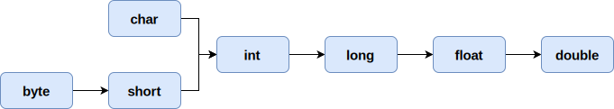
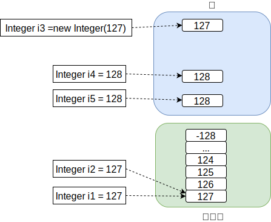

## 基本数据类型

Java 将基本数据类型分为8种，分别为： `byte` 、 `short` 、 `int` 、 `long` 、 `float` 、 `double` 、 `char` 、 `boolean` ，同样该 8 种数据类型同样对应了 8 种引用数据类型

### 8种基本数据类型相关属性

| 类型          | 占用字节数 | 默认值            | 对应引用数据类型(包装类型) |
|-------------|-------|----------------|----------------|
| **byte**    | 1     | `0`(byte)      | Byte           |
| **short**   | 2     | `0`(short)     | Short          |
| **int**     | 4     | `0`            | Integer        |
| **long**    | 8     | `0L`           | Long           |
| **float**   | 4     | `0.0F`         | Float          |
| **double**  | 8     | `0.0D`         | Double         |
| **char**    | 2     | `/u0000`(null) | Character      |
| **boolean** | 1     | `false`        | Boolean        |

整数数值类型如 byte 、 short 、 int 、 long 取值范围可通过如下公式计算<br/>
n=占用字节数，取值如下： [-(2<sup>8n-1</sup>),2<sup>8n-1</sup>-1]

### 自动拆箱与自动装箱

- **自动拆箱** ：将包装类型赋值给对应的基本数据类型时，触发自动拆箱操作
- **自动装箱** ：将基本数据类型赋值给对应的包装类型时，触发自动装箱操作

**自动拆装箱过程中的问题**

当包装类型为 `null` 时赋值给基本数据类型会报错

```java
public class TestDemo {
    public static void main(String[] args) {
        Integer i = null;
        int num = i; // error
    }
}
```

当基本数据类型与包装类做 `==` 运算时，包装类型会被转换为基本数据类型，从而 `==` 比较的其实为数值大小，而非地址值

```java
public class TestDemo {
    public static void main(String[] args) {
        int i1 = 1000;
        Integer i2 = new Integer(1000);
        System.out.println(i1 == i2); // true
    }
}
```

### 基本数据类型之间的转换

数值型 byte 、 short 、 int 、 long 、 float 、 double 以及字符型 char 按照占用字节数的大小比较区分为低精度与高精度,当低精度值赋值给高精度值时触发隐式(自动)转换，反之需要 显示(强制)转换

!> boolean 不能参与类型转换的，因为 Java 并不支持 boolean 转为数值

## 类型转换

<!-- tabs:start -->
<!-- tab:隐式(自动)转换 -->
根据精度从低到高，能够隐式转换，数据类型将自动提高，其转换方向如下



```java
public class TestDemo {
    public static void main(String[] args) {
        byte b = 1;
        int i = b; // i = 1
        long l = i; // l = 1L
        float f = l; // f = 1.0F
        double d = f; // d = 1.0D
    }
}
```

在进行数据类型转换的过程中，有可能会发生精度丢失或者数据溢出，需要开发者根据数据类型和业务场景进行合理的选择和处理

<!-- tab:强制(显式)转换 -->
将高精度的值强制赋值给低精度的变量，该操作需要显式的编写转换类型，该操作会造成精度丢失

!> 高精度值的存储空间大于低精度的存储空间，此时低精度目标类型不能容纳该数值，强制转换则可能会发生数据溢出进行截断保存，最终导致数据不一致问题

```java
public class TestDemo {
    public static void main(String[] args) {
        float f = 1.2F;
        int i = (int) f; // i = 1
        f = i;
        System.out.println("f = " + f); // f = 1.0F
        i = 128;
        byte b = (byte) i;
        System.out.println("b = " + b); // b = -128 这里可以直观的发现数据不一致问题
    }
}
```

<!-- tabs:end -->

## 数值缓存

Java 将数值 `-128` ~ `127` 存放在 [常量池](/开发语言/Java/JVM/JVM内存模型.md?id=常量池) 中，当 Integer 类变量被直接赋值该范围的值时，会直接指向常量池中的缓存值，并非重新开辟空间，只有当最终值不在该范围内或通过 `new` 关键字创建新实例会指向新的内存地址



**示例代码**

```java
public class TestDemo {
    public static void main(String[] args) {
        Integer i1 = 127;
        Integer i2 = 128;
        Integer i3 = i2 - 1;
        Integer i4 = new Integer(127);
        System.out.println(i1 == i2); // false
        System.out.println(i1 == i3); // true
        System.out.println(i1 == i4); // false
    }
}
```

!> `Integer i1 = 127` 是通过 `Integer.valueOf(127)` 来完成初始化的

## 引用数据类型

Java 将数据、接口、类定义为引用数据类型，当该类型的变量创建时需要先开辟内存空间，然后将引用(相当于指针)指向对应的内存空间，其中如 `Integer` 、 `String` 等比较特殊

## String

### new与直接赋值的区别

- **new** ：创建一个新的实例，且单独开辟内存空间
- **直接赋值** ：该值存放于 [常量池](/开发语言/Java/JVM/JVM内存模型.md?id=常量池) 中，当多个 String 直接赋值同一个字符串时，其地址值相同

```java
public class TestDemo {
    public static void main(String[] args) {
        String s1 = "abc"; // "abc"来源于常量池
        String s2 = "abc";
        String s3 = new String("abc"); // "abc"来源于常量池，但new重新开辟了空间存储"abc"
        String s4 = new String(s2);
        System.out.println(s1 == s2); // true
        System.out.println(s1 == s3); // false
        System.out.println(s2 == s4); // false
    }
}
```

### String为什么不可变

其原因并不完全是底层实现的 `char[]` 由final修饰，毕竟 final 修饰的引用数据类型仅仅是不让修改其地址指向罢了，不可变其关键在于对其数据的封装，`char[]` 被 `private` 修饰同时 String 类也通过 final 修饰禁止被继承，阻止了通过访问成员变量以及通过继承访问父类成员变量，而且 String 类中的每次字符串操作后都会创建一个新的对象返回。综上所述最终实现 String 实例不可变

### String、StringBuffer、StringBuilder三者的区别

- **String** ：值是不可变的，每次对 String 的操作都会生成新的 String 对象
- **StringBuffer** ：可变字符串类和线程安全的字符串操作类，方法由 synchronize 关键字修饰，任何对它指向的字符串的操作都不会产生新的对象。每个 StringBuffer 对象都有一定的缓冲区容量，当字符串大小没有超过容量时，不会分配新的容量，当字符串大小超过容量时，会自动增加容量
- **StringBuilder** ：相较于 StringBuffer 有速度优势，所以多数情况下建议使用 StringBuilder 类。然而在应用程序要求线程安全的情况下，则必须使用 StringBuffer 类

## 重载与重写

<!-- tabs:start -->
<!-- tab:重载 -->
**重载** ：一个类中存在多个方法名称相同，而参数列表不同的方法，这种行为叫重载

```java
public interface TestDemo {
    void add(int i, int n) {
    }

    // 不构成重载，参数不同体现在类型、顺序、个数上的不同而不是参数名
    // void add(int m, int n) {
    // }

    void add(float f, float x) {
    }

    void add(int i, float f) {
    }
}
```

<!-- tab:重写 -->
**重写** ：一个类对父类的定义的方法进行重新实现，这种行为重写/覆盖

```java
class Person {
    void eat() {
        System.out.println("该吃饭了");
    }
}

class Man extends Person {
    @Override
    void eat() { //重新实现了父类的方法
        System.out.println("我爱吃肉");
    }
}
```

<!-- tabs:end -->

## ==与equals的区别

对于基本数据类型和引用数据类型 `==` 的作用效果是不同的。当基本数据类型参与判断时比较的是值是否相同，而引用数据类型比较的是引用地址是否相同

?> 当基本数据类型与引用数据类型进行比较时会触发 **自动拆箱** 之后再比较数值，这里的引用数据类型必须是基本数据类型的包装类型不支持其他类型

`equals` 本质上就是 == ，只不过 String 和 Integer 等类重写了 equals 方法，将其变成了值比较

## 为什么要重写equals和hashCode

重写 equals 是因为 equals 的默认实现是 == ，比较的是地址值，而很多情况下需要根据具体的内容比较去区分对象是不是同一个，此时就需要重写 equals

重写 hashCode 是因为 Java 中 Set 与 Map 都是先通过hash值去判断两个对象是不是同一个，而默认的 hashCode 是通过地址值计算的，两个 new 创建的对象地址一定是不一样的，此时 Set 和 Map 就会认为两个对象不相等

!> 1. equals 相等时 hashCode 值也要相等<br/> 2. hashCode 相等时，equals 不一定相等

## static关键字的特点

static 修饰的类只能是内部类，且静态内部类只能访问外部类的静态变量及静态方法

static 修饰的方法，可以直接通过类名调用，不需要实例对象调用，且不能在方法中调用实例变量或实例方法

static 修饰的变量，全局只有一个

## this与super的指向

**this** ：this 指对象本身， this.xx 指向对象的成员变量， this.xx() 指向对象的成员方法， this() 指向本类的空参/含参构造器

**super** ：super 指向父类空间， super.xx 指向父类变量， super.xx() 指向父类方法， super() 指向父类的空参/含参构造器

子类构造器中会默认调用super()

## throw与throws的区别

**throw** ：在函数体内使用，可以抛出指定类型的异常，执行带 throw 会终止其功能将问题抛给调用者

**throws** ：在函数声明上，可以指定多个可能会发生的异常，并不一定发生该异常

## try-catch-finally

**try-catch** 只能捕获 Exception 不嫩捕获 Error,try-catch 的 catch 异常应从子类异常开始捕获，再是父类异常

**try-catch-finally** 中无论是否发生异常都会执行到 finally 代码块中的代码

## 类初始化顺序

```text
父类静态变量 --> 父类静态代码块 --> 子类静态变量 --> 子类静态代码块 --> 父类普通变量 --> 父类普通代码块 --> 父类构造函数 --> 子类普通变量 --> 子类普通代码块 --> 子类构造函数
```

## 泛型擦除

在程序运行期间，所有的泛型信息都会被消除

## 动态代理

**JDK动态代理** ：JDK 中的动态代理是通过反射类 Proxy 以及 InvocationHandler 回调接口实现的，但是 JDK 中所有要进行动态代理的类必须要实现一个接口，也就是说只能对该类所实现接口中定义的方法进行代理，这在实际编程中有一定的局限性，而且使用反射的效率也不高

**Cglib动态代理** ：使用 cglib 实现动态代理，不受代理类必须实现接口的限制，因为 cglib 底层是用 ASM 框架，使用字节码技术生成代理类，比使用 Java 反射的效率要高， cglib 不能对声明 final 的方法进行代理，因为 cglib 原理是动态生成被代理类的子类
