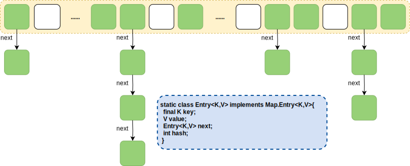
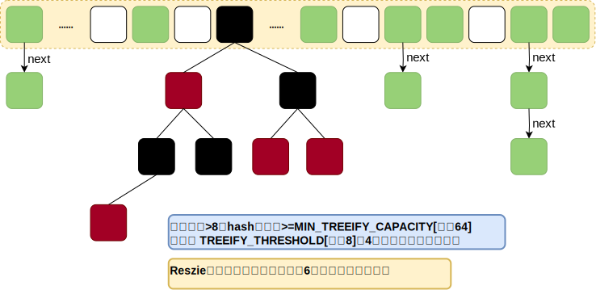
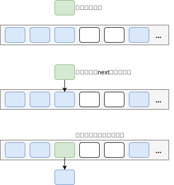
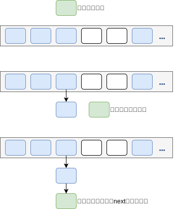
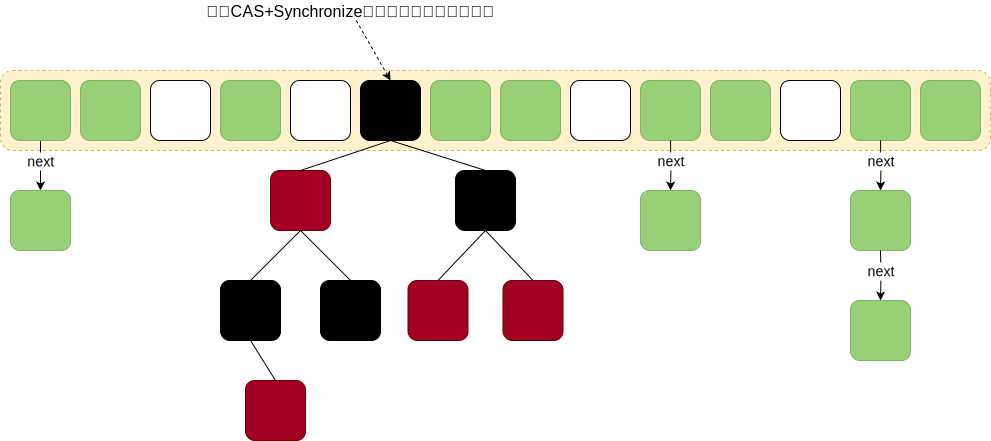

Java 中将集合分为两大类，分别为： `Collection` 单列集合、 `Map` 键值对集合，该两大类又衍生了多个子类

## Collection集合

Collection 其主要的子接口有 `List` 和 `Set` ，当然还有 `Queue`

### List

元素存取有序的集合，允许重复的集合

#### ArrayList

底层由数组实现的单列集合，元素存放有序，由于通过数组实现允许对元素进行快速访问，但进行增删操作处于中间位置元素时，需要对变动位及后面的元素进行复制移动代价较高，所以 ArrayList 有访问快增删慢的特性

- **默认大小** ：`0` 当调用 add() 方法时发现容量不足才会创建默认大小为 10 的数组
- **扩容倍数** ：`1.5` 源码: `int newCapacity = oldCapacity + (oldCapacity >> 1)`
- **扩容机制** ：创建一个新的数组，将旧数组中的数据拷贝到新数组中

#### Vector

底层同样由数组实现，但其实现方法通过 synchronize 修饰，线程安全但效率不如 ArrayList

- **默认大小** ：10
- **扩容倍数** ：2

#### LinkedList

底层由链表实现，元素存放有序，由于通过链表实现所以查询需要从根节点开始逐个遍历效率慢，但增删只需要调整前后节点的指针指向即可效率高，所以 LinkedList 拥有查询慢增删快的特性

### Set

元素唯一，没有存取顺序的集合

#### HashSet

HashSet 存储元素的顺序并不是按照存入时的顺序，而是按照哈希值排序（和 List 显然不同）。哈希表中存放的是哈希值所以取数据也是按照哈希值取得。元素的哈希值是通过元素的 hashCode 方法来获取的， HashSet 首先判断两个元素的哈希值，如果哈希值一样，接着会比较 equals 方法如果 equals 结果也为 true ， HashSet 就视两个元素为同一个元素。如果 equals 为 false 则不是同一个元素

HashSet 通过 HashMap 直接是实现的单列集合，其原理是值存在 HashMap 的 key 中，HashMap 的 value 则统一存储一个 Object，所以相关的扩容、查询机制可直接参考 HashMap

```java
// 部分源码
public class HashSet<E> extends AbstractSet<E> implements Set<E>, Cloneable, java.io.Serializable {
    private transient HashMap<E, Object> map;

    // 与支持映射中的对象关联的虚拟值
    private static final Object PRESENT = new Object();

    // ...

    public boolean add(E e) {
        return map.put(e, PRESENT) == null;
    }

    // ...
}
```

#### TreeSet

TreeSet() 是使用二叉树的原理对新 add() 的对象按照指定的顺序排序（升序、降序），每增加一个对象都会进行排序，将对象插入的二叉树指定的位置

Integer 和 String 对象都可以进行默认的 TreeSet 排序，而自定义类的对象是不可以的，自己定义的类必须实现 Comparable 接口，并且覆写相应的 compareTo() 函数，才可以正常使用

在覆写 compare() 函数时，要返回相应的值才能使 TreeSet 按照一定的规则来排序

比较此对象与指定对象的顺序。如果该对象小于、等于或大于指定对象，则分别返回负整数、零或正整数

#### LinkedHashSet

对于 LinkedHashSet 而言，它继承于 HashSet 、又基于 LinkedHashMap 来实现的。 LinkedHashSet 底层使用 LinkedHashMap 来保存所有元素，它继承于 HashSet ，其所有的方法操作上又与 HashSet 相同，因此 LinkedHashSet 的实现上非常简单，只提供了四个构造方法，并通过传递一个标识参数，调用父类的构造器，底层构造一个 LinkedHashMap 来实现，在相关操作上与父类 HashSet 的操作相同，直接调用父类 HashSet 的方法即可

## Map集合

### HashMap

HashMap 根据键的 hashCode 值存储数据，大多数情况下可以直接定位到它的值，因而具有很快的访问速度，但遍历顺序却是不确定的。 HashMap 最多只允许一条记录的键为 null ，允许多条记录的值为 null 。HashMap非线程安全，即任一时刻可以有多个线程同时写 HashMap ，可能会导致数据的不一致。如果需要满足线程安全，可以用 Collections 的 synchronizedMap 方法使 HashMap 具有线程安全的能力，或者使用 ConcurrentHashMap

#### 存储方式

<!-- tabs:start -->
<!-- tab:JDK7 -->
JDK7 版本中 HashMap 采用 **数组** + **链表** 的方式实现，通过 hash 值运算后得到 key 在 hash 数组中的散布位置，当该位置不存在值时则直接插入，当该位置存在值时则将新值插入该位的链表结构的头部



<!-- tab:JDK8 -->

JDK8 版本中 HashMap 采用 **数组** + **链表** + [**红黑树**](/计算机基础/数据结构/红黑树详解.md) 的方式实现，通过 hash 值运算后得到 key 在 hash 数组中的散布位置，当该位置不存在值时则直接插入，当该位置存在值时则将新值插入该位的链表结构的尾部，链表的长度大于 8 时则将链表转换为红黑树结构，同样当红黑树的节点小于 6 时也会被回退成链表



<!-- tabs:end -->

#### 节点插入方式

<!-- tabs:start -->
<!-- tab:JDK7 -->
**头插法**



**存在的并发问题**


具体问题代码体现在源码 `void transfer(Entry[] newTable, boolean rehash)` 的逻辑中

```java
public class HashMap<K, V> {
    /**
     * Transfers all entries from current table to newTable.
     */
    void transfer(Entry[] newTable, boolean rehash) {
        int newCapacity = newTable.length;
        for (Entry<K, V> e : table) { // 遍历数组
            while (null != e) { // 遍历处理链表时线程切换
                Entry<K, V> next = e.next;
                if (rehash) {
                    e.hash = null == e.key ? 0 : hash(e.key);
                }
                int i = indexFor(e.hash, newCapacity);
                e.next = newTable[i]; // 将根节点加到新节点之后
                newTable[i] = e; // 将新节点设置为根节点
                e = next; // 遍历链表下一项
            }
        }
    }
}
```

<!-- tab:JDK8 -->
**尾插法**



```java
final V putVal(int hash, K key, V value, boolean onlyIfAbsent, boolean evict) {
    Node<K, V>[] tab;
    Node<K, V> p;
    int n, i;
    if ((tab = table) == null || (n = tab.length) == 0)
        n = (tab = resize()).length;
    if ((p = tab[i = (n - 1) & hash]) == null)
        tab[i] = newNode(hash, key, value, null);
    else {
        Node<K, V> e;
        K k;
        if (p.hash == hash && ((k = p.key) == key || (key != null && key.equals(k))))
            e = p;
        else if (p instanceof TreeNode)
            e = ((TreeNode<K, V>) p).putTreeVal(this, tab, hash, key, value);
        else { // 存在头节点&非树形结构
            for (int binCount = 0; ; ++binCount) {
                if ((e = p.next) == null) {
                    p.next = newNode(hash, key, value, null); // 写入链表最后 
                    if (binCount >= TREEIFY_THRESHOLD - 1) // 链表大于8转树形结构
                        treeifyBin(tab, hash);
                    break;
                }
                if (e.hash == hash &&
                        ((k = e.key) == key || (key != null && key.equals(k))))
                    break; // 遍历下一个
                p = e;
            }
        }
        // ...
    }
    // ...
    return null;
}
```

<!-- tabs:end -->

#### put方法源码分析

<!-- tabs:start -->
<!-- tab:JDK7 -->

**`V put(K key, V value)`**

```java
public V put(K key, V value) {
    if (table == EMPTY_TABLE) {
        inflateTable(threshold); // 扩容数组，生容量为2的幂次方
    }
    if (key == null)
        return putForNullKey(value); // 将 key=null 的放置在数组 0 号位
    int hash = hash(key);
    int i = indexFor(hash, table.length); // h & (length-1) 计算索引位置
    for (Entry<K, V> e = table[i]; e != null; e = e.next) {
        Object k;
        if (e.hash == hash && ((k = e.key) == key || key.equals(k))) { // 判断存在的话则替换
            V oldValue = e.value;
            e.value = value;
            e.recordAccess(this);
            return oldValue;
        }
    }
    // 只有发生了新增操作时才会执行到这里  
    modCount++;
    addEntry(hash, key, value, i); // 添加新元素
    return null;
}
```

**`int hash(Object key)`**

```java
/**
 * 原注释：
 * 检索对象哈希码并将补充哈希函数应用于结果哈希，这可以防止质量较差的哈希函数。
 * 这至关重要，因为 HashMap 使用长度为 2 的幂的哈希表，否则会遇到低位相同的哈希码冲突。
 * 注意：空键始终映射到哈希 0，因此索引为 0
 */
final int hash(Object k) {
    int h = hashSeed;
    if (0 != h && k instanceof String) {
        return sun.misc.Hashing.stringHash32((String) k);
    }
    h ^= k.hashCode();
    // 原注释：此函数确保每个位位置仅相差常量倍数的 hashCode 具有有限数量的冲突（默认负载因子下约为 8）
    h ^= (h >>> 20) ^ (h >>> 12);
    return h ^ (h >>> 7) ^ (h >>> 4);
}
```

**`void addEntry(int hash, K key, V value, int bucketIndex)`**

```java
/**
 * 原注释：将具有指定键、值和哈希码的新条目添加到指定存储桶。此方法负责在适当的情况下调整表的大小。子类可重写此方法以改变 put 方法的行为
 */
void addEntry(int hash, K key, V value, int bucketIndex) {
    if ((size >= threshold) && (null != table[bucketIndex])) { // 如果元素熟练超过阈值则扩容重新计算 hash 和索引位
        resize(2 * table.length);
        hash = (null != key) ? hash(key) : 0;
        bucketIndex = indexFor(hash, table.length);
    }
    createEntry(hash, key, value, bucketIndex); // 创建新节点并设置在链表头
}
```

**`void createEntry(int hash, K key, V value, int bucketIndex)`**

```java
/**
 * 与 addEntry 类似，不同之处在于此版本用于在 Map 构造或“伪构造”（克隆、反序列化）过程中创建条目。此版本无需担心调整表的大小。
 * 子类可重写此版本以更改 HashMap(Map)、clone 和 readObject 的行为
 */
void createEntry(int hash, K key, V value, int bucketIndex) {
    Entry<K, V> e = table[bucketIndex];
    table[bucketIndex] = new Entry<>(hash, key, value, e); // 这里可以看到将原链表 e 设置到了新节点的 next
    size++;
}
```

<!-- tab:JDK8 -->


**`V put(K key, V value)`**

```java
/**
 * 将指定值与此映射中的指定键相关联.
 * 如果映射先前包含键的映射，则旧的值被替换
 *
 * @param key 与指定值相关联的键
 * @param value 要与指定键关联的值
 * @return 与 key 关联的先前值，如果没有 key 的映射，则为 null
 *         （空返回也可以指示映射先前将空与键关联。）
 */
public V put(K key, V value) {
    return putVal(hash(key), key, value, false, true);
}
```

**`int hash(Object key)`**

```java
/**
 * 计算 key.hashCode() 并将散列的较高位（异或）传播到较低位
 * 由于该表使用二次幂掩码，因此仅在当前掩码上方位变化的散列集将始终发生冲突。 
 * （众所周知的例子是在小表中保存连续整数的浮点键集。）
 * 所以我们应用一种变换来向下传播较高位的影响。位扩展的速度、效用和质量之间存在权衡
 * 因为许多常见的散列集已经合理分布（因此不会从传播中受益），并且因为我们使用树来处理 bin 中的大量冲突，
 * 所以我们只是以最便宜的方式对一些移位的位进行异或以减少系统损失，
 * 以及合并最高位的影响，否则由于表边界而永远不会在索引计算中使用
 */
static final int hash(Object key) {
    int h;
    return (key == null) ? 0 : (h = key.hashCode()) ^ (h >>> 16);
}
```

**`V putVal(int hash, K key, V value, boolean onlyIfAbsent,boolean evict)`**

```java
/**
 * 实现 Map.put 和相关方法
 *
 * @param hash key的散列
 * @param key key
 * @param value 要put的值
 * @param onlyIfAbsent 如果是true，则不覆盖当前的值
 * @param evict 如果为 false，则表处于创建模式
 * @return 以前的值，如果没有，则为 null
 */
final V putVal(int hash, K key, V value, boolean onlyIfAbsent, boolean evict) {
    Node<K, V>[] tab;
    Node<K, V> p;
    int n, i;
    // table来自于成员变量 Node<K,V>[] table，即Map中的数组结构
    if ((tab = table) == null || (n = tab.length) == 0)
        // table为空时扩容
        n = (tab = resize()).length;
    if ((p = tab[i = (n - 1) & hash]) == null)
        // 判断如果定位到的数组位为null时创建一个新的普通节点
        tab[i] = newNode(hash, key, value, null);
    else {
        // 数组位存在数据时的处理
        Node<K, V> e;
        K k;
        if (p.hash == hash && ((k = p.key) == key || (key != null && key.equals(k))))
            // 将key与数组元素进行比较。key的hash一致，内存地址一致，或key不为空equals比较也一致，说明此时是更新数据
            e = p;
        else if (p instanceof TreeNode)
            // 如果是树形节点调用putTreeVal()，新键插入会返回null
            e = ((TreeNode<K, V>) p).putTreeVal(this, tab, hash, key, value);
        else {
            // 既不是数组位头元素又不是树形结构，那就执行链表的逻辑
            for (int binCount = 0; ; ++binCount) {
                if ((e = p.next) == null) {
                    // 下一个链表节点元素如果是空就新增节点
                    p.next = newNode(hash, key, value, null);
                    // TREEIFY_THRESHOLD 树形化的阈值 8
                    if (binCount >= TREEIFY_THRESHOLD - 1) // -1 是加上了数组中的根节点元素
                        // 这里判断链长度达到了8的阈值，将链表转化为红黑树并跳出循环
                        treeifyBin(tab, hash);
                    break;
                }
                if (e.hash == hash && ((k = e.key) == key || (key != null && key.equals(k))))
                    // 节点的hash与链表节点元素hash一致，或键的内存地址一致与键equals比较也一致，说明此时是更新数据
                    break;
                // 遍历下一个节点
                p = e;
            }
        }
        if (e != null) {
            // 键的旧值
            V oldValue = e.value;
            if (!onlyIfAbsent || oldValue == null)
                // 可以覆盖或旧值为空，赋值新值
                e.value = value;
            afterNodeAccess(e); // 将更新过的节点移到链表的最后
            return oldValue;
        }
    }
    // 只有发生了新增操作时才会执行到这里  
    ++modCount; // 这里记录了map元素变动的次数，用于遍历时比较，判断是否存在了并发操作，比较时不一致会抛出并发异常
    if (++size > threshold)
        // 集合当前元素数量大于阈值触发扩容  
        resize();
    afterNodeInsertion(evict);// 插入节点后的操作，方法实现了LRU淘汰机制，但默认不会生效
    return null;
}
```

**`TreeNode<K,V> putTreeVal(HashMap<K,V> map, Node<K,V>[] tab, int h, K k, V v)`**

> 作用就是获取对应要修改的节点，如果找不到就新增，大体步骤如下：
>
> 1. 获取到树形节点的根节点
> 2. 从根节点开始遍历，比较节点 hash 值
> 3. 为 0 且 equals 比较为 true 则是说明 key 是单当前遍历的节点，返回节点给方法调用者
> 4. 为 0 但 equals 比较为 false 时，会强制比较返回 -1 或 1
> 5. 遍历的节点 key 的 hash 与插入节点 key 的 hash 比较如果为 -1 ，则遍历节点的右子树
> 6. 如果为 1 ，则遍历节点的左子树
> 7. 遍历过程重复 3 、 4、 5 步
> 8. 如果在遍历的过程中发现下一个子树节点为 NULL 时，说明遍历红黑树未找到改 key ，此时创建一个新的子树节点，赋值至当前为空的这个子树节点
     **`Node<K,V>[] resize()`**

> 作用就是为了扩容，大体的步骤如下：
>
> - 计算新的容量、阈值
> - 创建一个新的 Node 数组
> - 遍历旧的数组结构
> - 获取元素指向，清除旧 map 中的地址指向
> - 通过 key 的 huah 值 & （扩容前容量 -1 ）的按位与计算结果判断是否要调整位置
> - 插入节点
> - 最终完成扩容
    **`Node<K,V> newNode(int hash, K key, V value, Node<K,V> next)`**

> 创建一个新的普通节点，非树形节点

**`void treeifyBin(Node<K,V>[] tab, int hash)`**

> 将链表树形化，但需要注意的是，当链表长度达到 8 但总节点数小于 64 时，该方法会去调用 resize ，而非继续树形化

**`void afterNodeAccess(Node<K,V> p)`**

> 将修改的节点移动到链表的最后

**`void afterNodeRemoval(Node<K,V> p)`**

> 这个方法其实可以忽视，因为方法体中的实现逻辑，在正常情况下是不会执行的

<!-- tabs:end -->

### ConcurrentHashMap

ConcurrentHashMap是Java并发包中的一个线程安全且高效的HashMap实现

<!-- tabs:start -->
<!-- tab:JDK7 -->
在 JDK7 版本中 ConcurrentHashMap 采用 `数组` + `链表`，引入了 Segment 分段锁的概念，转变成了两层结构，第一次 Hash 确定所在 Segment ，第二次 Hash 确定具体的节点位置

采用分段锁机制实现并发控制，但默认分为 16 段，所以意味着最多只有 16 个线程可以同时进行写操作

**分段锁机制**



<!-- tab:JDK8 -->
Java8 中 ConcurrentHashMap 抛弃了 Segment 分段锁，采用了粒度更细的加锁方式，采用 CAS + synchronize 的实现对节点的锁定，大幅度提升并发性能

当通过 hash 计算后得到的索引位为 null 时通过 **CAS** 进行比较并替换，当索引位不为 null 时如果在执行扩容则会帮助扩容，既不是 null 也不在扩容则通过 **synchronized(f) f:位于数组的根节点** 加锁处理修改节点/新增节点，最后判断如果是链表且长度是否达到树形化阈值，则触发树形化链表的操作



<!-- tabs:end -->

### LinkedHashMap

LinkedHashMap 是 HashMap 的一个子类，通过 HashMap + 双向链表的方式，保存了记录的插入顺序，在用 Iterator 遍历 LinkedHashMap 时，先得到的记录肯定是先插入的，也可以在构造时带参数，按照访问次序排序

### TreeMap

TreeMap 实现 SortedMap 接口，能够把它保存的记录根据键排序，默认是按键值的升序排序，也可以指定排序的比较器，当用 Iterator 遍历 TreeMap 时，得到的记录是排过序的

在使用 TreeMap 时， key 必须实现 Comparable 接口或者在构造 TreeMap 传入自定义的 Comparator ，否则会在运行时抛出 java.lang.ClassCastException 类型的异常

**实现排序的方式：**
<!-- tabs:start -->
<!-- tab:实现 Comparable 接口 -->
key 实现 Comparable 接口，例：按优先级升序排序

```java
public class Test implements Comparable<Test> {
    private final Integer level;

    public Test(Integer level) {
        this.level = level;
    }

    @Override
    public String toString() {
        return "Test{" +
                "level=" + level +
                '}';
    }

    public static void main(String[] args) {
        TreeMap<Test, Object> map = new TreeMap<>();

        map.put(new Test(3), null);
        map.put(new Test(1), null);
        map.put(new Test(4), null);
        map.put(new Test(5), null);
        map.put(new Test(2), null);

        map.forEach((k, v) -> System.out.printf("Key：'%s'\n", k));
    }

    @Override
    public int compareTo(Test o) {
        return Integer.compare(this.level, o.level);
    }
}
// 输出
// Key：'Test{level=1}'
// Key：'Test{level=2}'
// Key：'Test{level=3}'
// Key：'Test{level=4}'
// Key：'Test{level=5}'
```

<!-- tab:使用 Comparator 实现类 -->
传入自定义 Comparator 实现类，例：按优先级升序排序

```java
public class Test {
    private final Integer level;

    public Test(Integer level) {
        this.level = level;
    }

    public Integer getLevel() {
        return level;
    }

    @Override
    public String toString() {
        return "Test{" +
                "level=" + level +
                '}';
    }

    public static void main(String[] args) {
        TreeMap<Test, Object> map = new TreeMap<>(new Comparator<Test>() {
            @Override
            public int compare(Test o1, Test o2) {
                return Integer.compare(o1.getLevel(), o2.getLevel());
            }
        });
        map.put(new Test(3), null);
        map.put(new Test(1), null);
        map.put(new Test(4), null);
        map.put(new Test(5), null);
        map.put(new Test(2), null);

        map.forEach((k, v) -> System.out.printf("Key：'%s'\n", k));
    }
}
// 输出：
// Key：'Test{level=1}'
// Key：'Test{level=2}'
// Key：'Test{level=3}'
// Key：'Test{level=4}'
// Key：'Test{level=5}'

```

<!-- tabs:end -->

### HashTable

HashTable 是线程安全的类，但由于在增改删时会对全表加锁其性能很低，在性能上比不上 ConcurrentHashMap ，所以不推荐使用。 HashTable 中 hash 数组默认大小是 11 ，扩容的方式是 `old * 2 + 1` ，继承自 Dictionary 类
