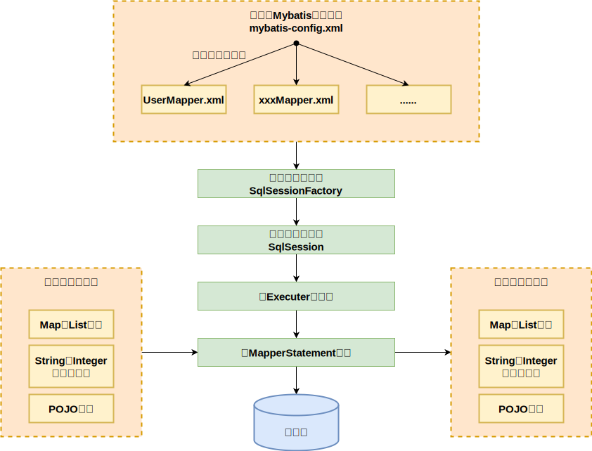
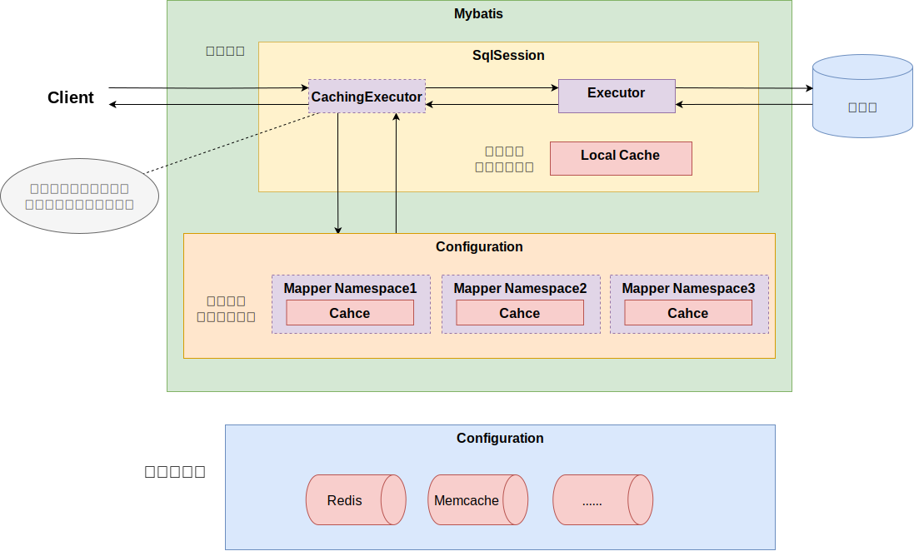

## 什么时Mybatis

1. Mybatis 是一个半自动 ORM (对象关系映射)的框架，内部通过对 JDBC 的封装实现。减少了开发过程中花费大量精力去加载驱动、创建连接、创建 statement 等繁杂的操作，只需要关注 SQL 语句本身
2. Mybatis 可以通过 XML 或注解来配置和映射原生信息，将 Entity 映射成数据库中的记录，避免了绝大部分 JDBC 代码、手动设置参数以及手动封装结果集
3. 通过XML文件或注解的方式将要执行的各种 statement 配置起来，并通过 Java 对象和 statement 中的 sql 的动态参数进行映射生成最终的 sql 语句，最后由 mybatis 框架执行 sql 并将结果映射为 java 对象返回

## Mybatis的优缺点

<!-- tabs:start -->
<!-- tab:优点 -->

1. 基于 SQL 语句编程， SQL 语句写在 XML 中，解除了 sql 与程序代码的耦合，便于统一管理。提供 xml 标签，支持编写动态 sql ，可以重用
2. 与 JDBC 相比减少了代码量，消除了 JDBC 大量的冗余代码，接替了手动处理连接创建、调用、销毁
3. 提供相关映射标签，支持对象与数据库的 ORM 字段关系映射。提供对象关系银蛇标签，支持对象关系维护
4. 与数据库具有很好的兼容性
5. 与 Spring 集成方便
6. 能很好对 SQL 进行性能优化和调整

<!-- tab:缺点 -->

1. SQL 语句编写工作量较大，数据量大时对开发人员的 SQL 功底有一定的要求
2. SQL 依赖于数据库，导致数据库移植性差，不能随意更换、调整数据库

<!-- tabs:end -->

## MyBatis的工作原理



1. **读取 MyBatis 配置文件** ：`mybatis-config.xml` 为 MyBatis 的全局配置文件，配置了 MyBatis 的运行环境等信息，例如数据库连接信息
2. **加载映射文件** ：映射文件即 SQL 映射文件，该文件中配置了操作数据库的 SQL 语句，需要在 MyBatis 配置文件 mybatis-config.xml 中加载。 mybatis-config.xml 文件可以加载多个映射文件，每个文件对应数据库中的一张表
3. **构造会话工厂** ：通过 MyBatis 的环境等配置信息构建会话工厂 SqlSessionFactory
4. **创建会话对象** ：由会话工厂创建 SqlSession 对象，该对象中包含了执行 SQL 语句的所有方法
5. **Executor 执行器** ：MyBatis 底层定义了一个 Executor 接口来操作数据库，它将根据 SqlSession 传递的参数动态地生成需要执行的 SQL 语句，同时负责查询缓存的维护
6. **MappedStatement 对象** ：在 Executor 接口的执行方法中有一个 MappedStatement 类型的参数，该参数是对映射信息的封装，用于存储要映射的 SQL 语句的 id 、参数等信息
7. **输入参数映射** ：输入参数类型可以是 Map 、 List 等集合类型，也可以是基本数据类型和 POJO 类型。输入参数映射过程类似于 JDBC 对 preparedStatement 对象设置参数的过程
8. **输出结果映射** ：输出结果类型可以是 Map 、 List 等集合类型，也可以是基本数据类型和 POJO 类型。输出结果映射过程类似于 JDBC 对结果集的解析过程

## Mapper接口的工作原理

Mapper 接口没有实现类，当调用接口时通过全限定名(例： com.xxxx.user.mapper.UserMapper ) + 方法名拼接字符串作为Key值(例： com.xxxx.user.mapper.UserMapper.findUserByName )，可唯一定位一个 MapperStatement 。在 xml 中的每一个 `<select>` 、 `<insert>` 、 `<update>` 、 `<delete>` 标签都会被解析成一个 MapperStatement 对象。 Mapper 接口采用 JDK 动态代理， Mybatis 在运行时生成代理对象 proxy ，代理对象会拦截接口方法，转而执行 MapperStatement 所代表的 sql ，然后将 sql 执行结果封装放回

## Mapper接口为什么不能重载

Mapper接口中的方法不能进行重载，因为采用 **全限定名 + 方法名** 的保存和寻找策略

## Mybatis动态 SQL 有什么用

根据标签中表达式的值，完成逻辑判断并动态拼接 sql 的功能，提高了单个接口的重用性

## XML映射文件中有哪些创建的标签

**定义 SQL**

- **`<insert>`**
- **`<select>`**
- **`<update>`**
- **`<delete>`**

**格式化**

- **`<where>`** ：动态添加 `where` 关键字，并处理条件开头通过动态sql可能多出来的 `AND` | `OR`
- **`<set>`** ：当动态 sql 拼接时，`set` 后未设置更新字段及其值时去除多余的 `set` 关键字
- **`<trim>`** ：与 where 关键字功能相似，区别在于该标签可以指定要去除的关键字

**动态SQL**

- **`<if>`** ：当 `test` 表达式成立时，拼接标签中的 sql
- **`<foreac>`** ：循环遍历集合元素，常用于 `in` 和 `insert into values`
- **`<choose>`** ：相当于 java 中的 switch ，当内部按顺序任意一个 `<when>` 条件成即结束，如果都不满足则使用 `<ootherwise>`
- **`<when>`** ：相当于 switch 语句中的 case ，默认带 break 的那种
- **`<ootherwise>`** ：相当于 switch 语句中的 default
- **`<bind>`：**

**结果映射**

- **`<resultMap>`** ：结果映射集
- **`<id>`** ：设置表主键字段与属性的关联
- **`<result>`** ：设置属性与字段的关联
- **`<association>`** ：设置属性与记录属于一对一关联关系，常用与属性为其他对象
- **`<collection>`** ：设置属性与记录属于一对多关联关系，常用于属性为集合

**其他**

- **`<sql>`** ：定义 SQL 片段
- **`<include>`** ：导入 sql 片段
- **`<selectKey>`** ：设置主键生成策略

## #{}与${}的区别

- `#{}` 为预编译处理，Mybatis 在处理 `#{}` 时会将 sql 中的 `#{}` 替换为 `?` ，调用 PreparedStatement 的 set 方法进行赋值
- `${}` 为字符串拼接，Mybatis 处理 `${}` 时会将 sql 中的 `${}` 直接替换成对应的值
- `#{}` 能有效的防止 sql 注入，提高安全性

## 实现模糊查询

<!-- tabs:start -->
<!-- tab:代码中处理 -->
代码中完成通配符添加， sql 中通过 `#{}` 注入

```java
String key = "ABC";
String likeStr = "%" + key + "%";
List<Table> tables = mapper.qryList(likeStr);
```

```xml
<!-- xxxMapper.xml -->
<select id="xxxx">
    select * from table where name like #{likeStr}
</select>
```

<!-- tab:SQL拼接 -->
sql 中直接拼接通配符，可能造成 sql 注入问题

```xml
<!-- xxxMapper.xml -->
<select id="xxxx">
    select * from table where name like '%${key}%'
</select>
```

<!-- tab:函数拼接SQL -->
sql 中调用拼接函数拼接通配符，可以避免出现 sql 注入问题

```xml
<!-- xxxMapper.xml -->
<select id="xxxx">
    select * from table where name like concat('%',#{key},'%')
</select>
```

<!-- tabs:end -->

## mapper中传递多个参数

<!-- tabs:start -->
<!-- tab:通过索引位 -->

- 通过 `#{arg?}` 实现，? 为参数所在索引位0..n
- 通过 `#{param?}` 实现，? 为参数所在索引位1..n

```java
User findUser(Integer age, Integer sex);
```

```xml
<!-- xxxMapper.xml -->
<select id="findUser">
  select * from table where age = #{param1} and sex = #{param2}
</select>
```

<!-- tab:使用注解 -->
使用 `@Param` 注解

```java
User findUser(@Param("age") Integer age, @Param("sex") Integer sex);
```

```xml
<!-- xxxMapper.xml -->
<select id="findUser">
    select * from table where age = #{age} and sex = #{sex}
</select>
```

<!-- tabs:end -->

## 实体属性名与表中字段不一致

1. 通过在 sql 中设置别名返回与实体属性名对应的别名
2. 通过 `<resultMap>` 设置实体属性名与表字段的映射关系

## 关联查询结果封装

<!-- tabs:start -->
<!-- tab:一对一 -->

```html
<select id="findUser" resultMap="bindEntity">
    select * from student s,class c where s.c_id = c.c_id and s.s_id = #{id}
</select>
<resultMap id="bindEntity" resultType="student">
    <id property="id" column="s_id"/>
    <result property="name" column="s_name"/>
    <association property="class" javaType="class">
        <id property="id" column="c_id"/>
        <result property="name" column="c_name"/>
    </association>
</resultMap>
```

<!-- tab:一对多 -->

```html
<select id="findUser" resultMap="bindEntity">
    select * from class c,student s where c.c_id = s.c_id and c.c_id = #{id}
</select>
<resultMap id="bindEntity" resultType="class">
    <id property="id" column="c_id"/>
    <result property="name" column="c_name"/>
    <collection property="class" javaType="class">
        <id property="id" column="c_id"/>
        <result property="name" column="c_name"/>
    </collection>
</resultMap>
```

<!-- tabs:end -->

## Mybatis缓存

Mybatis 中有一级缓存和二级缓存，默认情况下一级缓存是开启的，而且是不能关闭的。一级缓存是指 SqlSession 级别的缓存，当在同一个 SqlSession 中进行相同的 SQL 语句查询时，第二次以后的查询不会从数据库查询，而是直接从缓存中获取，一级缓存最多缓存 `1024` 条 SQL 。二级缓存是指可以跨 SqlSession 的缓存。是 mapper 级别的缓存，对于 mapper 级别的缓存不同的 SqlSession 是可以共享的



### 一级缓存

基于 PerpetualCache 的 HashMap 本地缓存，其存储作用域为 Session，当 Session flush 或 close 之后，该 Session 中的所有 Cache 就将清空，默认打开一级缓存

第一次发出一个查询 sql ， sql 查询结果写入 SqlSession 的一级缓存中，缓存使用的数据结构是一个 map

- `key`： MapperID + offset + limit + Sql + 所有的入参
- `value`： 用户信息

同一个 SqlSession 再次发出相同的 sql ，就从缓存中取出数据。如果两次中间出现 commit 操作（修改、添加、删除），本 SqlSession 中的一级缓存区域全部清空，下次再去缓存中查询不到所以要从数据库查询，从数据库查询到再写入缓存

### 二级缓存

二级缓存与一级缓存其机制相同，默认也是采用 PerpetualCache ， HashMap 存储，不同在于其存储作用域为 Mapper ( Namespace )，并且可自定义存储源，如 Ehcache 。默认不打开二级缓存，要开启二级缓存，使用二级缓存属性类需要实现 Serializable 序列化接口(可用来保存对象的状态),可在它的映射文件中配置 `<cache/>`

二级缓存的范围是 mapper 级别（ mapper 同一个命名空间）， mapper 以命名空间为单位创建缓存数据结构，结构是 map 。 mybatis 的二级缓存是通过 CacheExecutor 实现的。 CacheExecutor 其实是 Executor 的代理对象。所有的查询操作，在 CacheExecutor 中都会先匹配缓存中是否存在，不存在则查询数据库

- `key`： MapperID + offset + limit + Sql + 所有的入参

#### 二级缓存开启方式

<!-- tabs:start -->
<!-- tab:全局配置 -->
<!-- tabs:start -->
<!-- tab:xml方式 -->

```xml
<!-- mybatis.xml -->
<settings>
    <!-- 开启二级缓存(整体开启) -->
    <setting name="cacheEnabled" value="true"/>
</settings>
```

<!-- tab:yml/yaml方式 -->

```yaml
mybatis:
  configuration:
    cache-enabled: true
```

<!-- tabs:end -->
<!-- tab:单个Mapper中启用 -->

```xml
<!-- xxxMapper.xml 开启 mapper 所在 namespace 的二级缓存 -->
<cache eviction="FIFO" flushInterval="60000" size="512" readOnly="true"/>
```

相关配置属性：

- `eviction:` 清除策略
    - `LRU:` 最近最少使用：移除最长时间不被使用的对象。默认清除策略
    - `FIFO:` 先进先出：按对象进入缓存的顺序来移除它们
    - `SOFT:` 软引用：基于垃圾回收器状态和软引用规则移除对象
    - `WEAK:` 弱引用：更积极地基于垃圾收集器状态和弱引用规则移除对象
- `flushInterval:` 刷新间隔时间 单位毫秒 ms
- `size:` 缓存最大占用空间
- `readOnly:` 只读

<!-- tabs:end -->

#### 禁用/清空二级缓存配置

<!-- tabs:start -->
<!-- tab:禁用二级缓存 -->
通过设置 `useCache="false"` 可以禁用单个 SQL 使用缓存

```xml
<!-- 查询所有 -->
<select id="getAllTableA" resultType="string" useCache="false">
    select * from table_a
</select>
```

<!-- tab:清空二级缓存 -->
通过设置 `flushCache="true"` 可以清空该 namespace 下的缓存

```xml

<update id="updateTableAData" flushCache="true" parameterType="xx.xx">
    update table_a set name = #{name} where id = #{id}
</update>
```

<!-- tabs:end -->
