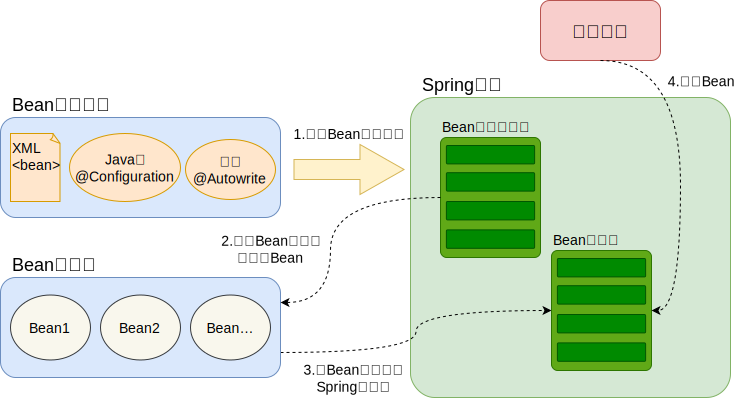

## IoC简介

Spring 通过一个配置文件描述 Bean 及 Bean 之间的依赖关系，利用 Java 语言的反射功能实例化 Bean 并建立 Bean 之间的依赖关系。 Spring 的 IoC 容器在完成这些底层工作的基础上，还提供了 Bean 实例缓存、生命周期管理、Bean 实例代理、事件发布、资源装载等高级服务

依赖注入 (DI) 是 IoC 的一种特殊形式，对象仅通过构造函数参数、工厂方法的参数或在构造或从工厂方法返回对象实例后设置的属性来定义其依赖项（即它们使用的其他对象）。然后，IoC 容器在创建 bean 时注入这些依赖项。这个过程本质上是 bean 本身的逆过程（因此得名控制反转），通过使用直接构造类或服务定位器模式等机制来控制其依赖项的实例化或位置

## Spring 容器高层视图

Spring 启动时读取应用程序提供的 Bean 配置信息，并在 Spring 容器中生成一份相应的 Bean 配置注册表，然后根据这张注册表实例化 Bean，装配好 Bean 之间的依赖关系，为上层应用提供准备就绪的运行环境。其中 Bean 缓存池为 HashMap 实现



## IoC容器实现

`org.springframework.beans` 和包 `org.springframework.context` 是 Spring Framework 的 IoC 容器的基础。Spring IoC 容器的设计主要是基于 BeanFactory 和 ApplicationContext 两个接口，其中 ApplicationContext 是 BeanFactory 的子接口之一。换句话说 BeanFactory 是 Spring IoC 容器所定义的最底层接口，而 ApplicationContext 是其高级接口之一，并且对 BeanFactory 功能做了许多有用的扩展，所以在绝大部分的工作场景下，都会使用 ApplicationContext 作为 Spring IoC 容器

| **容器**             | 描述                                                                                                                                                                                              |
|--------------------|-------------------------------------------------------------------------------------------------------------------------------------------------------------------------------------------------|
| BeanFactory        | 最简单的容器，给 DI 提供了基本支持，它用 org.springframework.beans.factory.BeanFactory 接口来定义。BeanFactory 或者相关的接口，如 BeanFactoryAware，InitializingBean，DisposableBean，在 Spring 中仍然存在具有大量的与 Spring 整合的第三方框架的反向兼容性的目的 |
| ApplicationContext | 该容器添加了更多的企业特定的功能，例如从一个属性文件中解析文本信息的能力，发布应用程序事件给感兴趣的事件监听器的能力。该容器是由 org.springframework.context.ApplicationContext 接口定义                                                                            |

### BeanFactory结构

BeanFactory 是 Spring 框架的基础设施，面向 Spring 本身。ApplicationContext 面向使用 Spring 框架的开发者，几乎所有的应用场合我们都直接使用 ApplicationContext 而非底层的 BeanFactory


- **BeanDefinitionRegistry注册表：** Spring 配置文件中每一个节点元素在 Spring 容器里都通过一个 BeanDefinition 对象表示，它描述了 Bean 的配置信息。而 BeanDefinitionRegistry 接口提供了向容器手工注册 BeanDefinition 对象的方法

- **BeanFactory顶层接口：** 位于类结构树的顶端 ，它最主要的方法就是 getBean(String beanName)，该方法从容器中返回特定名称的 Bean，BeanFactory 的功能通过其他的接口得到不断扩展

- **ListableBeanFactory：** 该接口定义了访问容器中 Bean 基本信息的若干方法，如查看 Bean 的个数、获取某一类型 Bean 的配置名、查看容器中是否包括某一Bean等方法

- **HierarchicalBeanFactory父子级联：** 父子级联 IoC 容器的接口，子容器可以通过接口方法访问父容器； 通过 HierarchicalBeanFactory 接口，Spring 的 IoC 容器可以建立父子层级关联的容器体系，子容器可以访问父容器中的 Bean，但父容器不能访问子容器的 Bean。Spring 使用父子容器实现了很多功能，比如在 SpringMVC 中，展现层 Bean 位于一个子容器中，而业务层和持久层的 Bean 位于父容器中。这样，展现层 Bean 就可以引用业务层和持久层的 Bean，而业务层和持久层的 Bean 则看不到展现层的 Bean

- **ConfigurableBeanFactory：** 是一个重要的接口，增强了IoC容器的可定制性，它定义了设置类装载器、属性编辑器、容器初始化后置处理器等方法

- **AutowireCapableBeanFactory自动装配：** 定义了将容器中的 Bean 按某种规则（如按名字匹配、按类型匹配等）进行自动装配的方法

- **SingletonBeanRegistry运行期间注册单例Bean：** 定义了允许在运行期间向容器注册单实例 Bean 的方法；对于单实例( singleton )的 Bean 来说，BeanFactory 会缓存 Bean 实例，所以第二次使用 getBean() 获取 Bean 时将直接从 IoC 容器的缓存中获取 Bean 实例。Spring 在 DefaultSingletonBeanRegistry 类中提供了一个用于缓存单实例 Bean 的缓存器，它是一个用 HashMap 实现的缓存器，单实例的 Bean 以 beanName 为键保存在这个 HashMap 中

- **依赖日志框架：** 在初始化 BeanFactory 时，必须为其提供一种日志框架，比如使用 Log4J， 即在类路径下提供 Log4J 配置文件，这样启动Spring容器才不会报错

### ApplicationContext结构

ApplicationContext 由 BeanFactory 派生而来，提供了更多面向实际应用的功能。ApplicationContext 继承了 HierarchicalBeanFactory 和 ListableBeanFactory 接口，在此基础上，还通过多个其他的接口扩展了 BeanFactory 的功能：


- **ClassPathXmlApplicationContext：** 默认从类路径加载配置文件
- **FileSystemXmlApplicationContext：** 默认从文件系统中装载配置文件
- **ApplicationEventPublisher：** 让容器拥有发布应用上下文事件的功能，包括容器启动事件、关闭事件等。
- **MessageSource：** 为应用提供 i18n 国际化消息访问的功能
- **ResourcePatternResolver ：** 所有 ApplicationContext 实现类都实现了类似于 PathMatchingResourcePatternResolver 的功能，可以通过带前缀的 Ant 风格的资源文件路径装载 Spring 的配置文件。
- **LifeCycle：** 该接口是Spring2.0加入的，该接口提供了 start() 和 stop() 两个方法，主要用于控制异步处理过程。在具体使用时，该接口同时被 ApplicationContext 实现及具体Bean实现，ApplicationContext 会将 start/stop 的信息传递给容器中所有实现了该接口的 Bean，以达到管理和控制 JMX、任务调度等目的
- **ConfigurableApplicationContext：** 扩展于 ApplicationContext，它新增加了两个主要的方法：refresh() 和 close()，让 ApplicationContext 具有启动、刷新和关闭应用上下文的能力。在应用上下文关闭的情况下调用 refresh() 即可启动应用上下文，在已经启动的状态下，调用 refresh() 则清除缓存并重新装载配置信息，而调用 close() 则可关闭应用上下文

### BeanFactory与ApplicationContext的区别

**对Bean的加载方式不同**

- BeanFactory 采用懒加载机制，只有调用 getBean() 时才进行对象的实
- ApplicationContext 采用预加载机制，应用启动后就实例化所有 Bean

**特性不同**

- BeanFactory 接口只提供了 IoC/DI 的支持，常用的 API 是 XMLBeanFactory
- ApplicationContext 继承自 BeanFactory，功能更加广泛

## SpringBean

### Bean的生命周期


### Bean的作用域

- **singleton：** 在 SpringIoC 容器中只有一个
- **prototype：** 一个 Bean 存在多个实例
- **request：** 每次 Http 请求都创建一个 Bean 该作用域仅在基于 web 的 SpringApplicationContext 情形下有效。
- **session：** 在一个 HTTP Session 中，一个 bean 定义对应一个实例。该作用域仅在基于 web 的 Spring ApplicationContext 情形下有效。
- **global-session：** 在一个全局的 HTTP Session 中，一个bean定义对应一个实例。该作用域仅在基于 web 的 Spring ApplicationContext 情形下有效。

?> SpringIoC 容器默认采用 singleton(单例) 创建 Bean，使用 prototype(多例) 因为频繁创建和销毁 Bean 会造成很大的性能消耗

### 依赖注入的方式

<!-- tabs:start -->
<!-- tab:构造器 -->

```java
public class A {
    public B b;

    public A(B b) {
        this.b = b;
    }
}
  ```

<!-- tab:set方法 -->

```java
public class A {
    public B b;

    public setB(B b) {
        this.b = b;
    }
}
```

<!-- tabs:end -->

### 懒加载

默认情况下，ApplicationContext实现会在初始化过程中急切地创建和配置所有单例 bean。通常，这种预实例化是可取的，因为可以立即发现配置或周围环境中的错误，而不是等到几小时甚至几天后。当这种行为不合需要时，您可以通过将 bean 定义标记为延迟初始化来防止单例 bean 的预实例化。延迟初始化 bean 会告诉 IoC 容器在首次请求时而不是在启动时创建 bean 实例

<!-- tabs:start -->
<!-- tab:注解 -->

```java
// 配置类中，例 UserConfig.java
@Lazy
@Bean
public UserService userService() {
    return new UserServiceImpl();
}
```

<!-- tab:xml -->

```xml
<!-- spring.xml -->
<bean id="lazy" class="cn.tangshh.example.service.UserServiceServiceImpl" lazy-init="true"/>
```

<!-- tabs:end -->

### Bean自动装配类型

- **no：** 默认的方式是不进行自动装配，通过显式设置 ref 属性来进行装配
- **byName：** 通过参数名自动装配，Spring 容器在配置文件中发现 bean 的 autowire 属性被设置成 byName，之后容器试图匹配、装配和该 bean 的属性具有相同名字的 bean
- **byType：** 通过参数类型自动装配，Spring 容器在配置文件中发现 bean 的 autowire 属性被设置成 byType，之后容器试图匹配、装配和该 bean 的属性具有相同类型的 bean 。如果有多个 bean 符合条件，则抛出错误
- **constructor：** 这个方式类似于 byType， 但是要提供给构造器参数，如果没有确定的带参数 的构造器参数类型，将会抛出异常
- **autodetect：** 首先尝试使用 constructor 来自动装配，如果无法工作，则使用 byType 方式

## 其他问题

### 三级缓存解决循环依赖的原理
