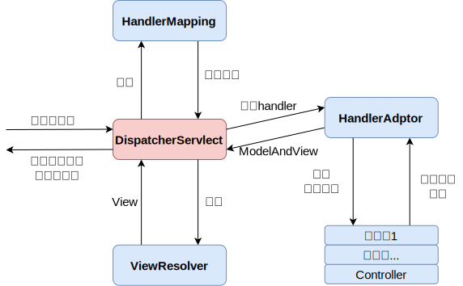

Spring MVC(模型-视图-控制器)框架是围绕 **DispatcherServlet** 来设计的，这个 servlet 会把请求分发给各个请求处理器，并支持可配置的处理器映射、视图渲染、本地化、时区、主题渲染以及文件上传等

## SpringMVC常用组件

### DispatcherServlet

调度程序，HTTP 请求处理程序/ 控制器的中央调度程序，由它来调用其他已注册的组件处理用户请求。具体[源码](/开发语言/Java/Spring/SpringMVC详解.md?id=源码)

### HandlerMapping

处理器映射器，定义请求和处理程序对象之间的映射的对象要实现的接口

```java
public interface HandlerMapping {
    HandlerExecutionChain getHandler(HttpServletRequest request) throws Exception;
}
```

getHandler：返回此请求的处理程序和任何拦截器。可以根据请求 URL、会话状态或实现类选择的任何因素进行选择

### HandlerExecutionChain

处理程序执行链，由处理程序对象和任何处理程序拦截器组成

```java
public class HandlerExecutionChain {
    private final Object handler;
    private final List<HandlerInterceptor> interceptorList = new ArrayList<>();
    private int interceptorIndex = -1;
}
```

- handler：请求处理器，通常就是我们自定义的 controller 对象及方法
- interceptorList：拦截器，当前请求匹配到的拦截器列表
- interceptorIndex：拦截器索引，用来记录执行到第几个拦截器了

### Handler

处理器，通常需要我们自己开发，一般指我们自定义的 Controller，在 DispatcherServlet 的控制下 handler 对具体的请求进行处理

### HandlerAdapter

处理器适配器，负责对 handler 的方法进行调用，由于 handler 的类型可能有很多种，每种 handler 的调用过程可能不一样，此时就需要用到适配器 HandlerAdapter，适配器对外暴露了统一的调用方式（见其 handle 方法），内部将 handler 的调用过程屏蔽了，HandlerAdapter 接口源码如下，主要有 2 个方法需要注意：

- supports：当前 HandlerAdapter 是否支持handler，其内部主要就是判 HandlerAdapter 是否能够处理 handler 的调用
- handle：其内部负责调用 handler 的来处理用户的请求，返回返回一个 ModelAndView 对象

```java
public interface HandlerAdapter {
    boolean supports(Object handler);

    @Nullable
    ModelAndView handle(HttpServletRequest request, HttpServletResponse response, Object handler) throws Exception;
}
```

### ModelAndView

模型和视图，主要用来存放视图对象或视图的名称和共享给客户端的数据

```java
public class ModelAndView {
    @Nullable
    private Object view;
    @Nullable
    private ModelMap model;
}
```

### ViewResolver

视图解析器，这个是框架提供的，不需要咱们自己开发，它负责视图解析，根据视图的名称得到对应的视图对象（View）

```java
public interface ViewResolver {
    @Nullable
    View resolveViewName(String viewName, Locale locale) throws Exception;
}
```

这个接口有很多实现类，比如 jsp 的、freemarker、thymeleaf 的等，他们都有各自对应的 ViewResolver ，而比较常用的实现类是 InternalResourceViewResolver，例如：

```xml
<!-- 添加视图解析器 -->
<bean id="viewResolver" class="org.springframework.web.servlet.view.InternalResourceViewResolver">
    <property name="prefix" value="/WEB-INF/view/"/>
    <property name="suffix" value=".jsp"/>
</bean>
```

InternalResourceViewResolver 大致的处理过程如下：

1. 判断视图 viewName 是否以 `redirect:` 开头，如果是，则返回 RedirectView 类型的视图对象，RedirectView 是用来重定向的，RedirectView 内部用到的是 response.sendRedirect(url) 进行页面重定向；否则继续向下②
2. 判断 viewName 是否以`forward:`开头，如果是，则返回 InternalResourceView 类型的视图对象，InternalResourceView 是用来做跳转的，InternalResourceView 内部用到的是 request.getRequestDispatcher(path).forward(request, response) 进行页面跳转；否则继续向下③
3. 判断当前项目是否存在 jstl 所需的类，如果是，则返回 JstlView 类型的视图，否则返回 InternalResourceView 类型的视图，这两个视图的 render 方法最终会通过 request.getRequestDispatcher(path).forward(request, response) 进行页面的跳转，跳转的路径是 `prefix + viewName + suffix`

### View

负责将结果展示给用户，View接口源码如下，render方法根据指定的模型数据（model）渲染视图，即render方法负责将结果输出给客户端

```java
public interface View {
    void render(@Nullable Map<String, ?> model, HttpServletRequest request, HttpServletResponse response) throws Exception;
}
```

### HandlerExceptionResolver

处理器异常解析器，负责处理异常的，HandlerExceptionResolver接口有个resolveException方法，用来解析异常，返回异常情况下对应的ModelAndView对象

```java
public interface HandlerExceptionResolver {
    @Nullable
    ModelAndView resolveException(HttpServletRequest request, HttpServletResponse response, @Nullable Object handler, Exception ex);
}
```

    ### HttpMessageConverter

请求报文转换器，将请求报文转换为Java对象，或将Java对象转换为响应报文，在处理@RequestBody、@RequestEntity的时候会用到

```java
public interface HttpMessageConverter<T> {
    boolean canRead(Class<?> clazz, @Nullable MediaType mediaType);

    boolean canWrite(Class<?> clazz, @Nullable MediaType mediaType);

    List<MediaType> getSupportedMediaTypes();

    default List<MediaType> getSupportedMediaTypes(Class<?> clazz) {
        return (canRead(clazz, null) || canWrite(clazz, null) ?
                getSupportedMediaTypes() : Collections.emptyList());
    }

    T read(Class<? extends T> clazz, HttpInputMessage inputMessage) throws IOException, HttpMessageNotReadableException;

    void write(T t, @Nullable MediaType contentType, HttpOutputMessage outputMessage) throws IOException, HttpMessageNotWritableException;
}
```

## MVC流程



### 大致流程

1. 客户端请求提交到 DispatchServlet(前端控制器)
2. DispatchServlet 查询 HandlerMapping(处理器映射器)，找到对应的 handler(处理器)
3. DispatchServlet 调用拦截器前置处理 preHandle 方法
4. DispatchServlet 通过 HandlerAdapter(处理器适配器)执行对应的 Handler 逻辑
5. DispatchServlet 调用拦截器后置处理 postHandle方法
6. 返回 ModelAndView(模型数据和视图)至 DispatchServlet
7. DispatchServlet 将 ModelAndView 传给 ViewResolver(视图解析器)
8. ViewResolver 解析后返回对应的 View(视图)
9. DispatchServlet 将 Model(模型数据)渲染至 View 中
10. DispatchServlet 将最终结果响应客户端

### 源码

```java
public class DispatcherServlet extends FrameworkServlet {
    protected void doDispatch(HttpServletRequest request, HttpServletResponse response) throws Exception {
        HttpServletRequest processedRequest = request;
        HandlerExecutionChain mappedHandler = null;
        boolean multipartRequestParsed = false;
        // 获取异步处理管理器，servlet3.0后支持异步处理，可以在子线程中响应用户请求
        WebAsyncManager asyncManager = WebAsyncUtils.getAsyncManager(request);
        try {
            try {
                ModelAndView mv = null;
                Exception dispatchException = null;
                try {
                    // 校验是否为multipart文件上传类型请求，是返回multipart类型的请求方式，不是返回原请求对象
                    processedRequest = this.checkMultipart(request);
                    // 记录是否为multipart类型请求
                    multipartRequestParsed = processedRequest != request;
                    // 获取HandlerExecutionChain对象
                    mappedHandler = this.getHandler(processedRequest);
                    // 找不到处理器（controller）返回404
                    if (mappedHandler == null) {
                        this.noHandlerFound(processedRequest, response);
                        return;
                    }
                    // 获取处理器适配器
                    HandlerAdapter ha = this.getHandlerAdapter(mappedHandler.getHandler());
                    // 下面为Last-Modified缓存机制，作用节省网络带宽、提供响应速度和用户体验
                    String method = request.getMethod();
                    boolean isGet = HttpMethod.GET.matches(method);
                    if (isGet || HttpMethod.HEAD.matches(method)) {
                        long lastModified = ha.getLastModified(request, mappedHandler.getHandler());
                        if ((new ServletWebRequest(request, response)).checkNotModified(lastModified) && isGet) {
                            return;
                        }
                    }
                    // 调用拦截器的preHandle方法，若返回false，处理结束
                    if (!mappedHandler.applyPreHandle(processedRequest, response)) {
                        return;
                    }
                    // 调用handler实际处理请求，获取ModelAndView对象，这里会调用HandlerAdapter#handle方法处理请求，其内部会调用handler来处理具体的请求
                    mv = ha.handle(processedRequest, response, mappedHandler.getHandler());
                    // 判断异步请求不是已经开始了，开始了就返回了
                    if (asyncManager.isConcurrentHandlingStarted()) {
                        return;
                    }
                    // 设置默认视图
                    this.applyDefaultViewName(processedRequest, mv);
                    // 调用拦截器的postHandle方法
                    mappedHandler.applyPostHandle(processedRequest, response, mv);
                } catch (Exception var20) {
                    dispatchException = var20;
                } catch (Throwable var21) {
                    dispatchException = new NestedServletException("Handler dispatch failed", var21);
                }
                // 处理分发结果，渲染视图(包含了正常处理和异常情况的处理)，将结果输出到客户端
                this.processDispatchResult(processedRequest, response, mappedHandler, mv, (Exception) dispatchException);
            } catch (Exception var22) {
                // 调用拦截器的afterCompletion方法
                this.triggerAfterCompletion(processedRequest, response, mappedHandler, var22);
            } catch (Throwable var23) {
                // 调用拦截器的afterCompletion方法
                this.triggerAfterCompletion(processedRequest, response, mappedHandler, new NestedServletException("Handler processing failed", var23));
            }
        } finally {
            // 对于异步处理的情况，调用异步处理的拦截器AsyncHandlerInterceptor的afterConcurrentHandlingStarted方法
            if (asyncManager.isConcurrentHandlingStarted()) {
                if (mappedHandler != null) {
                    // 确保调用拦截器的postHandle方法
                    mappedHandler.applyAfterConcurrentHandlingStarted(processedRequest, response);
                }
            } else if (multipartRequestParsed) {
                // 对于multipart的请求，清理资源，比如文件上传的请求，在上传的过程中文件会被保存到临时文件中，这里就会对这些文件继续清理
                this.cleanupMultipart(processedRequest);
            }

        }
    }
}
```
