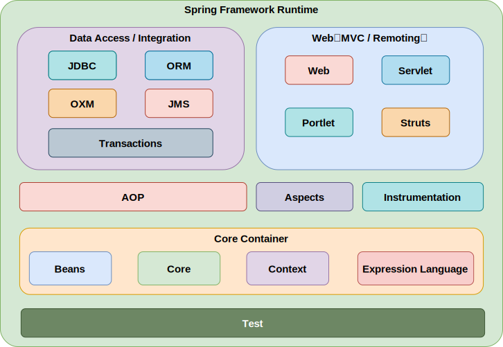

?> [Spring官方文档](https://docs.spring.io/spring-framework/reference/overview.html)

## Spring核心组件

## Spring核心

IoC 容器和 AOP 模块。通过 IoC 容器管理 POJO 对象以及他们之间的耦合关系；通过 AOP 以动态非侵入的方式增强服务。IoC 让相互协作的组件保持松散的耦合，而 AOP 编程允许你把遍布于应用各层的功能分离出来形成可重用的功能组件。

## Spring框架中使用的设计模式

- **单例模式：** Spring 创建 Bean 对象的默认方式就是单例
- **代理模式：** SpringAOP 中使用了代理模式
- **模板模式：** RestTemplate、RedisTemplate 等
- **工厂模式：** Spring 中的 BeanFactory 就是典型的工厂方法模式
- **观察者模式：** Spring 中的 Event 和 Listener
- **责任链模式：** DispatcherServlet 中使用到了
