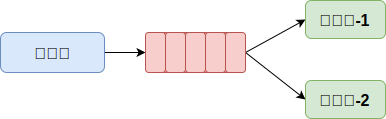
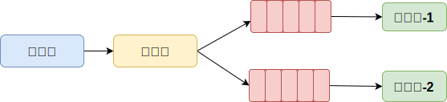
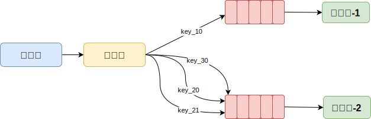

## WorkQueues工作队列模式

- **生产者** ：生产消息的程序
- **队列(Queue)** ：接收和存储消息
- **消费者** ：处理消息的程序

一个或多个消费端共同消费同一个队列中的消息

应用场景：任务过多或过重时可以提高任务处理的效率

## Publish/Subscribe订阅模式

- **生产者** ：生产消息的程序
- **路由交换机(Exchange)** ：负责消息分发，确认消息处理方式。共四种类型
    - *广播(Fanout)：* 将消息发送给所有绑定的队列
    - *定向(Direct)：* 将消息发送给指定 `routing_key` 的队列
    - *通配(Topic)：* 将消息发送给符合 `routing_pattern` (路由模式)的队列
    - *首部(Headers)：* 将消息发送给 `Headers` 数据匹配的队列
- **队列(Queue)** ：接收和存储消息
- **消费者** ：消费消息的程序

## Routing路由模式

与订阅模式结构相似，只有匹配的 `routing_key` 的队列才能接收到消息

## Topics话题模式
