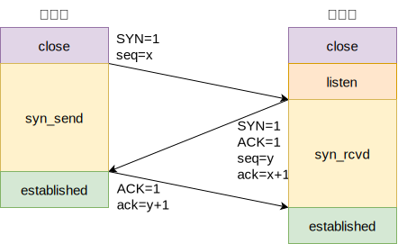

?> [推荐文章](https://mp.weixin.qq.com/s/Xb-kcSAF0q7awMfx6Dgp6A)

## 什么是TCP

传输控制协议（TCP，Transmission Control Protocol）是一种面向连接的、可靠的、基于字节流的传输层通信协议。它负责提供可靠的数据传输服务，确保数据在传输过程中不会丢失、损坏、重复或乱序

### TCP报文头

## 三次握手

TCP（传输控制协议）的三次握手机制是一种用于在两个 TCP 主机之间建立一个可靠的连接的过程。这个机制确保了两端的通信是同步的，并且在数据传输开始前，双方都准备好了进行通信

最开始都是 CLOSE，之后服务器进入 LISTEN

- 第一次握手：SYN
    - 发起连接：客户端创建一个 TCP 报文段，报文段的 SYN 位设置 1，表明这是一个连接请求，并会随机选择个 seq 序列值，假设为 x。并发送报文段给服务器
    - 目的：客户端通知服务器它希望建立连接，并告知服务器自己的初始序列号
    - 状态：客户端进入 syn_send 状态
- 第二次握手：SYN + ACK
    - 确认并应答：服务器监听到客户端的连接请求后，如果同意建立连接则会创建响应 TCP 报文发送给客户端。响应报文端的 SYN 和 ACK 位会被设置为 1，同样也会随机选择个 seq 序列值，假设为 y，并将客户端发送来的 seq 值 +1 ，即 x+1 作为 ack 确认号一同写入报文段中
    - 目的：服务器告诉客户端，它的连接请求被接受了，并通知客户端自己的初始序列号
    - 状态：服务器进入 syn_rcvd 状态
- 第三次握手：ACK
    - 最终确认：客户端收到服务器响应后再向服务器发送个确认。确认请求的报文的 ACK 位会被设置为 1，确认号设置为服务器响应的 seq 值 +1 ，即 y+1 作为 ack 确认号一同写入报文段中
    - 目的：客户端确认收到了服务器的同步应答，完成三次握手，建立连接
    - 状态：客户端进入 established 状态，当服务器接收到这个包时，也进入 established 状态

## 四次挥手
